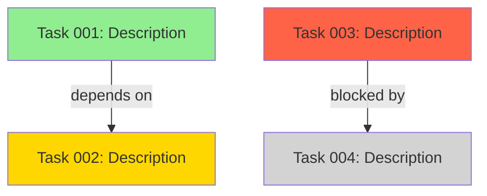

Generate a `team-status` report.

Feature flag rule:
- If `TEAM_STATUS_V1_ENABLED` is not enabled, return:
  - rollout state
  - enablement steps
  - expected pilot scope

When enabled, include:
1. Active streams (task_id, owner, state, dependency blockers)
2. Blockers (severity, owner, age, mitigation, escalation status)
3. Role workload (assigned streams per role, saturation risk)
4. Recommended next actions (top 5, ordered by impact)
5. Checkpoint deltas since last report (done/in_flight/blocked changes)
6. Portfolio summary for shared dependencies (if scope includes multiple projects)

## Task DAG Visualization

7. **Produce a task dependency graph** (Mermaid format):



  - Read `docs/tasks/active-tasks.md` for pending/in_progress/blocked/in_review nodes
  - Read `docs/tasks/completed-tasks.md` for `done` nodes — `active-tasks.md` NEVER contains `done`
  - Reconstruct dependency edges for done nodes from the `Depends on` cells of active rows
- Show cross-stream dependencies

## Checkpoint Metrics

8. **Summarize checkpoint activity**:
   - Total checkpoints since last team-status report
   - Phase transitions: [list completed transitions]
   - Validation gates: passed=<n>, failed=<n>, pending=<n>
   - Artifact versions produced: [list new artifacts with versions]

## Blocker Summary

9. **Produce a blocker summary table**:

| # | Blocker ID | Severity | Owner | Age (days) | Blocked Tasks | Mitigation | Escalation |
|---|-----------|----------|-------|------------|---------------|------------|------------|
| 1 | ... | CRITICAL/HIGH/MEDIUM | ... | ... | [task IDs] | ... | ... |

## Velocity Data

10. **Include velocity metrics**:
    - Tasks completed this period: <count> (<story points>)
    - Tasks completed last period: <count> (<story points>)
    - Velocity trend: increasing / stable / decreasing
    - Throughput: tasks/day average
    - Lead time: average days from pending → done

Output format:
```markdown
## Team Status

### Active Streams
- [task_id] [state] [owner] [dependency summary]

### Blockers
- [blocker_id] [severity] [owner] [age] [mitigation] [escalation]

### Role Workload
- [role]: [active_count] streams ([low|medium|high] saturation)

### Recommended Next Actions
1. ...
2. ...
3. ...
4. ...
5. ...

### Checkpoint Delta
- done: [...]
- in_flight: [...]
- blocked: [...]

### Task DAG
[Mermaid diagram]

### Velocity
- This period: <points> pts (<tasks> tasks)
- Last period: <points> pts (<tasks> tasks)
- Trend: [increasing|stable|decreasing]

### Portfolio Dependencies
- [shared dependency] [impacted streams] [priority]
```

Scope:
{{input}}
