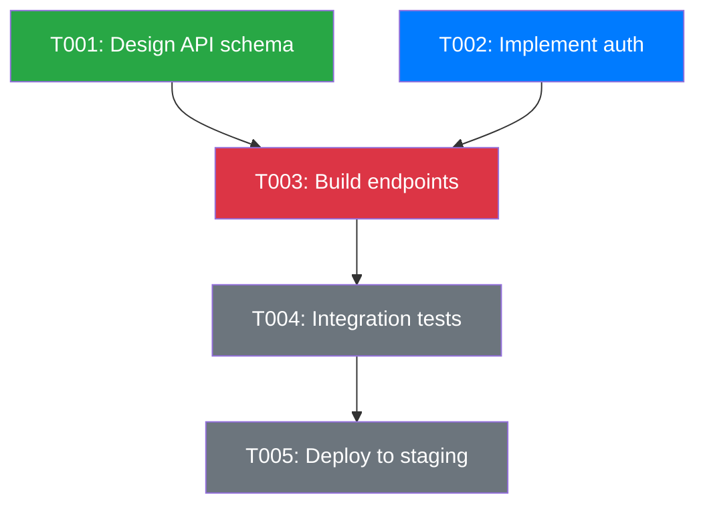
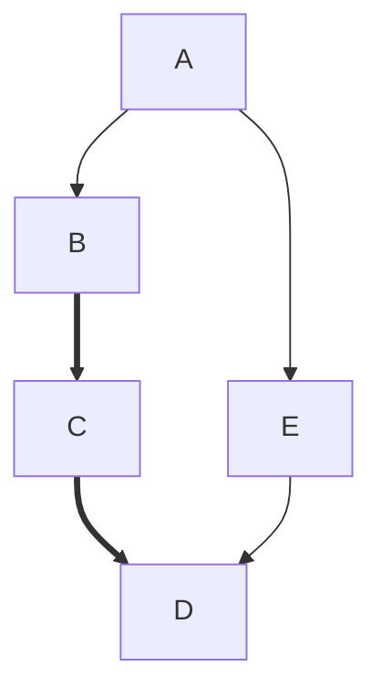
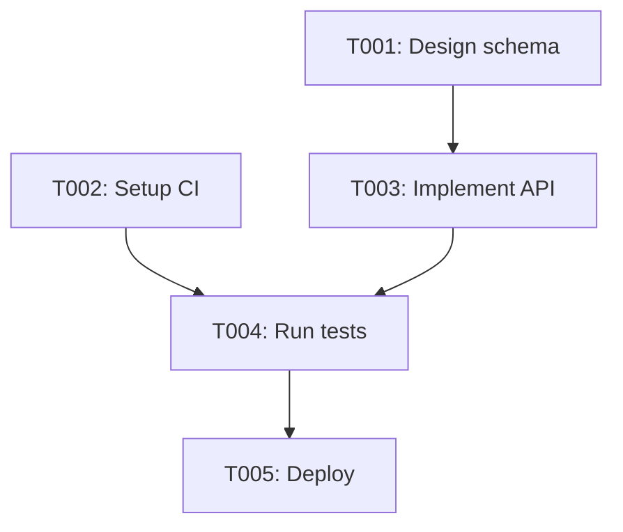

# Dependency Graphing

## Purpose

Build and visualize task dependency graphs as Mermaid DAGs. Identify critical paths, detect circular dependencies, and provide a clear visual of project workflow ordering.

## When to Use

- Analyzing task execution order before starting a batch of work
- Identifying the critical path through a set of tasks
- Detecting circular dependencies that would deadlock execution
- Generating visual project status reports
- Planning parallel execution lanes for agents

## Procedure

### 1. Extract Dependencies from Task Table

1. Read `docs/tasks/active-tasks.md`.
2. For each task row, extract `ID`, `Title`, `Status`, `Blocks`, and `BlockedBy`.
3. Build an adjacency list: for each task, record its outgoing edges (tasks it blocks).

### 2. Generate Mermaid DAG

1. Start the graph with `graph TD` (top-down) or `graph LR` (left-right).
2. For each task, create a node: `TASK_NNN["TNNN: Title"]`.
3. For each dependency edge, create an arrow: `TASK_NNN --> TASK_MMM`.
4. Apply styling based on status:
   - `pending` → default style
   - `in_progress` → blue fill
   - `blocked` → red fill
   - `in_review` → yellow fill
   - `done` → green fill

#### Mermaid Template



### 3. Detect Circular Dependencies

1. Perform a topological sort on the dependency graph.
2. If the sort fails (not all nodes visited), a cycle exists.
3. To identify the cycle:
   - Track the DFS visit stack.
   - When a back-edge is found, extract the cycle path.
4. Report the cycle as a critical blocker.

#### Cycle Detection Pseudocode

```
function hasCycle(graph):
    visited = {}
    stack = {}
    for each node in graph:
        if node not in visited:
            if dfs(node, graph, visited, stack):
                return true
    return false

function dfs(node, graph, visited, stack):
    visited[node] = true
    stack[node] = true
    for each neighbor in graph[node]:
        if neighbor not in visited:
            if dfs(neighbor, graph, visited, stack):
                return true
        else if neighbor in stack:
            return true  // cycle detected
    delete stack[node]
    return false
```

### 4. Identify Critical Path

1. Assign a weight of 1 to each task (or use estimated effort if available).
2. Find the longest path from any root node (no `BlockedBy`) to any leaf node (no `Blocks`).
3. The critical path determines the minimum project duration.
4. Highlight the critical path in the Mermaid graph with thick arrows:



(Use `==>` for critical path edges.)

### 5. Identify Parallel Execution Lanes

1. Group tasks by their depth in the DAG (distance from root).
2. Tasks at the same depth with no mutual dependencies can execute in parallel.
3. Output a lane diagram:

```
Lane 0: T001, T002  (parallel)
Lane 1: T003             (depends on Lane 0)
Lane 2: T004             (depends on Lane 1)
Lane 3: T005             (depends on Lane 2)
```

## Examples

### From Task Table to Mermaid

Given active tasks:

| ID | Title | Blocks | BlockedBy |
|----|-------|--------|-----------|
| T001 | Design schema | T003 | — |
| T002 | Setup CI | T004 | — |
| T003 | Implement API | T004 | T001 |
| T004 | Run tests | T005 | T002, T003 |
| T005 | Deploy | — | T004 |

Output:



Critical path: `T001 → T003 → T004 → T005` (length 4).

## Guidelines

- Always run cycle detection before generating execution plans.
- Regenerate the graph whenever tasks are added, removed, or re-linked.
- Store generated graphs in `docs/artifacts/` for reference.
- Use the graph to inform agent work assignments — assign parallel lanes to different agents.
- If a circular dependency is detected, escalate immediately using the `blocker-escalation` skill.
