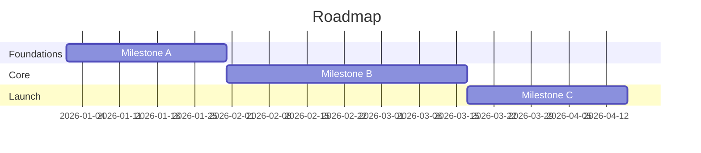

# Milestone Roadmap — `<project>`

**Horizon:** `<Qx YYYY>` → `<Qx YYYY>`

## Milestones

| ID | Milestone | Target | Definition of done |
|----|-----------|--------|--------------------|
| M1 | … | YYYY-MM-DD | … |
| M2 | … | YYYY-MM-DD | … |

## Cross-cutting concerns
- Security: …
- Performance: …
- Compliance: …
