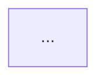

# Plan-Approve-Execute Protocol

## Purpose

Enforce a structured three-phase workflow — Plan, Approve, Execute — to ensure all work is reviewed and approved before implementation begins. This prevents wasted effort from misaligned execution and keeps the user in control of project direction.

## When to Use

- Starting a new project or major phase
- Planning a new feature or significant change
- Any work that requires more than a single task to complete
- When the orchestrator needs to propose a batch of tasks for user review

## File Location

```
docs/plans/plan-<feature-or-phase>.md
```

## The Three Phases

### Phase 1: Plan

The orchestrator or lead agent produces a plan document covering what will be built, how, and in what order.

#### Plan Document Format

```markdown
# Plan: <Feature/Phase Name>

**Author:** <agent-name>
**Date:** YYYY-MM-DD
**Status:** draft | approved | rejected | superseded

## Objective
<1-2 sentences: what this plan achieves>

## Scope
### In Scope
- <item>
- <item>

### Out of Scope
- <item>

## Approach
<Description of the technical approach, patterns, and key design decisions>

## Task Breakdown
| ID | Title | Assignee | Priority | BlockedBy | Estimated Effort |
|----|-------|----------|----------|-----------|-----------------|
| TASK-NNN | ... | ... | ... | ... | S/M/L |

## Dependency Graph


## Risks & Mitigations
| Risk | Likelihood | Impact | Mitigation |
|------|-----------|--------|------------|
| ... | low/medium/high | low/medium/high | ... |

## Success Criteria
- [ ] <measurable criterion>
- [ ] <measurable criterion>

## Open Questions
- <question for user/team>
```

### Phase 2: Approve

Present the plan to the user for review and approval.

#### Approval Prompt Template

```
I've prepared a plan for **<Feature/Phase Name>**.

**Summary:** <1-2 sentence summary>
**Tasks:** <N> tasks, estimated effort: <total>
**Key decisions:**
- <decision 1>
- <decision 2>

**Open questions:**
- <question>

Please review the full plan at `docs/plans/plan-<name>.md`.

Options:
1. ✅ **Approve** — proceed with execution
2. ✏️ **Revise** — specify changes needed
3. ❌ **Reject** — abandon this approach
```

#### Handling Responses

| Response | Action |
|----------|--------|
| Approve | Update plan status to `approved`, proceed to Execute phase |
| Revise | Update plan per feedback, re-present for approval |
| Reject | Update plan status to `rejected`, discuss alternative approaches |

### Phase 3: Execute

Begin implementation according to the approved plan.

#### Execution Kickoff Procedure

1. Confirm plan status is `approved`.
2. Create all tasks from the plan's Task Breakdown in `docs/tasks/active-tasks.md` (use `task-management` skill).
3. Generate the dependency graph (use `dependency-graphing` skill).
4. Identify the first set of unblocked tasks.
5. Assign tasks to agents per the plan's Assignee column.
6. Begin execution, following the task dependency order.
7. Write an initial checkpoint (use `checkpoint-protocol` skill).

## Procedure Summary

```
1. PLAN
   ├── Analyze requirements
   ├── Design approach
   ├── Break down into tasks
   ├── Identify dependencies and risks
   └── Write plan document

2. APPROVE
   ├── Present plan summary to user
   ├── Handle feedback (approve/revise/reject)
   └── Update plan status

3. EXECUTE
   ├── Create tasks in active-tasks.md
   ├── Generate dependency graph
   ├── Assign and begin work
   └── Write initial checkpoint
```

## Examples

### Small Feature Plan

```markdown
# Plan: Add Rate Limiting

**Author:** orchestrator
**Date:** 2025-03-20
**Status:** draft

## Objective
Add rate limiting to the public API to prevent abuse.

## Task Breakdown
| ID | Title | Assignee | Priority | BlockedBy | Estimated Effort |
|----|-------|----------|----------|-----------|-----------------|
| TASK-020 | Research rate limit strategies | backend-dev | high | — | S |
| TASK-021 | Implement token bucket | backend-dev | high | TASK-020 | M |
| TASK-022 | Add rate limit headers | backend-dev | medium | TASK-021 | S |
| TASK-023 | Write rate limit tests | qa-agent | high | TASK-021 | M |

## Success Criteria
- [ ] Rate limiting active on all public endpoints
- [ ] 429 responses include Retry-After header
- [ ] Load test confirms limits enforced correctly
```

## Guidelines

- Never execute without an approved plan. The approval step is mandatory.
- Plans can be revised multiple times before approval. Iterate until the user is satisfied.
- Keep plans concise — focus on decisions and task structure, not implementation details.
- If a plan is superseded by a new plan, update its status to `superseded` and link to the replacement.
- Execution must follow the approved task order. Deviations require a plan amendment and re-approval.
