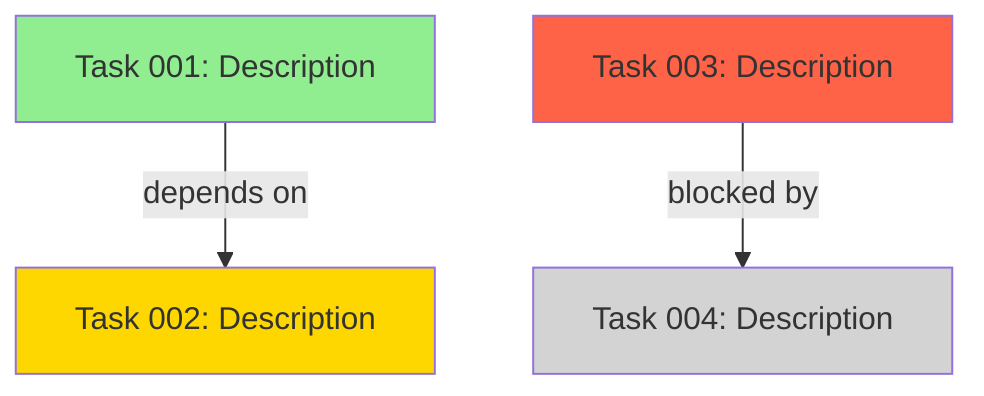

Generate a sprint status report for the current sprint:

## Sprint Metrics

1. **Completed Items**: List all done tasks with story points
2. **In Progress**: Current work with % complete estimate
3. **Remaining**: Not started items with priorities
4. **Blocked**: Any blocked items and why
5. **Velocity**: Points completed vs committed
6. **Risks**: Any at-risk items for the sprint goal
7. **Burndown**: Current trajectory (on track / behind / ahead)

## Task DAG Visualization

8. **Produce a task dependency graph** (Mermaid format):

- Read from `docs/tasks/active-tasks.md` for current task states
- Color code: done=green, in_progress=yellow, blocked=red, pending=gray

## Checkpoint Metrics

9. **Summarize checkpoint data since last sprint status**:
   - Checkpoints written this sprint: <count>
   - Phase transitions completed: [list]
   - Validation gates passed/failed: [list]
   - Artifact versions produced: [list]

## Token Spend Summary

10. **Aggregate spend telemetry for the sprint**:
    - Total tokens used this sprint
    - Projected remaining budget
    - Variance from plan (over/under by %)
    - Per-phase breakdown if available

Provide actionable recommendations for any issues found.
