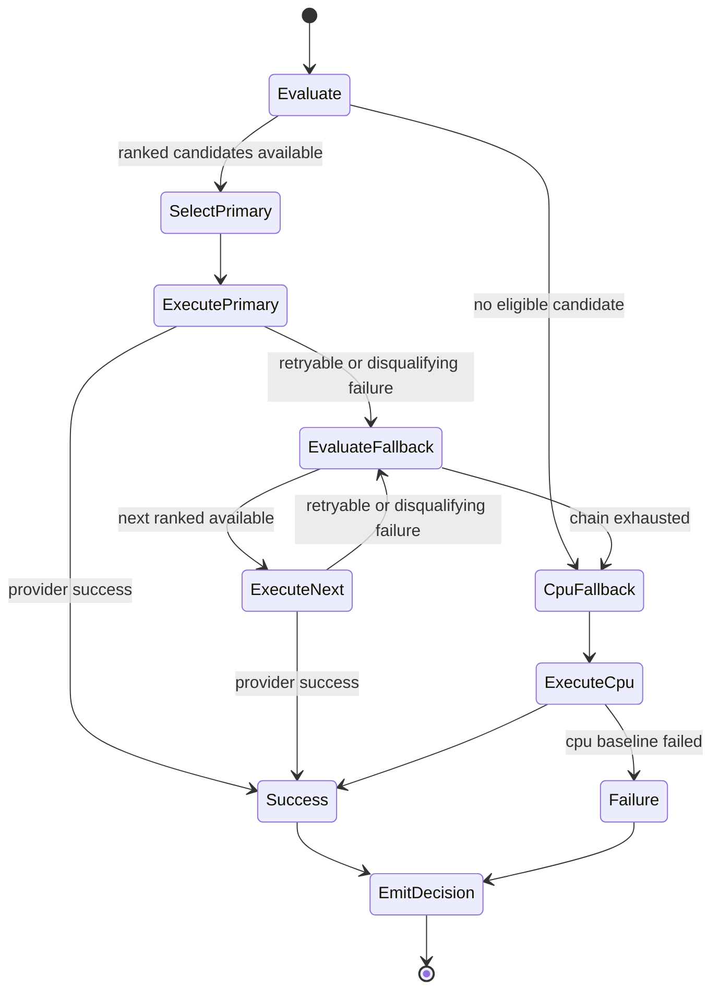

# Architecture Phase 5 HHD v1 — CWSO

> Owner: solution-architect · Based on: [docs/artifacts/requirements-phase5-hardware-v1.md](requirements-phase5-hardware-v1.md), [docs/artifacts/architecture-v1.md](architecture-v1.md), [docs/decisions/ADR-006-semantic-ast-merge.md](../decisions/ADR-006-semantic-ast-merge.md), [docs/artifacts/security-baseline-v1.md](security-baseline-v1.md) · Status: accepted

## 1. System context and goals
Phase 5 introduces a hardware-aware dispatch model that extends the current Go orchestrator plus Rust sidecar architecture without changing tool contracts or merge semantics from [docs/artifacts/architecture-v1.md](architecture-v1.md).

Goals:
- Meet [FR-001](requirements-phase5-hardware-v1.md#3-functional-requirements) by selecting one backend plus ranked fallbacks from a versioned contract.
- Meet [FR-002](requirements-phase5-hardware-v1.md#3-functional-requirements) and [NFR-002](requirements-phase5-hardware-v1.md#4-non-functional-requirements) with deterministic fallback to CPU baseline in <= 2.0 seconds.
- Meet [FR-003](requirements-phase5-hardware-v1.md#3-functional-requirements), [FR-004](requirements-phase5-hardware-v1.md#3-functional-requirements), and [NFR-004](requirements-phase5-hardware-v1.md#4-non-functional-requirements) by introducing capability snapshots and bounded policy evaluation overhead.
- Preserve adapter-first portability (no vendor lock-in) and backward compatibility for existing dispatch callers.

System boundary:
- In-process orchestrator components: policy evaluator, provider registry, capability cache, fallback executor.
- Sidecars remain isolated process boundaries for Git and merge operations; they are not bypassed by hardware routes.
- External hardware providers are accessed only through provider adapters implementing a common contract.

## 2. Component architecture changes

### 2.1 Existing baseline retained
The following baseline elements from [docs/artifacts/architecture-v1.md](architecture-v1.md) are unchanged:
- Transport, auth/origin validation, router/tier gate.
- Job manager lifecycle and event bus model.
- Rust sidecars (`cwso-git-shadow`, `cwso-merge-engine`) and sandbox tier routing.

### 2.2 New components for hardware-aware dispatch
```mermaid
graph TB
  subgraph Orchestrator[Go Orchestrator]
    Router[Tool Router and Permission Gate]
    HHD[Hardware Dispatch Coordinator]
    Policy[Policy Scoring Engine v2]
    Registry[Provider Registry]
    CapCache[Capability Snapshot Cache]
    Fallback[Fallback Executor]
    EventBus[Event Bus and Telemetry]
  end

  subgraph Sidecars[Rust Sidecars]
    GitShadow[cwso-git-shadow]
    MergeEng[cwso-merge-engine]
  end

  subgraph Providers[Provider Adapters]
    CPU[CPU Baseline Adapter]
    GPU[GPU-capable Adapter]
    RnD[Research Adapter (feature-flagged)]
  end

  Router --> HHD
  HHD --> Policy
  Policy --> Registry
  Registry --> CapCache
  Policy --> Fallback
  Fallback --> CPU
  Fallback --> GPU
  Fallback --> RnD
  HHD --> EventBus
  HHD --> MergeEng
  HHD --> GitShadow
```

Responsibilities:
- Hardware Dispatch Coordinator: orchestrates scoring, selection, execution, and fallback chain.
- Provider Registry: immutable view of registered adapters and contract versions.
- Capability Snapshot Cache: interval-refreshed capability state consumed by scoring ([FR-003](requirements-phase5-hardware-v1.md#3-functional-requirements)).
- Policy Scoring Engine v2: deterministic ranking using policy inputs from [FR-004](requirements-phase5-hardware-v1.md#3-functional-requirements).
- Fallback Executor: ordered retry/fallback runner with bounded per-attempt timeout and reason classification.

Data flow summary:
1. Router receives a dispatch request with workload profile + policy context.
2. HHD loads current policy version + capability snapshot epoch.
3. Policy engine scores eligible adapters and returns ranking.
4. Coordinator executes top-ranked provider with guard timeout.
5. On disqualifying failure class, fallback executor advances to next ranked adapter.
6. CPU baseline is terminal safe fallback.
7. Decision event is emitted with selected backend, chain, reason, and timing ([FR-008](requirements-phase5-hardware-v1.md#3-functional-requirements)).

## 3. Provider contract model

### 3.1 Contract versioning
Contract identifier: `dispatch.provider/v1`.

Versioning rules:
- Major version increments for breaking field semantics or required fields.
- Minor version increments for additive optional capability fields and reason metadata.
- Orchestrator accepts provider major equal to supported major and minor >= minimum baseline.
- Providers advertising unsupported major are marked `incompatible` and excluded from scoring.

Compatibility mode:
- Existing callers that do not send hardware policy context are mapped to `cpu-baseline-default` behavior.
- Absence of optional fields must never change deterministic ordering for equal score candidates.

### 3.2 Capability schema (logical)
Required provider capability fields:
- `provider_id`: stable adapter identifier.
- `contract_version`: semantic version for provider contract.
- `health_state`: `healthy | degraded | unavailable`.
- `latency_class`: ordinal class used for coarse routing.
- `cost_class`: ordinal class used for policy weighting.
- `queue_depth`: integer queue pressure indicator.
- `supported_workload_tags`: set of workload tags.
- `reliability_class`: provider-declared SLA bucket.
- `feature_flags`: set of opt-in experimental flags ([FR-005](requirements-phase5-hardware-v1.md#3-functional-requirements)).
- `last_updated_at`: monotonic snapshot timestamp.

Optional extension fields:
- `accelerator_type`, `region`, `energy_class`, `model_family`.

Validation constraints:
- Unknown required fields are rejected.
- Unknown optional extension fields are ignored but logged for schema evolution.
- Stale capability snapshots beyond TTL are treated as `degraded`.

### 3.3 Dispatch response and error model
Selection payload (internal and audit event):
- `policy_version`
- `capability_epoch`
- `selected_provider`
- `ranked_fallback_chain`
- `score_breakdown`
- `confidence`

Normalized error classes:
- `timeout`: provider exceeded per-attempt deadline.
- `unavailable`: health check or connection failure.
- `capacity_exhausted`: queue depth or throttling breach.
- `contract_incompatible`: version/capability mismatch.
- `policy_denied`: operator allow/deny policy exclusion.
- `quality_guardrail`: experimental route disabled by quality threshold.

Each error must include:
- `reason_code`
- `retryable` boolean
- `fallback_required` boolean
- `provider_id`
- `observed_at`

Timeout and retry policy:
- Provider attempt timeout is policy-bound and cannot exceed request SLA budget.
- Retry-attempt count is deterministic by reliability class (no unbounded retries).
- Fallback decision uses ordered chain only; random retry ordering is prohibited.

## 4. Policy scoring, fallback flow, and state machine

### 4.1 Deterministic scoring model
Scoring inputs follow [FR-004](requirements-phase5-hardware-v1.md#3-functional-requirements):
- Workload class
- P95 latency budget
- Reliability class
- Cost weight
- Backend health
- Operator allow/deny lists

Determinism rules:
- Stable ordered tuple sort key: `(policy_score desc, health_rank desc, reliability_rank desc, provider_id asc)`.
- Tie-breaking always resolves on `provider_id` ascending.
- Same inputs + same capability epoch + same policy version must produce identical ranking.

### 4.2 Fallback semantics
Fallback order:
1. Highest ranked eligible provider.
2. Next ranked provider on retryable or disqualifying failure.
3. CPU baseline adapter as terminal fallback.

Fallback triggers:
- Timeout, unavailable, capacity exhausted, contract incompatible, quality guardrail disable.

Non-fallback terminal failures:
- Policy denied with no eligible alternatives.
- Authorization or request validation failures (outside dispatch selection concern).

### 4.3 Dispatch state machine


State guarantees:
- CPU fallback is always attempted unless request is invalid or explicitly denied.
- Decision emission is mandatory on all terminal paths.
- Chain exhaustion is explicit and auditable.

## 5. Security and observability implications

### 5.1 Security implications
Aligned to [docs/artifacts/security-baseline-v1.md](security-baseline-v1.md):
- No secrets in provider contracts; credentials resolved only from environment/secret mounts.
- Authorization and tier gate stay in router, not provider adapter.
- Provider capability and dispatch inputs must be schema-validated server-side ([FR-007](requirements-phase5-hardware-v1.md#3-functional-requirements)).
- Experimental routes remain feature-flagged and disabled by default ([FR-005](requirements-phase5-hardware-v1.md#3-functional-requirements)).
- Wasm scoring plugins (future T066) must remain in constrained host-call allowlist and memory/time envelope.

### 5.2 Observability implications
Decision telemetry envelope (required):
- `decision_id`, `request_id`, `policy_version`, `capability_epoch`
- `selected_provider`, `fallback_chain`, `fallback_count`
- `reason_code`, `confidence`, `estimated_latency_ms`, `actual_latency_ms`
- `feature_flags_applied`, `quality_guardrail_state`

Operational metrics:
- Dispatch overhead p95 (target <= 10 ms per [NFR-004](requirements-phase5-hardware-v1.md#4-non-functional-requirements)).
- Detection-to-fallback latency (target <= 2.0 s per [NFR-002](requirements-phase5-hardware-v1.md#4-non-functional-requirements)).
- Reliability delta against CPU baseline ([NFR-003](requirements-phase5-hardware-v1.md#4-non-functional-requirements)).
- Per-provider incompatibility and guardrail-disable rates.

## 6. Compatibility and migration strategy
Migration principles:
- Adapter-first: all providers accessed via contract-conformant adapters.
- No vendor-required fields in core routing path.
- CPU baseline path remains default-safe route.

Rollout stages:
1. Stage A: register CPU adapter under new contract with policy bypass compatibility mode.
2. Stage B: introduce one GPU-capable adapter in shadow mode (decision logging, no live route).
3. Stage C: enable live policy scoring with deterministic fallback and feature flags.
4. Stage D: incrementally enable experimental adapters behind quality and security gates.

Backward compatibility commitments:
- Existing dispatch callers retain current behavior when no policy context provided.
- Contract additions are optional-only for v1 minor versions.
- Failure reasons map to existing orchestrator error envelopes.

## 7. Risks and mitigations
| Risk | Impact | Mitigation |
|------|--------|------------|
| Capability drift between reported and actual provider state | Incorrect routing and reliability regressions | Short TTL snapshots, degrade-on-stale policy, health hysteresis |
| Non-deterministic ranking under tie conditions | Replay mismatch and incident triage complexity | Stable sort tuple and explicit tie-breaker by provider ID |
| Experimental route quality regression | Merge-assist output degradation | Quality guardrail auto-disable with explicit reason code |
| Provider contract fragmentation | Adapter lock-in and upgrade friction | Versioned contract, compatibility matrix, conformance tests |
| Fallback storm under provider outages | Latency spikes and noisy alerts | Bounded retries, backpressure, CPU terminal fallback, alert deduplication |
| Security drift in adapter implementations | Exposure of credentials or privilege escalation | Centralized secret handling, server-side validation, security gate checklist |

## 8. Traceability to requirements
- [FR-001](requirements-phase5-hardware-v1.md#3-functional-requirements): Section 3 and Section 4 define versioned selection + fallback chain.
- [FR-002](requirements-phase5-hardware-v1.md#3-functional-requirements): Section 4.2 and Section 4.3 define deterministic CPU fallback.
- [FR-003](requirements-phase5-hardware-v1.md#3-functional-requirements): Section 2.2 and Section 3.2 define capability snapshot pipeline.
- [FR-004](requirements-phase5-hardware-v1.md#3-functional-requirements): Section 4.1 defines policy inputs and stable scoring.
- [FR-005](requirements-phase5-hardware-v1.md#3-functional-requirements): Section 3.2 and Section 5.1 enforce feature-flagged experimental routes.
- [FR-006](requirements-phase5-hardware-v1.md#3-functional-requirements): Section 5.1 captures constrained Wasm scoring plugin path.
- [FR-007](requirements-phase5-hardware-v1.md#3-functional-requirements): Section 5.1 preserves security invariants.
- [FR-008](requirements-phase5-hardware-v1.md#3-functional-requirements): Section 5.2 defines mandatory routing decision event.
- [NFR-002](requirements-phase5-hardware-v1.md#4-non-functional-requirements): Section 4 fallback speed target.
- [NFR-003](requirements-phase5-hardware-v1.md#4-non-functional-requirements): Section 5 reliability delta metrics.
- [NFR-004](requirements-phase5-hardware-v1.md#4-non-functional-requirements): Section 5 dispatch overhead target.
