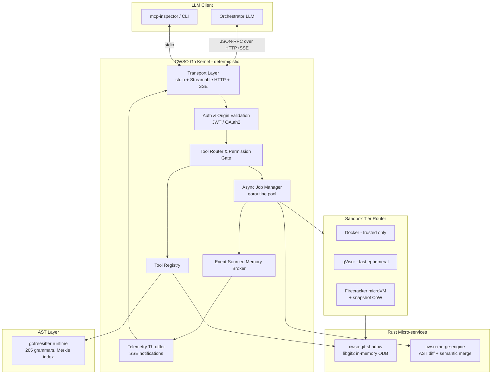

# Architecture v1 — CWSO

> Owner: solution-architect · Based on: `requirements-v1.md`, blueprint v1 · Status: accepted

## 1. Component diagram

## 2. Process model
- **Single binary**: `cwso-orchestrator` (Go) hosts transport, router, job manager, event bus.
- **Sidecar binaries** (started by orchestrator over Unix domain sockets):
  - `cwso-git-shadow` (Rust, `libgit2` bindings) — ODB ops, blob writes, tree peeling.
  - `cwso-merge-engine` (Rust, `tree-sitter` + custom AST diff) — semantic merge.
- **Sandbox runtimes**: invoked per-job by the job manager via a `RunnerInterface` (Docker SDK, runsc CLI, Firecracker API socket).

## 3. Data model
| Entity | Storage | Notes |
|--------|---------|-------|
| Shadow workspace | In-memory map keyed by UUID; backed by bare Git repo on tmpfs | Append-only DAG |
| Job | In-memory queue + Postgres-optional persistence (Phase 4) | Status FSM: `queued → running → completed / failed / killed` |
| Event log | Append-only ring buffer per workspace; flushed to disk hourly | Source of truth for memory broker |
| AST index | Merkle-hashed file→tree map in Go process | Rebuilt on file mutation only |

## 4. Tool taxonomy & permission tiers

| Tool | Tier | Allowed roles |
|------|------|---------------|
| `read_file_sync`, `list_dir` | Worker-safe | Orchestrator, Worker |
| `write_file_sync` | Worker-only (in shadow) | Worker |
| `query_ast` | Read | Orchestrator, Worker |
| `create_shadow_workspace` | Planning | Orchestrator |
| `dispatch_concurrent_jobs` | Planning | Orchestrator |
| `merge_concurrent_results` | Planning | Orchestrator |

Permission gate enforced server-side in `Router`; never delegated to LLM.

## 5. Cross-cutting
- **Logging**: zerolog → JSON, correlation ID per JSON-RPC envelope.
- **Tracing**: OpenTelemetry SDK; spans for tool calls, job dispatch, merge ops.
- **Config**: `viper`; env var first; YAML override; secrets via mounted files only.
- **Errors**: typed sentinel errors; mapped to JSON-RPC error codes per MCP spec.

## 6. Inputs to phases
- Phase 1 → Transport, Auth, Router, Registry, baseline FS tools.
- Phase 2 → AST layer, GitShadow service, `query_ast`, `create_shadow_workspace`.
- Phase 3 → JobMgr, EventBus, Telemetry, `dispatch_concurrent_jobs`.
- Phase 4 → Sandbox tier router, MergeEng, `merge_concurrent_results`, conflict matrix.

## 7. ADR index
- ADR-001 — Hybrid Go + Rust language split
- ADR-002 — MCP Streamable HTTP transport (spec 2025-03-26)
- ADR-003 — Tiered sandbox strategy (Docker / gVisor / Firecracker)
- ADR-004 — In-memory Git ODB via libgit2 (Rust sidecar) with go-git fallback
- ADR-005 — Tree-sitter (gotreesitter) for AST queries with Merkle incremental indexing
- ADR-006 — Semantic AST merge instead of line-based merge
