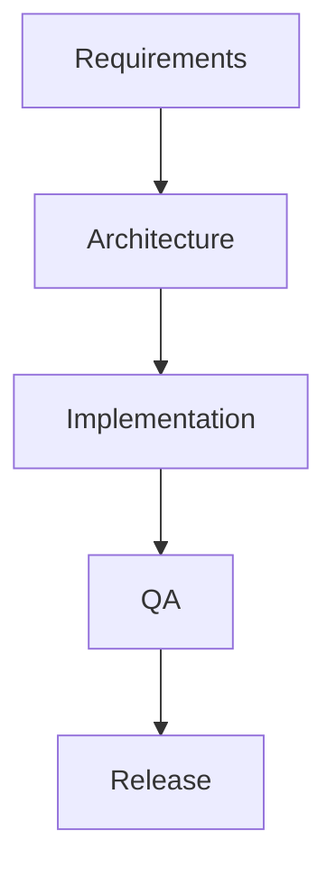

# Plan: <slug>

> Filename convention: `plan-<slug>.md` (e.g. `plan-payment-feature.md`).
> Replace this template's content; do not delete the headings.

## Goal
One paragraph describing the outcome. Include user-visible value and the boundary of "done".

## Scope
- **In scope**: …
- **Out of scope**: …
- **Assumptions**: …

## Task graph



## Agent assignments

| Task | Agent | Estimated scope |
|------|-------|-----------------|
| T001 | product-owner | small |
| T002 | solution-architect | medium |
| T003 | backend-developer + frontend-developer | large |
| T004 | qa-engineer | medium |
| T005 | release-manager | small |

## Artifact flow

```
T001 → requirements-v1.md  (consumed by: T002, T003)
T002 → architecture-v1.md  (consumed by: T003, T004)
T003 → implementation/*    (consumed by: T004)
T004 → test-report-v1.md   (consumed by: T005)
```

## Risks & mitigations

| Risk | Likelihood | Impact | Mitigation |
|------|-----------|--------|-----------|
|      |           |        |           |

## Token budget

| Phase | Budget | Spent | Remaining |
|-------|--------|-------|-----------|
| Planning | 80k | — | — |
| Architecture | 80k | — | — |
| Implementation | 120k | — | — |
| QA / Security / Release | 60k | — | — |

## Approval

- [ ] User approved on YYYY-MM-DD
- [ ] Plan locked; revisions create `plan-<slug>-v2.md`
