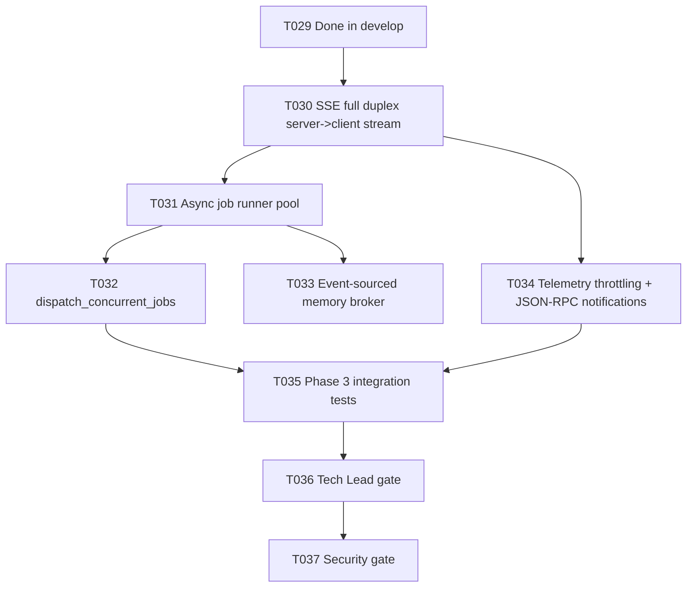

# Plan T030 — Phase 3 SSE Kickoff

## Goal
Deliver T030 as the next critical-path task after T029 by upgrading the existing Streamable HTTP endpoint from heartbeat-only SSE to full server-to-client JSON-RPC notification streaming, while preserving current POST /mcp behavior, JWT/origin security checks, and Phase 2 integration stability. This unlocks T031 and T034 and starts Phase 3 execution.

## Task Graph

## Agent Assignments
- backend-developer:
  Scope: Implement event bus package, SSE transport wiring, topic publishing points, and unit/integration tests for T030.
- qa-engineer:
  Scope: Extend/author validation scenarios for SSE delivery latency, heartbeat stability, and multi-subscriber behavior aligned with T030 acceptance criteria.
- tech-lead:
  Scope: Post-implementation architecture/code gate for T030 before T031 kickoff.
- security-engineer:
  Scope: Focused review of SSE auth continuity, origin enforcement, and event leakage risk.

## Artifact Flow
1. backend-developer produces:
   - orchestrator/internal/eventbus/bus.go
   - transport updates in orchestrator/internal/transport/http.go
   - transport + eventbus tests
2. qa-engineer consumes those artifacts and produces:
   - Phase 3 SSE verification notes/tests
3. tech-lead consumes implementation + QA outputs and emits:
   - Gate verdict (PASS/CONDITIONAL_PASS/FAIL)
4. security-engineer consumes the same and emits:
   - Security gate verdict and findings

## Risks And Mitigations
- Risk: SSE backpressure causes memory growth under slow clients.
  Mitigation: Per-subscriber bounded channel, drop policy with explicit dropped counter and log visibility.
- Risk: T030 behavior regresses POST /mcp semantics.
  Mitigation: Keep POST path untouched, run existing Go tests and phase2 integration unchanged.
- Risk: Notification envelope diverges from MCP Streamable HTTP expectation.
  Mitigation: Constrain emitted payloads to JSON-RPC notification envelope and add assertion tests.
- Risk: JWT/origin checks drift between POST and GET.
  Mitigation: Reuse identical middleware chain for GET /mcp SSE path and add auth parity tests.

## Token Budget Per Phase
- Planning (this plan): <= 10k
- Implementation (T030): <= 60k
- QA + Security gate for T030: <= 30k
- Buffer for fix iteration before T031: <= 20k
- Total planned for T030 slice: <= 120k

## Immediate Execution Proposal
1. Reconcile task ledger status for T029 completion.
2. Start T030 implementation brief execution with backend-developer.
3. Run T030-focused tests plus unchanged phase2 integration.
4. Trigger Tech Lead and Security mini-gates for T030 exit criteria.
