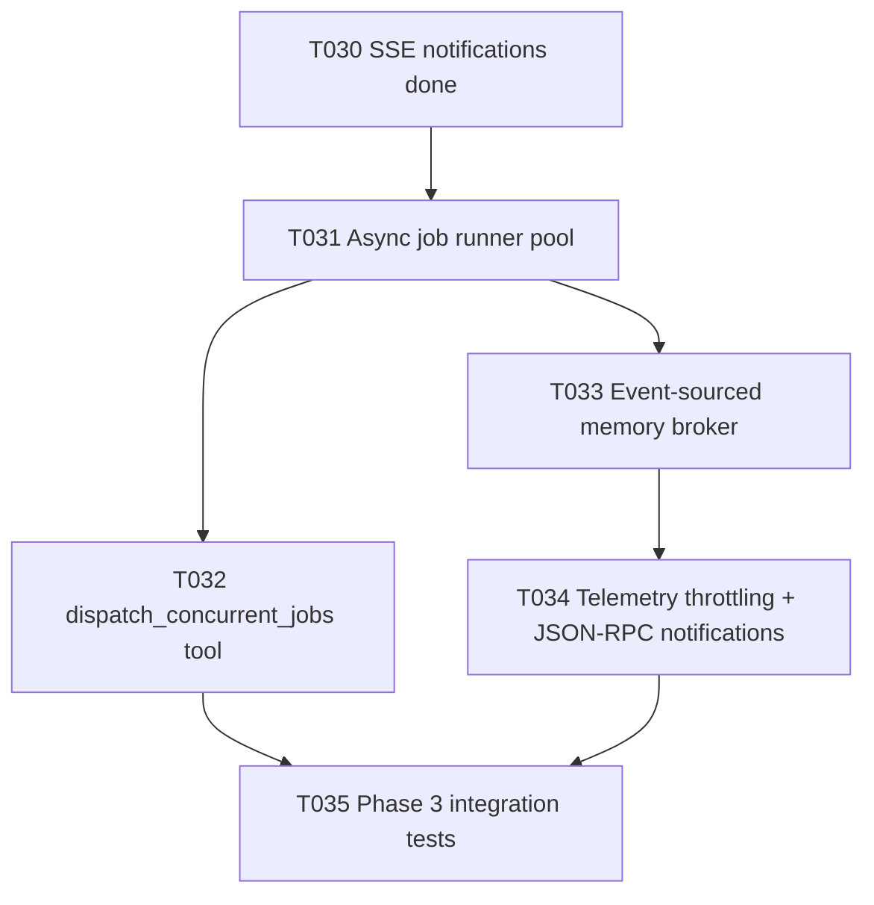

# Plan T031 — Phase 3 Async Job Runner Pool

## Goal
Implement T031 as the next critical-path phase after T030 by adding an asynchronous job runner pool in the orchestrator that accepts work quickly, executes jobs concurrently with bounded worker capacity, and emits lifecycle events for downstream dispatch and telemetry tasks (T032 and T033), without regressing existing synchronous MCP behavior.

## Task Graph

## Agent Assignments
- backend-developer:
  Scope: design and implement orchestrator job manager package, worker pool lifecycle, queueing semantics, cancellation and timeout handling, and event publication hooks.
- qa-engineer:
  Scope: add race-safe tests for queueing, worker saturation, cancellation, and result collection under concurrency.
- tech-lead:
  Scope: review correctness of concurrency primitives, backpressure behavior, and package boundaries before T032 starts.
- security-engineer:
  Scope: validate input validation at job boundaries, authorization checks for job-control actions, and denial-of-service resistance controls.

## Artifact Flow
1. backend-developer produces:
   - orchestrator/internal/jobs/ pool and lifecycle manager
   - integration points from transport/router to enqueue async units of work
   - lifecycle event publication to SSE/event bus topics
2. qa-engineer consumes implementation and outputs:
   - concurrency and cancellation test report
3. tech-lead and security-engineer consume implementation plus tests and output:
   - T031 gate verdicts and conditions (if any)

## Risks And Mitigations
- Risk: race conditions and goroutine leaks in worker shutdown.
  Mitigation: context-based lifecycle control, explicit drain tests, race detector runs.
- Risk: unbounded queue growth under burst load.
  Mitigation: bounded queue with clear rejection/backpressure strategy and metrics.
- Risk: breaking existing sync tool path while introducing async internals.
  Mitigation: isolate async path behind dedicated package interfaces and keep current POST path defaults intact.
- Risk: missing event consistency for downstream SSE/telemetry.
  Mitigation: enforce canonical lifecycle events (queued/running/completed/failed/cancelled) and test event ordering.

## Token Budget Per Phase Slice
- Planning and task prep: <= 12k
- Implementation: <= 55k
- QA + review gates: <= 28k
- Fix iteration buffer: <= 25k
- Total T031 slice target: <= 120k

## Immediate Execution Proposal
1. Create or update task brief for T031 with explicit acceptance criteria and test matrix.
2. Delegate implementation to backend-developer on feature/T031-async-job-runner.
3. Validate with race-enabled tests in orchestrator packages.
4. Run T031 mini-gates (tech-lead and security) and only then proceed to T032.
