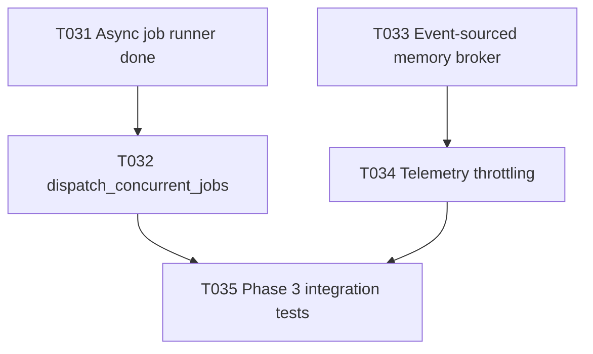

# Plan T032 — Phase 3 dispatch_concurrent_jobs Tool

## Goal
Implement T032 by introducing the planning-tier MCP tool `dispatch_concurrent_jobs` so orchestrator clients can submit multi-job batches and receive immediate acknowledgements (with job IDs for accepted jobs) while actual execution proceeds asynchronously on the T031 job manager.

## Task Graph

## Agent Assignments
- backend-developer:
  Scope: implement tool contract, validation, permission enforcement, and enqueue integration with internal job manager.
- qa-engineer:
  Scope: add and run tests for immediate-return semantics, partial acceptance, and permission controls.
- tech-lead:
  Scope: review API contract stability and failure-mode correctness before T035 integration gate.
- security-engineer:
  Scope: verify input validation, abuse limits (batch size/queue pressure), and role-based access control.

## Artifact Flow
1. backend-developer produces:
   - tool implementation and registry wiring in orchestrator internal tools/server
   - tests for dispatch path and queue-pressure behavior
2. qa-engineer consumes implementation and produces:
   - T032 test execution summary (including negative-path and permission checks)
3. tech-lead + security-engineer consume implementation and tests and produce:
   - focused T032 verdicts or conditions for T035 readiness

## Risks And Mitigations
- Risk: dispatch tool accidentally blocks on job completion.
  Mitigation: enforce enqueue-only flow; test elapsed response time and no completion wait in handler.
- Risk: batch requests can overwhelm queue and cause unstable failures.
  Mitigation: deterministic per-item enqueue error mapping and max batch-size validation.
- Risk: permission bypass allows worker role to dispatch.
  Mitigation: planning-tier authorization in registry plus explicit permission test.
- Risk: malformed batch payloads lead to inconsistent state.
  Mitigation: strict schema validation before any enqueue attempt.

## Token Budget Per Slice
- Planning and briefing: <= 12k
- Implementation: <= 45k
- QA + focused reviews: <= 23k
- Fix iterations buffer: <= 20k
- Total T032 slice target: <= 100k

## Immediate Execution Proposal
1. Delegate T032 implementation to backend-developer using task brief [docs/tasks/task-T032.md](../tasks/task-T032.md).
2. Validate with targeted tests in tools/server/jobs packages and ensure full go test regression remains green.
3. Prepare T035-readiness checkpoint once T032 and T033/T034 convergence requirements are clear.
