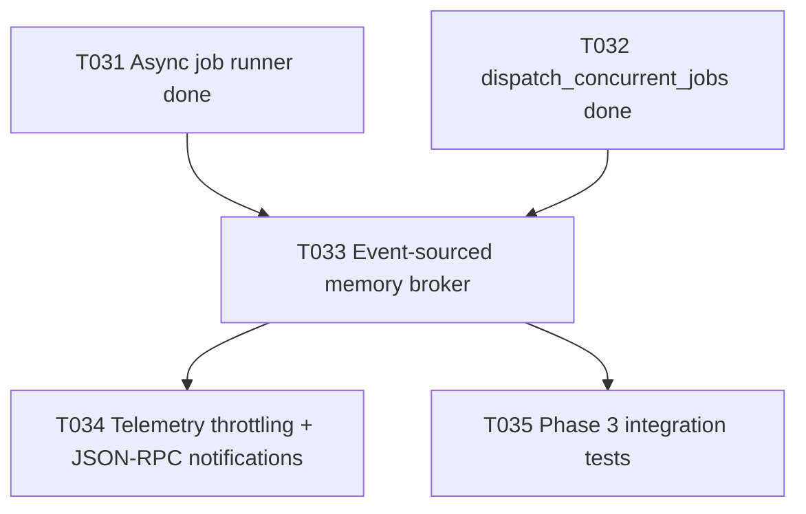

# Plan T033 — Phase 3 Event-Sourced Memory Broker

## Goal
Implement T033 by adding an event-sourced memory broker inside the Go kernel as a bounded append-only event log and query surface, so phase-3 telemetry and integration flows can consume deterministic, ordered lifecycle data without blocking job execution.

## Task Graph

## Agent Assignments
- backend-developer:
  Scope: design and implement broker package (append-only records, sequence IDs, bounded retention, query API) and integrate producer hooks.
- qa-engineer:
  Scope: verify ordering, retention, concurrent ingest/read behavior, and query correctness under load.
- tech-lead:
  Scope: review broker interface boundaries and event model consistency with phase-3 architecture.
- security-engineer:
  Scope: verify event sanitation (no secrets/PII), retention posture, and abuse resistance.

## Artifact Flow
1. backend-developer produces:
   - `orchestrator/internal/memorybroker/*`
   - integration hooks from jobs/dispatch paths
   - unit tests and concurrency tests
2. qa-engineer consumes implementation and produces:
   - T033 validation summary and edge-case findings
3. tech-lead/security-engineer consume implementation + QA report and produce:
   - focused verdicts for T034/T035 readiness

## Risks And Mitigations
- Risk: ingest path blocks job execution under contention.
  Mitigation: lock-light append path with bounded queue/ring and non-blocking producer contract.
- Risk: unbounded memory growth from event accumulation.
  Mitigation: strict ring capacity with deterministic oldest-first eviction and tests.
- Risk: event schema drift across producers.
  Mitigation: centralized event envelope type and producer helper API.
- Risk: sensitive data leakage into event log.
  Mitigation: sanitize payload fields and explicitly exclude secrets/tokens.

## Token Budget Per Slice
- Planning and briefing: <= 12k
- Implementation: <= 50k
- QA + reviews: <= 25k
- Fix iteration buffer: <= 20k
- Total T033 slice target: <= 107k

## Immediate Execution Proposal
1. Approve this T033 plan and move task status to in_progress.
2. Delegate implementation to backend-developer with [docs/tasks/task-T033.md](../tasks/task-T033.md).
3. Validate with race-enabled broker tests plus regressions in jobs/tools/server packages.
4. Feed broker outputs into T034 telemetry throttling workstream.
