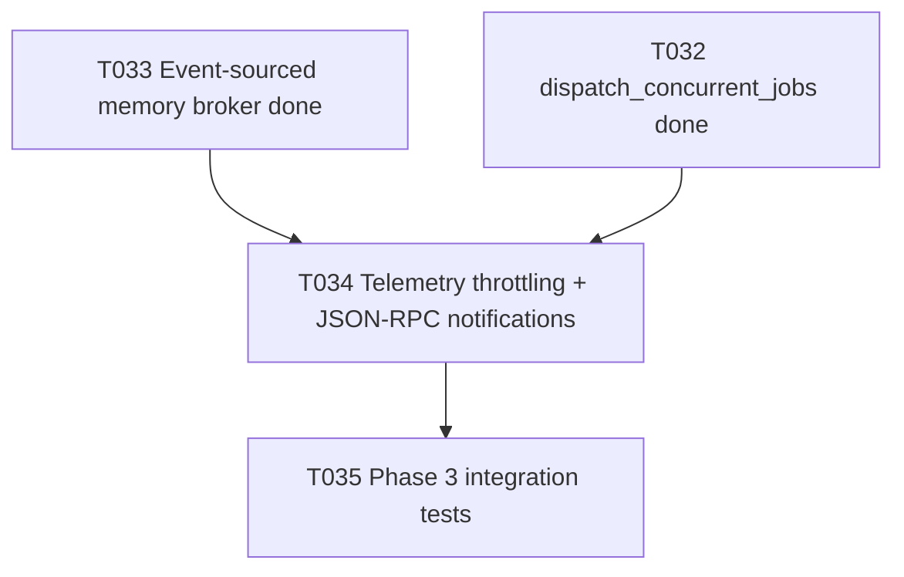

# Plan T034 — Phase 3 Telemetry Throttling + JSON-RPC Notifications

## Goal
Implement T034 by adding a deterministic telemetry-throttling layer that consumes brokered event streams and emits rate-controlled JSON-RPC notifications over SSE, balancing responsiveness and client stability while preserving critical event fidelity.

## Task Graph

## Agent Assignments
- backend-developer:
  Scope: implement topic-aware throttle policies, notification emission bridge, and envelope-safe transformation.
- qa-engineer:
  Scope: validate rate control behavior, critical-event bypass, and SSE notification correctness under burst load.
- tech-lead:
  Scope: review policy design tradeoffs (latency vs suppression) and integration correctness before T035.
- security-engineer:
  Scope: verify payload sanitation and that sensitive fields remain redacted in emitted notifications.

## Artifact Flow
1. backend-developer produces:
   - telemetry throttling module and integration wiring to SSE path
   - tests for policy behavior and regression safety
2. qa-engineer consumes implementation and outputs:
   - burst-load and notification correctness report
3. tech-lead and security-engineer consume implementation + QA results and output:
   - gate conditions for T035 readiness

## Risks And Mitigations
- Risk: over-throttling hides useful progress signals.
  Mitigation: topic policies with terminal-state bypass and minimum guaranteed emission cadence.
- Risk: under-throttling still overloads clients.
  Mitigation: bounded per-topic token-bucket/window limits with explicit suppression counters.
- Risk: policy complexity introduces non-determinism.
  Mitigation: deterministic windowing and testable ordering rules.
- Risk: secret leakage in transformed payloads.
  Mitigation: preserve broker sanitization and add output-level assertions in tests.

## Token Budget Per Slice
- Planning and setup: <= 10k
- Implementation: <= 45k
- QA + focused review: <= 20k
- Fix iteration buffer: <= 20k
- Total T034 slice target: <= 95k

## Immediate Execution Proposal
1. Delegate T034 implementation to backend-developer with [docs/tasks/task-T034.md](../tasks/task-T034.md).
2. Validate with transport/memorybroker regression tests under burst scenarios.
3. Feed final T034 outputs directly into T035 integration test preparation.
