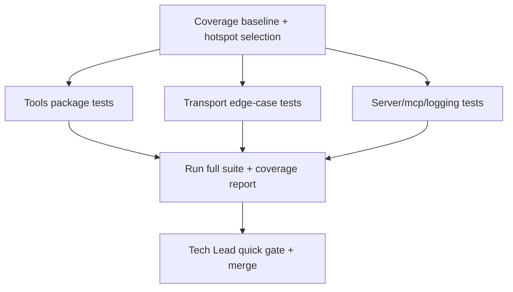

# Plan: T038 Phase 3 Coverage Boost

## Goal
Raise orchestrator Go test coverage from the current baseline (~60.5% local) to a practical pre-Phase-4 target of >=72% by adding deterministic, fast unit tests around low-coverage but high-value packages (`tools`, `transport`, `server`, `mcp`, `logging`) while preserving existing behavior and passing full CI.

## Scope
- **In scope**:
  - Add focused unit tests for untested/under-tested functions in `orchestrator/internal/tools`, `orchestrator/internal/transport`, `orchestrator/internal/server`, `orchestrator/internal/mcp`, and `orchestrator/internal/logging`.
  - Keep tests hermetic (no network side effects, no fragile timing where avoidable).
  - Produce updated coverage measurement from `go test ./... -coverprofile=coverage.out`.
- **Out of scope**:
  - Refactoring business logic solely to chase coverage numbers.
  - Adding integration/e2e suites beyond existing Phase 3 integration coverage.
  - Phase 4 implementation work.
- **Assumptions**:
  - Existing behavior/spec is correct and should be tested, not rewritten.
  - CI timeout budget can absorb expanded unit suite.

## Task graph



## Agent assignments

| Task | Agent | Estimated scope |
|------|-------|-----------------|
| T038A baseline + hotspot map | orchestrator | small |
| T038B tools package unit tests (`registry`, FS metadata/roles, dispatch tool shape) | backend-developer | medium |
| T038C transport edge tests (origin, limiter eviction behavior hooks, auth/headers branches) | backend-developer | medium |
| T038D server/mcp/logging unit tests | backend-developer | medium |
| T038E coverage validation + regression run | qa-engineer | small |
| T038F code review gate | tech-lead | small |

## Artifact flow

```
T038A → hotspot-report-T038.md (consumed by: T038B/T038C/T038D)
T038B → *_test.go updates in internal/tools (consumed by: T038E/T038F)
T038C → *_test.go updates in internal/transport (consumed by: T038E/T038F)
T038D → *_test.go in internal/server/internal/mcp/internal/logging (consumed by: T038E/T038F)
T038E → coverage-T038.txt + pass/fail summary (consumed by: T038F)
T038F → merge-ready verdict
```

## Risks & mitigations

| Risk | Likelihood | Impact | Mitigation |
|------|-----------|--------|-----------|
| Coverage increases slowly despite many tests | Medium | Medium | Prioritize files with largest statement counts first (`tools`, `transport`, `server`) |
| Flaky tests from timing-dependent SSE behavior | Medium | Medium | Use deterministic clocks/hooks where available and bounded waits |
| Overfitting tests to implementation details | Medium | Low | Assert externally visible behavior/contracts, not private internals |
| CI lint/format regressions | Low | Medium | Run `gofmt -l`, `go test ./...`, and coverage checks locally before push |

## Token budget

| Phase | Budget | Spent | Remaining |
|-------|--------|-------|-----------|
| Planning | 80k | ~8k | ~72k |
| Implementation | 120k | 0 | 120k |
| QA / Security | 60k | 0 | 60k |
| Release follow-up | 60k | 0 | 60k |

## Approval

- [ ] User approved on 2026-05-15
- [ ] Plan locked; revisions create `plan-T038-phase3-coverage-boost-v2.md`
