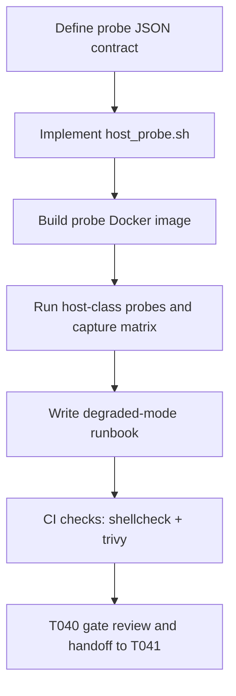

# Plan: T040 phase4 host validation

## Goal
Validate host readiness for Firecracker and gVisor before Phase 4 runtime work begins, producing machine-readable capability output plus operator documentation so the orchestrator can safely choose default sandbox routing at boot without requiring manual host inspection.

## Scope
- **In scope**:
  - Build host capability probe assets under `sandbox/probe/`.
  - Validate KVM, vhost-net, kernel version, runsc availability, and firecracker viability from containerized probe execution.
  - Produce host readiness and degraded-mode artifacts under `docs/artifacts/`.
  - Add CI checks for shellcheck and trivy scan on the probe image.
- **Out of scope**:
  - Implementing runtime sandbox runners (T041-T043).
  - Applying host kernel changes or package installs on bare host.
  - Tier router implementation (T044).
- **Assumptions**:
  - Docker is available in local/dev and CI.
  - Some hosts may not expose `/dev/kvm`; degraded mode must still pass.
  - Probe must run in container context only.

## Task graph



## Agent assignments

| Task | Agent | Estimated scope |
|------|-------|-----------------|
| T040A Contract definition | devops-engineer | small |
| T040B Probe script implementation | devops-engineer | medium |
| T040C Probe image packaging | devops-engineer | small |
| T040D Capability matrix capture/report | devops-engineer | medium |
| T040E Degraded-mode operator runbook | technical-writer | small |
| T040F CI quality/security checks | devops-engineer + security-engineer | medium |
| T040G Review + downstream unblock | tech-lead | small |

## Artifact flow

```
T040A -> sandbox/probe/host_probe.sh contract (consumed by: T040B)
T040B -> sandbox/probe/host_probe.sh (consumed by: T040C, T040D)
T040C -> sandbox/probe/Dockerfile (consumed by: T040F)
T040D -> docs/artifacts/host-readiness-v1.md (consumed by: T041, T042, T043, T044)
T040E -> docs/artifacts/degraded-mode-v1.md (consumed by: T041, T042, T044)
T040F -> CI evidence (shellcheck clean + trivy zero HIGH/CRITICAL) (consumed by: T040G)
T040G -> task status done, unblock T041
```

## Risks & mitigations

| Risk | Likelihood | Impact | Mitigation |
|------|-----------|--------|-----------|
| Host lacks KVM device | High | High | Explicit degraded gVisor-only mode in runbook; mark firecracker_ok false without failing probe execution |
| False positive KVM detection | Medium | High | Validate both device presence and executable probe path; add permission-toggled test for /dev/kvm |
| Probe portability differences across host classes | Medium | Medium | Keep script POSIX-compatible bash and rely on containerized checks only |
| Security drift in probe image | Medium | Medium | Trivy gate in CI with zero HIGH/CRITICAL policy |
| CI environment cannot run privileged checks | Medium | Medium | Capture CI-specific matrix class in readiness report and document known limitations |

## Token budget

| Phase | Budget | Spent | Remaining |
|-------|--------|-------|-----------|
| Planning | 80k | ~10k | ~70k |
| Phase 4 implementation | 120k | ~8k forecast for T040 | ~112k |
| QA/Security | 60k | ~5k forecast for T040 checks | ~55k |

## Validation gates

| Check | Owner | Pass criteria |
|------|-------|---------------|
| Probe output schema | devops-engineer | Valid JSON with required fields on local dev host |
| KVM false-positive test | devops-engineer | Distinguishes accessible vs inaccessible /dev/kvm |
| Shell lint | devops-engineer | shellcheck clean, no warnings |
| Image vulnerability scan | security-engineer | trivy zero HIGH/CRITICAL |
| Task review | tech-lead | PASS to unblock T041 |

## Approval

- [x] User approved on 2026-05-15
- [ ] Plan locked; revisions create `plan-T040-phase4-host-validation-v2.md`
