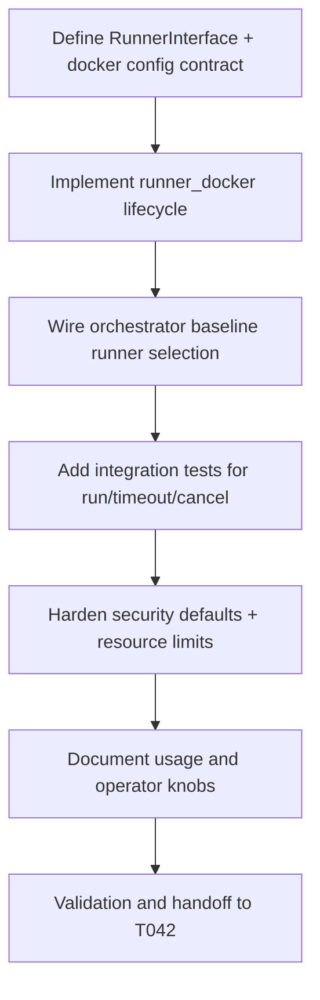

# Plan: T041 phase4 docker baseline runner

## Goal
Implement a production-safe Docker baseline sandbox runner that can execute orchestrator jobs with bounded resources, deterministic lifecycle control, and auditable isolation defaults. This task establishes the trusted baseline runtime needed to unblock gVisor and Firecracker tiers while preserving degraded-mode operability from T040 host readiness outputs.

## Scope
- **In scope**:
  - Create Docker runner implementation under `orchestrator/internal/sandbox/`.
  - Define common `RunnerInterface` and Docker-specific lifecycle (`Prepare`, `Run`, `StreamLogs`, `Cleanup`, `Health`).
  - Add container security defaults, CPU/memory/pid limits, filesystem constraints, and network mode guardrails.
  - Wire runner selection for baseline tier in orchestrator runtime config.
  - Add unit/integration tests for success, timeout, cancellation, and cleanup-on-failure.
  - Document operator config and local validation commands.
- **Out of scope**:
  - gVisor runtime integration (T042).
  - Firecracker runtime + snapshot CoW (T043).
  - Tier routing policy logic beyond baseline default (T044).
- **Assumptions**:
  - Docker daemon is available in local/dev and CI.
  - Local host may not support KVM (from T040) but supports degraded operation.
  - Existing job-runner contracts from Phase 3 remain unchanged.

## Task graph



## Agent assignments

| Task | Agent | Estimated scope |
|------|-------|-----------------|
| T041A Contract definition | devops-engineer + backend-developer | medium |
| T041B Docker runner implementation | devops-engineer | large |
| T041C Runtime wiring | devops-engineer | medium |
| T041D Tests and fixtures | devops-engineer + qa-engineer | medium |
| T041E Security hardening checks | devops-engineer + security-engineer | medium |
| T041F Docs + runbook update | technical-writer | small |
| T041G Review and downstream unblock | tech-lead | small |

## Artifact flow

```
T041A -> orchestrator/internal/sandbox/runner.go contract (consumed by: T041B, T042, T043)
T041B -> sandbox runner implementation + tests (consumed by: T041C, T041E)
T041C -> orchestrator runtime config wiring (consumed by: T041D)
T041D -> integration evidence for baseline execution (consumed by: T041G)
T041E -> hardened defaults and security evidence (consumed by: T042, T044)
T041F -> operator documentation updates (consumed by: T042, T043, T044)
T041G -> task status done, unblock T042
```

## Risks & mitigations

| Risk | Likelihood | Impact | Mitigation |
|------|-----------|--------|-----------|
| Docker socket over-privilege exposure | Medium | High | Use constrained API paths, least-privilege runtime options, no host mounts except explicit read-only workspace bind |
| Container escape via permissive flags | Low | High | Forbid privileged mode, cap-drop all, no-new-privileges, read-only rootfs by default |
| Orphaned containers after cancellation | Medium | Medium | Enforce context cancellation hooks + idempotent cleanup retries |
| Baseline runner latency regressions | Medium | Medium | Add timing assertions in integration tests and collect execution telemetry |
| Drift from degraded-mode assumptions | Low | Medium | Validate baseline works when firecracker_ok=false and document fallback behavior |

## Token budget

| Phase | Budget | Spent | Remaining |
|-------|--------|-------|-----------|
| Planning | 80k | ~12k | ~68k |
| Phase 4 implementation | 120k | ~14k (T040 + T041 planning) | ~106k |
| QA/Security | 60k | 0 | 60k |

## Approval

- [x] Continuation approved on 2026-05-15
- [ ] Plan locked; revisions create `plan-T041-phase4-docker-baseline-v2.md`
