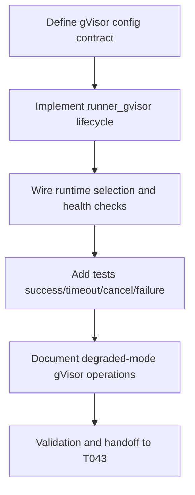

# Plan: T042 phase4 gVisor runner

## Goal
Implement the gVisor sandbox runner so the orchestrator can execute medium-risk workloads in a stronger isolation boundary than Docker baseline, while maintaining low startup latency and compatibility with degraded-mode operation where Firecracker is unavailable.

## Scope
- **In scope**:
  - Add gVisor runner implementation under `orchestrator/internal/sandbox/runner_gvisor.go` aligned to `RunnerInterface`.
  - Configure `runsc` runtime selection and hardened defaults.
  - Wire orchestrator configuration to select gVisor runner.
  - Add tests for execution success, timeout/cancel cleanup, and runtime fallback/error surfacing.
  - Update sandbox operator documentation for gVisor usage.
- **Out of scope**:
  - Firecracker implementation (T043).
  - Tier router policy orchestration (T044).
  - Semantic merge implementation track (T045+).
- **Assumptions**:
  - Docker baseline from T041 is complete and provides contract baseline.
  - Hosts may be degraded (`firecracker_ok=false`) and must still support gVisor pathway.
  - `runsc` may be unavailable in some environments and must fail clearly without breaking Docker path.

## Task graph



## Agent assignments

| Task | Agent | Estimated scope |
|------|-------|-----------------|
| T042A Contract + security defaults | devops-engineer | medium |
| T042B gVisor runner implementation | devops-engineer | large |
| T042C Runtime/config wiring | devops-engineer | medium |
| T042D Test implementation | devops-engineer + qa-engineer | medium |
| T042E Documentation updates | technical-writer | small |
| T042F Handoff and review preparation | tech-lead | small |

## Artifact flow

```
T042A -> gVisor config contract (consumed by: T042B)
T042B -> orchestrator/internal/sandbox/runner_gvisor.go (consumed by: T042C, T042D)
T042C -> config/bootstrap runtime wiring (consumed by: T042D)
T042D -> validation evidence for gVisor behavior (consumed by: T042F)
T042E -> docs/runtime guidance updates (consumed by: T043, T044)
T042F -> task status done, unblock T043
```

## Risks & mitigations

| Risk | Likelihood | Impact | Mitigation |
|------|-----------|--------|-----------|
| `runsc` absent on host/CI | High | High | Add explicit health check and actionable error; keep Docker baseline available fallback |
| Runtime flag mismatch across runsc versions | Medium | Medium | Keep minimal, version-tolerant runtime options and test with mocked API expectations |
| Cleanup leak in cancellation path | Medium | Medium | Reuse deterministic stop->kill->remove pattern from T041 and assert in tests |
| Performance regressions vs target | Medium | Medium | Capture execution timing in tests and logs for later T049 tuning |
| Security drift from hardened defaults | Low | High | Reuse baseline security defaults and enforce via tests |

## Token budget

| Phase | Budget | Spent | Remaining |
|-------|--------|-------|-----------|
| Planning | 80k | ~13k | ~67k |
| Phase 4 implementation | 120k | ~20k (through T042 planning) | ~100k |
| QA/Security | 60k | 0 | 60k |

## Approval

- [x] Continuation approved on 2026-05-15
- [ ] Plan locked; revisions create `plan-T042-phase4-gvisor-runner-v2.md`
