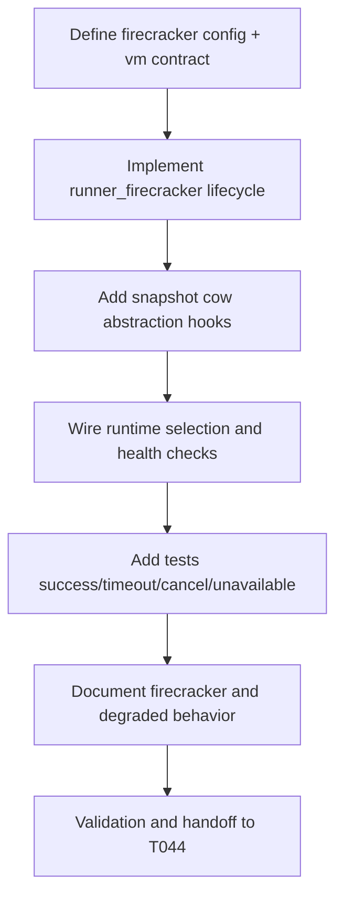

# Plan: T043 phase4 firecracker runner + snapshot cow

## Goal
Implement the Firecracker secure-isolation runner with snapshot copy-on-write lifecycle hooks so untrusted workloads can execute in hardware-isolated microVMs, while preserving deterministic orchestration semantics and allowing degraded fallback behavior when host KVM capabilities are unavailable.

## Scope
- **In scope**:
  - Add Firecracker runner implementation under `orchestrator/internal/sandbox/runner_firecracker.go` conforming to `RunnerInterface`.
  - Define Firecracker runtime config knobs and VM lifecycle contract.
  - Implement baseline microVM launch/execute/collect/cleanup flow with snapshot-aware abstraction points.
  - Add snapshot CoW hooks/interfaces for create-from-template and fast clone path (initial deterministic implementation acceptable).
  - Add tests for success, timeout/cancel cleanup, and KVM/runtime-unavailable failure behavior.
  - Update sandbox runtime docs and operator guidance.
- **Out of scope**:
  - Tier router policy logic (T044).
  - Semantic merge track (T045+).
  - Full production-grade snapshot optimization tuning beyond deterministic baseline.
- **Assumptions**:
  - T040 host capability probing is available for KVM readiness decisions.
  - T041/T042 runner interface and lifecycle semantics are stable.
  - Local/CI environments may not expose KVM; tests must be mock-driven and deterministic.

## Task graph



## Agent assignments

| Task | Agent | Estimated scope |
|------|-------|-----------------|
| T043A Contract + security defaults | devops-engineer + backend-developer | medium |
| T043B Firecracker runner implementation | devops-engineer | large |
| T043C Snapshot CoW hooks | devops-engineer | medium |
| T043D Runtime/config wiring | devops-engineer | medium |
| T043E Test implementation | devops-engineer + qa-engineer | medium |
| T043F Documentation updates | technical-writer | small |
| T043G Handoff and review prep | tech-lead | small |

## Artifact flow

```
T043A -> firecracker contract/config (consumed by: T043B)
T043B -> orchestrator/internal/sandbox/runner_firecracker.go (consumed by: T043C, T043D)
T043C -> snapshot CoW interfaces/hooks (consumed by: T044)
T043D -> config/bootstrap runtime wiring (consumed by: T043E)
T043E -> validation evidence for secure-isolation execution (consumed by: T043G)
T043F -> docs/runtime guidance updates (consumed by: T044, T049)
T043G -> task status done, unblock T044
```

## Risks & mitigations

| Risk | Likelihood | Impact | Mitigation |
|------|-----------|--------|-----------|
| KVM unavailable on dev/CI hosts | High | High | Use explicit health checks and clear runtime-unavailable errors; rely on mock-backed tests |
| Firecracker process lifecycle complexity | Medium | High | Keep strict state machine and deterministic cleanup in all failure paths |
| Snapshot CoW implementation drift | Medium | Medium | Introduce explicit abstraction boundary with testable contract before optimization |
| Security misconfiguration of microVM launch | Low | High | Apply least-privilege defaults and validate launch args in tests |
| Interface mismatch with tier router | Medium | Medium | Keep RunnerInterface compatibility and document expected profile mapping for T044 |

## Token budget

| Phase | Budget | Spent | Remaining |
|-------|--------|-------|-----------|
| Planning | 80k | ~15k | ~65k |
| Phase 4 implementation | 120k | ~32k (through T043 planning) | ~88k |
| QA/Security | 60k | 0 | 60k |

## Approval

- [x] Continuation approved on 2026-05-15
- [ ] Plan locked; revisions create `plan-T043-phase4-firecracker-runner-v2.md`
