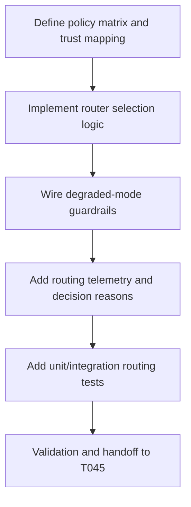

# Plan: T044 phase4 sandbox tier router

## Goal
Implement a server-side sandbox tier router that deterministically maps jobs to Docker, gVisor, or Firecracker runtimes based on trust and host capability signals, while preventing caller-driven privilege escalation and preserving degraded-mode behavior when Firecracker is unavailable.

## Scope
- **In scope**:
  - Add tier-routing logic in orchestrator backend using existing runner contracts.
  - Enforce server-side trust policy mapping from dispatch/create-shadow inputs to runtime selection.
  - Integrate host readiness/degraded-mode awareness for safe fallback behavior.
  - Emit structured routing decisions for observability and later QA verification.
  - Add tests for routing policy, non-escalation enforcement, degraded fallback, and error paths.
- **Out of scope**:
  - Semantic merge engine implementation (T045+).
  - Firecracker runtime internals (already in T043).
  - Release/security gate execution (T050+).
- **Assumptions**:
  - T041-T043 runner backends are complete and stable.
  - Host readiness artifacts may indicate Firecracker unavailable on dev/CI hosts.
  - Existing request schemas already carry sandbox profile hints.

## Task graph



## Agent assignments

| Task | Agent | Estimated scope |
|------|-------|-----------------|
| T044A Policy definition | backend-developer + security-engineer | medium |
| T044B Router implementation | backend-developer | large |
| T044C Degraded-mode integration | backend-developer + devops-engineer | medium |
| T044D Telemetry wiring | backend-developer | medium |
| T044E Tests | backend-developer + qa-engineer | medium |
| T044F Handoff and review prep | tech-lead | small |

## Artifact flow

```
T044A -> routing policy matrix doc/code (consumed by: T044B)
T044B -> router implementation in orchestrator (consumed by: T044C, T044D)
T044C -> degraded/fallback behavior (consumed by: T044E)
T044D -> routing decision telemetry (consumed by: T049)
T044E -> validation evidence and tests (consumed by: T044F)
T044F -> task status done, unblock T045
```

## Risks & mitigations

| Risk | Likelihood | Impact | Mitigation |
|------|-----------|--------|-----------|
| Profile escalation by caller | Medium | High | Enforce server-side policy override and reject unauthorized tier selection |
| Misrouting under degraded hosts | Medium | High | Integrate host readiness checks and explicit fallback matrix |
| Runtime selection ambiguity | Medium | Medium | Emit structured routing reason codes and test matrix |
| Regression in dispatch flow | Low | High | Keep request/response schemas stable and cover with integration tests |
| Security bypass via defaults | Low | High | Default-deny policy for unknown profiles and strict validation |

## Token budget

| Phase | Budget | Spent | Remaining |
|-------|--------|-------|-----------|
| Planning | 80k | ~17k | ~63k |
| Phase 4 implementation | 120k | ~44k (through T044 planning) | ~76k |
| QA/Security | 60k | 0 | 60k |

## Approval

- [x] Continuation approved on 2026-05-15
- [ ] Plan locked; revisions create `plan-T044-phase4-sandbox-tier-router-v2.md`
