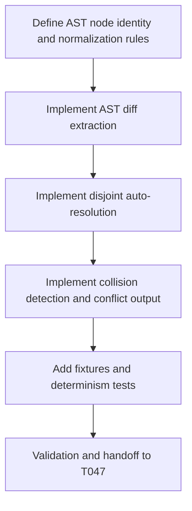

# Plan: T046 phase4 semantic merge algorithm

## Goal
Implement deterministic AST-aware merge logic in `cwso-merge-engine` that can auto-resolve structurally disjoint edits across concurrent workspaces while producing safe, explicit conflict outcomes for irreconcilable node collisions.

## Scope
- **In scope**:
  - Extend merge engine from trivial-case logic to AST-guided diff/merge decisions.
  - Implement language-normalized node matching for Go/Rust/Python/TypeScript using existing parsers.
  - Auto-resolve disjoint structural changes with deterministic output.
  - Keep strict no-corruption behavior with explicit conflict result for unresolved collisions.
  - Add fixtures/tests for disjoint merges, overlapping edits, delete-vs-modify, and rename/usage interactions.
- **Out of scope**:
  - Public tool exposure and orchestrator integration path (T047).
  - Conflict matrix enrichment/output contract (T048).
  - Full multi-workspace N-way merge optimization (post-T048).
- **Assumptions**:
  - T045 IPC and baseline protocol are stable.
  - Tree-sitter parse pipeline is in place for four target languages.
  - Determinism is mandatory for identical inputs.

## Task graph



## Agent assignments

| Task | Agent | Estimated scope |
|------|-------|-----------------|
| T046A Node identity design | backend-developer (Rust) | medium |
| T046B AST diff implementation | backend-developer (Rust) | large |
| T046C Auto-resolution logic | backend-developer (Rust) | large |
| T046D Conflict detection path | backend-developer (Rust) | medium |
| T046E Tests/fixtures | backend-developer + qa-engineer | medium |
| T046F Handoff prep | tech-lead | small |

## Artifact flow

```
T046A -> normalization rules (consumed by: T046B)
T046B -> ast diff primitives (consumed by: T046C, T046D)
T046C -> resolved merged output path (consumed by: T046E)
T046D -> explicit unresolved conflict path (consumed by: T048)
T046E -> validation evidence + determinism results (consumed by: T046F)
T046F -> task status done, unblock T047
```

## Risks & mitigations

| Risk | Likelihood | Impact | Mitigation |
|------|-----------|--------|-----------|
| Language grammar edge cases break normalization | Medium | High | Constrain to robust node categories and fail-safe conflict behavior |
| Nondeterministic merge ordering | Medium | High | Canonical sort and stable traversal order in all merge decisions |
| Silent corruption on overlapping edits | Low | Critical | Default to conflict on uncertainty; never synthesize ambiguous output |
| Performance regressions on large files | Medium | Medium | Keep per-file complexity bounded and add fixture benchmarks |
| Overfitting to one language | Medium | Medium | Shared normalization abstractions and per-language fixture parity |

## Token budget

| Phase | Budget | Spent | Remaining |
|-------|--------|-------|-----------|
| Planning | 80k | ~19k | ~61k |
| Phase 4 implementation | 120k | ~74k (through T046 planning) | ~46k |
| QA/Security | 60k | 0 | 60k |

## Approval

- [x] Continuation approved on 2026-05-15
- [ ] Plan locked; revisions create `plan-T046-phase4-semantic-merge-algorithm-v2.md`
