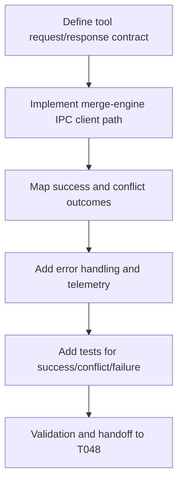

# Plan: T047 phase4 merge_concurrent_results tool

## Goal
Integrate the semantic merge engine into orchestrator tooling by implementing `merge_concurrent_results`, so concurrent workspace outputs can be merged through a deterministic, AST-aware backend with clear success and conflict responses.

## Scope
- **In scope**:
  - Implement/complete `merge_concurrent_results` tool contract in orchestrator.
  - Wire tool execution to `cwso-merge-engine` IPC endpoint.
  - Translate engine responses to stable tool-level JSON output contract.
  - Add observability and error mapping for merge success/failure paths.
  - Add unit/integration tests for successful merge, deferred conflict, and runtime failures.
- **Out of scope**:
  - Conflict matrix enrichment/details (T048).
  - Full swarm end-to-end suite (T049).
  - Release/security gate execution.
- **Assumptions**:
  - T045/T046 merge engine IPC and semantic logic are stable.
  - Shadow workspace metadata needed for merge orchestration is available in current runtime paths.
  - Tool schema may need additive extension only.

## Task graph



## Agent assignments

| Task | Agent | Estimated scope |
|------|-------|-----------------|
| T047A Contract and schema alignment | backend-developer | medium |
| T047B Tool implementation | backend-developer | large |
| T047C Outcome mapping | backend-developer | medium |
| T047D Telemetry/error mapping | backend-developer | medium |
| T047E Test implementation | backend-developer + qa-engineer | medium |
| T047F Handoff prep | tech-lead | small |

## Artifact flow

```
T047A -> tool contract/schema (consumed by: T047B)
T047B -> tool implementation in orchestrator/internal/tools (consumed by: T047C, T047D)
T047C -> stable success/conflict output mapping (consumed by: T048)
T047D -> telemetry/error metadata (consumed by: T049)
T047E -> validation evidence (consumed by: T047F)
T047F -> task status done, unblock T048
```

## Risks & mitigations

| Risk | Likelihood | Impact | Mitigation |
|------|-----------|--------|-----------|
| IPC contract drift between orchestrator and merge-engine | Medium | High | Keep schema strict and add compatibility tests with fixture payloads |
| Conflict responses too sparse for downstream use | Medium | Medium | Preserve error code stability now; enrich structured matrix in T048 |
| Merge runtime failures leak internal details | Low | Medium | Sanitize external error surfaces and keep detailed logs internal |
| Tool contract breaks existing clients | Low | High | Additive schema changes only and backward-compatible defaults |
| Phase 4 token overrun risk | Medium | Medium | Keep implementation focused and defer non-critical enhancements to T048 |

## Token budget

| Phase | Budget | Spent | Remaining |
|-------|--------|-------|-----------|
| Planning | 80k | ~21k | ~59k |
| Phase 4 implementation | 120k | ~90k (through T047 planning) | ~30k |
| QA/Security | 60k | 0 | 60k |

## Approval

- [x] Continuation approved on 2026-05-15
- [ ] Plan locked; revisions create `plan-T047-phase4-merge-concurrent-results-tool-v2.md`
