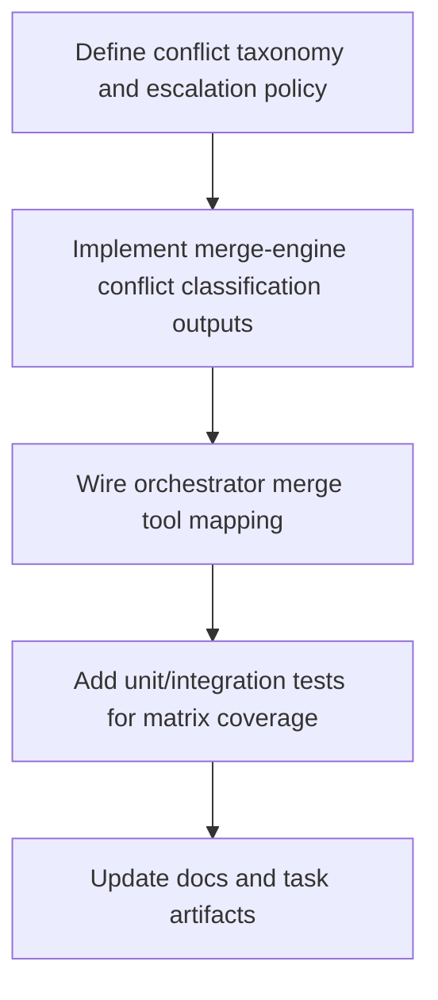

# Plan: T048 Phase 4 Conflict Matrix Escalation

## Goal
T048 will extend the merge flow to deterministically classify merge conflicts into a formal escalation matrix so the orchestrator can route outcomes consistently across auto-resolve, structured conflict, and hard-fail paths. The deliverable should preserve current merge success behavior from T047 while adding explicit, test-backed conflict classes and stable machine-readable metadata that downstream tasks (T049 e2e and release gates) can assert against.

## Task Graph

## Agent Assignments
- @solution-architect (small): confirm taxonomy boundaries and escalation policy shape against architecture-v1.
- @backend-developer (medium): implement Rust merge-engine classification and Go tool mapping.
- @qa-engineer (medium): add/extend tests for all conflict classes and deterministic behavior.
- @tech-lead (small): review implementation against architecture and gate criteria for T048 readiness.

## Artifact Flow
- Input artifacts:
  - docs/tasks/task-T047.md
  - docs/artifacts/architecture-v1.md
  - schemas/merge_concurrent_results.json
  - orchestrator/internal/tools/merge_tools.go
  - services/cwso-merge-engine/src/*
- Produced artifacts:
  - Updated merge conflict taxonomy in merge-engine protocol/model code.
  - Updated orchestrator mapping and error semantics.
  - Test coverage for conflict matrix classes.
  - docs/tasks/task-T048.md (implementation notes + acceptance evidence).
  - docs/checkpoints/checkpoint-016-phase4-t048-complete.md.
- Consumers:
  - T049 Phase 4 swarm e2e suite consumes matrix behavior and test contracts.

## Risks And Mitigations
- Risk: Taxonomy overfitting to current parser capabilities.
  - Mitigation: keep classes minimal and extensible; encode unknown as explicit fallback class.
- Risk: Behavior regression in existing successful merge path.
  - Mitigation: lock current green-path tests and add non-regression assertions.
- Risk: Inconsistent status mapping between Rust sidecar and Go orchestrator.
  - Mitigation: shared fixture-based contract tests across both boundaries.
- Risk: Ambiguous escalation ownership for future classes.
  - Mitigation: document class-to-action table in task/checkpoint artifacts.

## Token Budget Per Phase
- Planning/briefing: 8k
- Implementation/delegation: 32k
- Validation/review gate: 12k
- Documentation/checkpointing: 6k
- Total for T048 cycle: 58k
