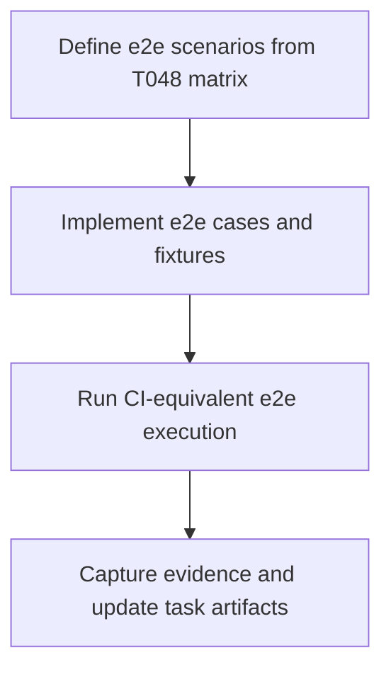

# Plan: T049 Phase 4 Swarm E2E Suite

## Goal
Build and validate a Phase 4 swarm end-to-end suite that exercises conflict-matrix escalation behavior introduced in T048 through realistic orchestrator and merge tool flows. The suite must verify deterministic class/action mappings and protect against regressions in successful merge, conflict, policy rejection, and runtime error paths.

## Task Graph

## Agent Assignments
- @qa-engineer (medium): implement/extend e2e suite for matrix coverage and deterministic assertions.
- @backend-developer (small, consult): clarify expected tool payloads and reason code semantics as needed.
- @tech-lead (small, next gate): consume evidence for T050 review.

## Artifact Flow
- Inputs:
  - docs/tasks/task-T048.md
  - docs/checkpoints/checkpoint-016-phase4-t048-complete.md
  - orchestrator/internal/tools/merge_tools.go
  - services/cwso-merge-engine/src/ipc.rs
  - existing phase2/phase3 integration scripts
- Outputs:
  - Updated/new e2e scripts/tests for conflict matrix flows
  - Validation evidence in task-T049 completion notes
  - Optional schema/assertion fixtures if needed
- Consumer:
  - T050 Phase 4 Tech Lead gate

## Risks And Mitigations
- Risk: Flaky environment-dependent e2e behavior.
  - Mitigation: deterministic fixtures and explicit readiness waits.
- Risk: Assertions drift from actual tool contract.
  - Mitigation: bind assertions to stable reason/class/action fields from T048.
- Risk: Overlap with existing phase2 e2e causing redundant runtime.
  - Mitigation: keep focused matrix scenarios and reuse existing harness utilities.

## Token Budget
- Planning: 6k
- Implementation/delegation: 24k
- Validation and evidence: 12k
- Total: 42k
