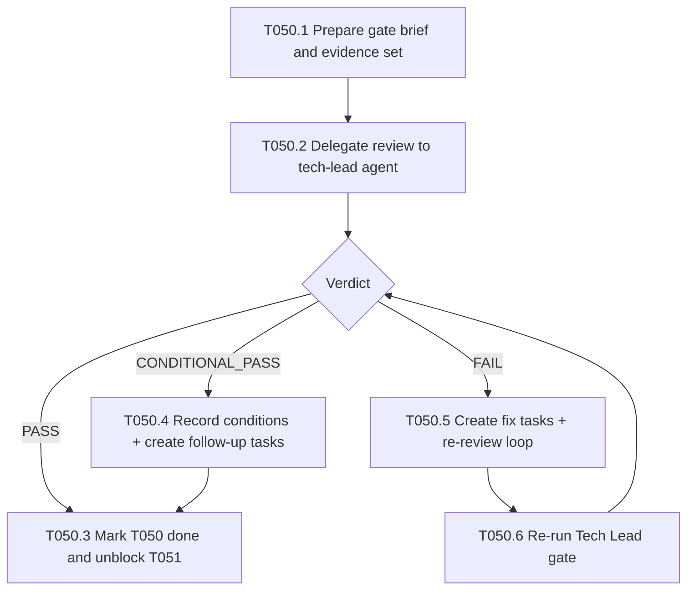

# Plan T050 - Phase 4 Tech Lead Gate

Date: 2026-05-16
Owner: orchestrator
Status: proposed

## Goal
Execute the Phase 4 Tech Lead gate for the recently completed conflict-matrix and swarm e2e work (T048/T049), obtain a formal verdict (PASS, CONDITIONAL_PASS, or FAIL), and either advance the release path to T051 or create concrete remediation tasks with clear ownership and acceptance criteria. This gate confirms implementation quality, architecture alignment, and readiness to proceed to security audit.

## Task graph

## Agent assignments and scope
- orchestrator (this agent): compile evidence, issue delegation brief, update task trackers/checkpoints.
  - Estimated scope: 6k-10k tokens.
- tech-lead: perform implementation-vs-architecture review and return structured verdict.
  - Estimated scope: 12k-20k tokens.
- backend-developer (conditional): only if fixes are required by verdict.
  - Estimated scope: 8k-20k tokens.

## Artifact flow
- Inputs to tech-lead:
  - docs/artifacts/architecture-v1.md
  - docs/tasks/task-T048.md
  - docs/tasks/task-T049.md
  - docs/checkpoints/checkpoint-017-phase4-t049-complete.md
  - Relevant code and CI outcomes for commit 34d25a30
- Output from tech-lead:
  - Review note with VERDICT and findings
- Outputs from orchestrator:
  - docs/tasks/task-T050.md (new)
  - docs/tasks/active-tasks.md (status update)
  - docs/tasks/completed-tasks.md (on completion)
  - docs/checkpoints/checkpoint-018-phase4-t050-complete.md (on completion)

## Risks and mitigations
- Risk: Gate identifies architectural drift not covered by T049 tests.
  - Mitigation: Require explicit mapping of each finding to architecture sections and affected files.
- Risk: Conditional findings are ambiguous and block T051.
  - Mitigation: Convert each condition to a tracked task with owner, acceptance criteria, and dependency.
- Risk: Scope creep in gate review delays release path.
  - Mitigation: Timebox review to Phase 4 deliverables and defer non-critical refactors.

## Token budget
- Planning: 6k (used to prepare this plan and gate brief)
- Execution: 24k (tech-lead review + tracker updates)
- Review loop reserve: 20k (only if FAIL/CONDITIONAL_PASS requires fixes)
- Total reserved for T050 cycle: 50k
