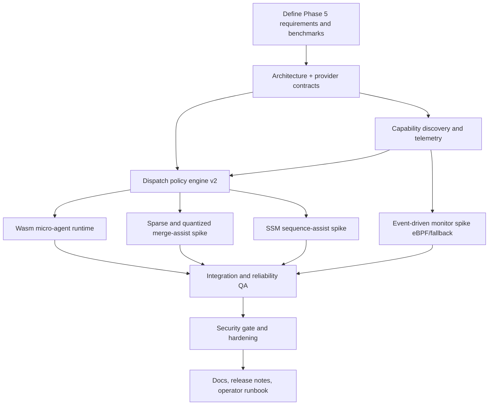

# Plan: T062 Phase 5 Hardware-Aware Roadmap

**Author:** orchestrator
**Date:** 2026-05-22
**Status:** draft

## Goal
Evolve CWSO from a single-path orchestration runtime into a hardware-aware, policy-driven system that can route workloads across heterogeneous execution backends (CPU, GPU, specialized inference endpoints), introduce low-overhead extensibility via Wasm micro-agents, and improve event-driven observability with kernel/user-space signals. Done means we ship a production-safe MVP path for heterogeneous dispatch and Wasm extension points, plus isolated R&D spikes for sparse/quantized inference routing and neuromorphic-style event processing with explicit go/no-go criteria.

## Scope
- **In scope**:
  - Heterogeneous Hardware Dispatcher (HHD) interface and policy engine.
  - Capability discovery and telemetry pipeline for dispatch decisions.
  - Wasm micro-agent runtime for safe, hot-swappable orchestration logic.
  - Event-driven monitoring enhancements (eBPF optional path, non-eBPF fallback).
  - Sparse/quantized and SSM-oriented inference experiments behind feature flags.
  - Release docs for operators: configuration, risk envelope, fallback behavior.
- **Out of scope**:
  - Mandatory dependence on any specific vendor silicon (LPU, photonic, neuromorphic chips).
  - Replacing core CWSO merge semantics or sandbox safety model.
  - Production commitment to research hardware without validation gates.
- **Assumptions**:
  - Existing sidecar architecture (Go orchestrator + Rust services) remains intact.
  - Dispatch can be extended through provider contracts without protocol breakage.
  - Specialized hardware access is initially via external APIs or isolated nodes.

## Hypotheses
H1: Policy-based heterogeneous dispatch improves p95 latency for eligible inference-heavy flows by >= 30% without reducing reliability.

H2: Wasm micro-agents reduce integration lead time for new dispatch/merge heuristics by >= 40% versus rebuilding core binaries.

H3: Event-driven telemetry (eBPF where permitted, fallback hooks otherwise) improves anomaly detection time by >= 50% versus current polling/log-only signals.

H4: Sparse/quantized and SSM-based assistive modules can cut cost-per-decision by >= 25% on targeted workloads while preserving output quality thresholds.

## Task graph



## Agent assignments

| Task | Agent | Estimated scope |
|------|-------|-----------------|
| T062 | product-owner + tech-lead | small |
| T063 | solution-architect | medium |
| T064 | backend-developer + devops-engineer | medium |
| T065 | backend-developer | large |
| T066 | backend-developer | medium |
| T067 | backend-developer + database-engineer | medium |
| T068 | backend-developer | medium |
| T069 | backend-developer + devops-engineer | medium |
| T070 | qa-engineer | medium |
| T071 | security-engineer + tech-lead | medium |
| T072 | technical-writer + release-manager | small |

## Artifact flow

```
T062 -> docs/artifacts/requirements-phase5-hardware-v1.md
        (consumed by: T063, T064, T065)

T063 -> docs/artifacts/architecture-phase5-hhd-v1.md
        docs/decisions/ADR-007-hardware-dispatch-provider-contract.md
        (consumed by: T064, T065, T066, T067, T068, T069)

T064 -> docs/artifacts/capability-telemetry-spec-v1.md
        (consumed by: T065, T069, T070)

T065 -> orchestrator dispatch policy v2 implementation
        schemas and tool contract updates
        (consumed by: T066, T067, T068, T070)

T066 -> Wasm micro-agent runtime module + operator config docs
        (consumed by: T070, T071)

T067 -> sparse and quantized assist spike report
        docs/artifacts/hypothesis-T067-results-v1.md
        (consumed by: T070, T072)

T068 -> SSM assist spike report
        docs/artifacts/hypothesis-T068-results-v1.md
        (consumed by: T070, T072)

T069 -> event-driven monitor spike report (eBPF and fallback)
        docs/artifacts/hypothesis-T069-results-v1.md
        (consumed by: T070, T071, T072)

T070 -> docs/artifacts/qa-phase5-report-v1.md
        (consumed by: T071, T072)

T071 -> docs/artifacts/security-phase5-audit-v1.md
        (consumed by: T072)

T072 -> docs/artifacts/release-v0.2.0-hardware-aware-v1.md
```

## Implementation strategy
1. Build the HHD abstraction first, then plug capabilities and policies into it.
2. Keep every experimental accelerator path behind feature flags and safe fallbacks.
3. Treat neuromorphic and photonic targets as connectors/contracts only in this phase.
4. Enforce parity tests: hardware-aware path must never regress existing correctness.

## Validation gates and success criteria
- Gate A (Post-T065): Dispatch policy correctness and deterministic fallback verified.
- Gate B (Post-T066/T069): Runtime safety and observability overhead within budget.
- Gate C (Post-T070): End-to-end regression suite passes with mixed backend scenarios.
- Gate D (Post-T071): OWASP/security checklist pass for new surfaces.

Success criteria:
- p95 latency improvement >= 30% on benchmarked eligible flows.
- Failure fallback time <= 2 seconds to baseline CPU path.
- No increase in sev-1/sev-2 reliability incidents in staging.
- Wasm extension onboarding time reduced >= 40% for one representative feature.
- At least one of T067/T068 validated with measurable cost or throughput gain.

## Risks and mitigations

| Risk | Likelihood | Impact | Mitigation |
|------|-----------|--------|-----------|
| Vendor claims do not translate to workload gains | medium | high | Benchmark against CWSO-specific traces before adoption decisions |
| eBPF permissions unavailable in some environments | high | medium | Ship fallback user-space event hooks and keep eBPF optional |
| Wasm runtime introduces new attack surface | medium | high | Capability sandboxing, module signing policy, strict host-call allowlist |
| Dispatch policy drift causes non-deterministic behavior | medium | high | Deterministic scoring function + trace logging + replay tests |
| Quantized/sparse outputs degrade merge quality | medium | medium | Human-verified acceptance set + auto-disable on quality threshold breach |
| Neuromorphic/photonic hardware access delay | high | low | Keep as adapter-only R&D track, no release-critical dependency |

## Token budget

| Phase | Budget | Planned usage | Remaining |
|-------|--------|---------------|-----------|
| Planning | 80k | 28k | 52k |
| Architecture | 80k | 42k | 38k |
| Implementation | 120k | 95k | 25k |
| QA / Security / Release | 60k | 46k | 14k |

## Execution policy
- Start execution only after explicit user approval.
- Create tasks `T062` through `T072` in [docs/tasks/active-tasks.md](docs/tasks/active-tasks.md) after approval.
- Run architecture, integration, and security gates before release packaging.
- Maintain HTTPS-only push workflow and continuous GitLab pipeline monitoring.

## Approval
- [ ] User approved on YYYY-MM-DD
- [ ] Plan locked; revisions create `plan-T062-phase5-hardware-aware-roadmap-v2.md`