# Plan: cwso-mega — Concurrent Workspace & Swarm Orchestrator

> **Mega-plan**: covers all 4 phases of the CWSO blueprint in one approved execution unit.
> Phases 1–2 follow **PoC Guidelines** (hypothesis-first, mandatory debt scorecards).
> Phases 3–4 follow **Production Guidelines** (full validation gates, OWASP audit, release readiness).

## Goal
Build the **Concurrent Workspace & Swarm Orchestrator (CWSO)**: a deterministic Go-kernel MCP backend that orchestrates LLM sub-agent swarms inside ephemeral, in-memory Git "Shadow Workspaces" running on tiered microVM sandboxes (gVisor / Firecracker), with semantic AST-based merge reconciliation. "Done" = all four phases delivered, semantic merge demonstrably reconciles parallel agent edits across ≥3 languages, and a containerized swarm of ≥8 concurrent sub-agents executes a multi-file refactor end-to-end without filesystem corruption or context overwrite.

## Scope
- **In scope**: monorepo with Go orchestrator + Rust micro-services (`cwso-merge-engine`, `cwso-git-shadow`); MCP stdio + Streamable HTTP transports; Shadow Workspaces via in-memory Git ODB; AST queries via Tree-sitter; async dispatch with SSE telemetry; tiered sandboxes (Docker/gVisor/Firecracker) with snapshot CoW; semantic AST merge; OWASP audit; release artifacts.
- **Out of scope**: multi-tenant SaaS / billing; commercial LLM client UI; production deployment to cloud (we deliver containerized release artifacts only); distributed multi-host orchestration (single-host swarm only).
- **Assumptions**: Docker available locally (confirmed); KVM available on dev/host for Phase 4 (validated in T040); Go 1.23+, Rust 1.80+; MCP spec pinned to **2025-03-26** for Phases 1–3, **2025-11-25** task semantics evaluated in Phase 4.
- **Decisions made by orchestrator** (per user delegation):
  - **MCP transport spec**: pin to `2025-03-26` (Streamable HTTP) for Phases 1–3; evaluate `2025-11-25` task envelopes during Phase 4 as ADR-007.
  - **Repo layout**: monorepo, Go module at `./orchestrator`, Rust workspace at `./services/`, shared schemas at `./schemas/`.
  - **PoC boundary**: Phases 1–2 = PoC (debt scorecards mandatory); Phase 3 begins with hardening pass (T029) before adding async features.

## Hypotheses (PoC Phases 1–2)

### Phase 1 hypothesis
```
HYPOTHESIS: A Go MCP server using the official go-sdk can serve baseline filesystem
            tools over both stdio and Streamable HTTP transports with p95 < 50ms
            tool-call latency and pass mcp-inspector capability conformance.
VALIDATION: Spin up server in Docker, run mcp-inspector + a synthetic load script
            (1k sequential tool calls).
SUCCESS:    All inspector checks pass; p95 < 50ms over 1k calls.
FAILURE:    Inspector reports protocol violations OR p95 ≥ 100ms.
```

### Phase 2 hypothesis
```
HYPOTHESIS: In-memory Git ODB manipulation (libgit2 via Rust + go-git fallback)
            plus tree-sitter AST queries can support 10 concurrent shadow workspaces
            on a 1k-file repo with workspace creation < 200ms and AST query < 50ms.
VALIDATION: Benchmark harness creating 10 parallel shadow workspaces from a fixture
            repo (1k files, mixed Go/Rust/TS/Py); execute query_ast for each.
SUCCESS:    p95 workspace-create < 200ms; p95 query_ast < 50ms; zero working-tree writes.
FAILURE:    Any physical writes to host working tree OR p95 > 2× targets.
```

## Task graph

```mermaid
graph TD
  %% Phase 0: Foundations
  T001[T001 Requirements] --> T002[T002 Architecture v1 + ADRs]
  T002 --> T003[T003 Monorepo scaffold]
  T002 --> T004[T004 Security baseline]
  T003 --> T005

  %% Phase 1: MVP Sync Server (PoC)
  subgraph P1[Phase 1 - PoC: Sync MCP Server]
    T005[T005 Go MCP server core] --> T006[T006 Baseline FS tools]
    T006 --> T007[T007 Streamable HTTP transport]
    T007 --> T008[T008 JWT + Origin validation]
    T008 --> T009[T009 Phase 1 test harness]
  end
  T004 --> T008
  T009 --> T010[T010 Phase 1 review gate]
  T010 --> T011[T011 Phase 1 debt scorecard]

  %% Phase 2: Shadow Workspaces + AST (PoC)
  T011 --> T020
  subgraph P2[Phase 2 - PoC: Shadow Workspaces + AST]
    T020[T020 cwso-git-shadow Rust crate] --> T021[T021 OverlayFS bind mount layer]
    T021 --> T022[T022 create_shadow_workspace tool]
    T020 --> T023[T023 gotreesitter integration]
    T023 --> T024[T024 query_ast tool + Unified Symbol Protocol]
    T024 --> T025[T025 Merkle-hash incremental indexer]
    T022 --> T026[T026 Phase 2 bench + test harness]
    T025 --> T026
  end
  T026 --> T027[T027 Phase 2 review gate]
  T027 --> T028[T028 Phase 2 debt scorecard]

  %% Phase 3: Async + SSE (Production)
  T028 --> T029[T029 PoC-debt remediation pass]
  T029 --> T030
  subgraph P3[Phase 3 - Production: Async Dispatch + SSE]
    T030[T030 Streamable HTTP full duplex SSE] --> T031[T031 Async job runner pool]
    T031 --> T032[T032 dispatch_concurrent_jobs tool]
    T032 --> T033[T033 Event-sourced memory broker]
    T033 --> T034[T034 Telemetry throttling + JSON-RPC notifications]
    T034 --> T035[T035 Phase 3 integration tests]
  end
  T035 --> T036[T036 Tech Lead gate] --> T037[T037 Security gate]

  %% Phase 4: Sandboxes + Semantic Merge (Production)
  T037 --> T040
  subgraph P4[Phase 4 - Production: Swarm Sandboxes + Semantic Merge]
    T040[T040 KVM/Firecracker host validation] --> T041[T041 Docker baseline runner]
    T041 --> T042[T042 gVisor runner]
    T042 --> T043[T043 Firecracker runner + snapshot CoW]
    T043 --> T044[T044 Sandbox tier router]
    T044 --> T045[T045 cwso-merge-engine Rust crate]
    T045 --> T046[T046 AST diff + semantic merge algorithm]
    T046 --> T047[T047 merge_concurrent_results tool]
    T047 --> T048[T048 Conflict matrix escalation]
    T048 --> T049[T049 Phase 4 swarm e2e suite]
  end
  T049 --> T050[T050 Tech Lead gate]
  T050 --> T051[T051 OWASP Top-10 security audit]
  T051 --> T052[T052 Release manager: changelog + v0.1.0 artifacts]
  T052 --> T053[T053 Final checkpoint + budget variance]
```



## Agent assignments

| Task | Agent role | Scope |
|------|-----------|-------|
| T001 | product-owner | small |
| T002 | solution-architect | large |
| T003 | devops-engineer | medium |
| T004 | security-engineer | small |
| T005–T009 | backend-developer | medium each |
| T010 | tech-lead (review) | small |
| T011 | backend-developer | small |
| T020–T022 | backend-developer (Rust) | medium each |
| T023–T025 | backend-developer (Go) | medium each |
| T026 | qa-engineer | medium |
| T027 | tech-lead (review) | small |
| T028 | backend-developer | small |
| T029 | backend-developer | medium |
| T030–T034 | backend-developer (Go) | medium–large |
| T035 | qa-engineer | medium |
| T036 | tech-lead (review) | small |
| T037 | security-engineer (review) | small |
| T040 | devops-engineer | small |
| T041–T044 | devops-engineer + backend-developer | large total |
| T045–T048 | backend-developer (Rust) | large |
| T049 | qa-engineer | large |
| T050 | tech-lead (review) | small |
| T051 | security-engineer | medium |
| T052 | release-manager | small |
| T053 | orchestrator | small |

## Artifact flow

```
T001 → requirements-v1.md
T002 → architecture-v1.md, ADR-001..006
T003 → monorepo skeleton, docker-compose.yml, Makefile, CI
T004 → security-baseline-v1.md
P1   → orchestrator/ (Go MCP server), test-report-phase1-v1.md, POC-DEBT-SCORECARD-phase1.md
P2   → services/cwso-git-shadow/, orchestrator/internal/ast/, POC-DEBT-SCORECARD-phase2.md
P3   → orchestrator async runtime, event-sourced memory, integration-report-phase3-v1.md
P4   → services/cwso-merge-engine/, sandbox runners, e2e-report-phase4-v1.md, security-audit-v1.md, CHANGELOG.md, v0.1.0 artifacts
```

## Risks & mitigations

| Risk | Likelihood | Impact | Mitigation |
|------|-----------|--------|-----------|
| Scope explosion across 4 phases in single plan | High | High | Strict phase gates; review must PASS before next phase begins; checkpoint at each gate |
| Firecracker requires KVM; some dev hosts lack it | Medium | High | T040 validates host capability up-front; fallback to gVisor-only mode documented |
| MCP spec churn (2025-03-26 → 2025-11-25) | Medium | Medium | Pin Phases 1–3; ADR-007 in Phase 4 evaluates upgrade |
| Cross-language semantic merge correctness | High | High | Per-language test corpus; conflict-matrix escalation always available as fallback |
| Prompt injection / sandbox escape | High | Critical | Immutable security constraints enforced; untrusted code only in Firecracker; OWASP gate before release |
| PoC debt accumulation poisoning Phase 3 | Medium | High | Mandatory T029 hardening pass before async work begins |
| Token budget exhaustion in Phase 4 | Medium | Medium | Checkpoint compression at each gate; fresh context per task |

## Token budget

| Phase | Budget | Spent | Remaining |
|-------|--------|-------|-----------|
| Planning (T001–T004) | 80k | — | — |
| Phase 1 (T005–T011) | 120k | — | — |
| Phase 2 (T020–T028) | 120k | — | — |
| Phase 3 (T029–T037) | 120k | — | — |
| Phase 4 (T040–T053) | 180k | — | — |
| QA / Security / Release | 60k | — | — |

## Validation gates

| Gate | After | Reviewer | Verdict required to proceed |
|------|-------|----------|----------------------------|
| Architecture | T002 | tech-lead + security-engineer | PASS |
| Phase 1 review | T009 | tech-lead | PASS / CONDITIONAL_PASS |
| Phase 2 review | T026 | tech-lead | PASS / CONDITIONAL_PASS |
| Hardening | T029 | tech-lead | PASS |
| Phase 3 integration | T035 | tech-lead → security | PASS |
| Phase 4 swarm e2e | T049 | tech-lead | PASS |
| Release security | T051 | security-engineer | PASS (no CRITICAL/HIGH) |
| Release readiness | T052 | release-manager | PASS |

## Approval

- [x] User approved (mega-plan, monorepo, PoC-then-harden, orchestrator decides spec) — 2026-05-10
- [ ] Plan locked; revisions create `plan-cwso-mega-v2.md`
