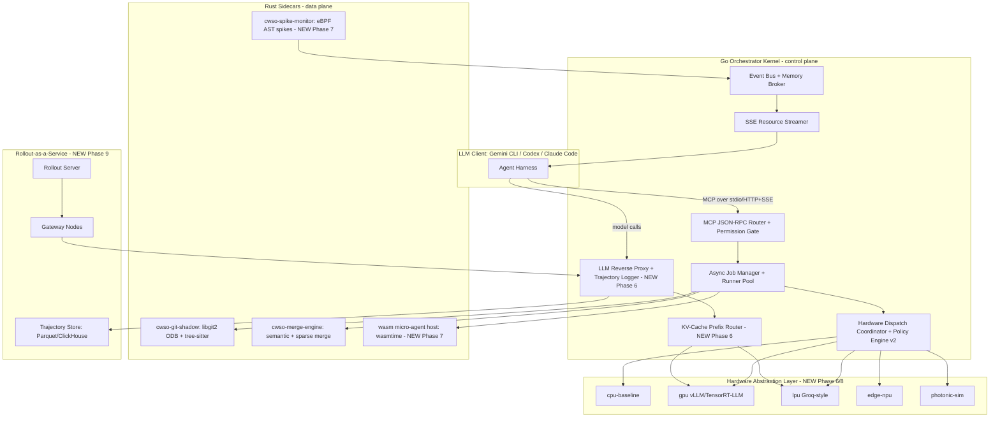
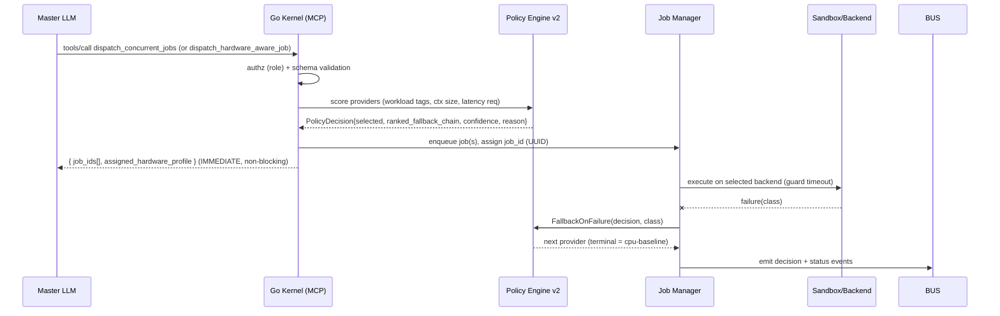
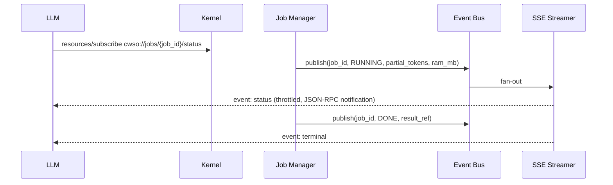
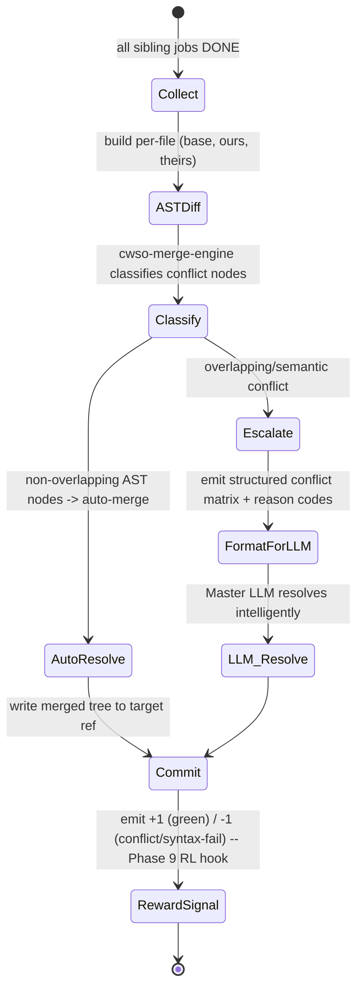

# CWSO Next-Gen Architectural Blueprint — v1

> Owner: orchestrator (Principal Architect role) · Status: proposed
> Based on: `input/CWSO System Architect Prompt.pdf`, `input/CWSO Next-Gen Features.pdf`,
> `input/CWSO RL & Rollout Features.pdf`, `input/NVIDIA Polar.pdf`,
> `docs/archive/artifacts/architecture-v1.md`, `docs/archive/artifacts/architecture-phase5-hhd-v1.md`,
> `docs/archive/decisions/ADR-001..ADR-007`, current `develop` source tree at `v0.2.0-rc1`.
> Audience: implementers. Every feature section is written to be directly buildable.

---

## 0. Current State of Implementation (as-built @ `v0.2.0-rc1`)

CWSO is **not greenfield**. The original architect prompt (Phase 1 sync server → Phase 4
containerized swarm) is already delivered and released. This blueprint therefore (a) documents
the as-built system so the foundation is unambiguous, and (b) defines the Next-Gen (Phase 6+)
roadmap that turns CWSO from a *software orchestrator* into a *hardware-aware, self-improving
agent hypervisor*.

### 0.1 What exists today

| Layer | Component | Path | State |
|-------|-----------|------|-------|
| Go kernel | MCP server (hand-rolled subset, spec `2025-03-26`) | `orchestrator/internal/mcp`, `internal/server` | done |
| Transport | stdio + Streamable HTTP + full-duplex SSE | `orchestrator/internal/transport` | done |
| Auth | HS256 JWT, Origin allowlist, `application/json` enforcement, security headers | `internal/transport`, `internal/config` | done |
| Tools | `fs_tools`, `shadow_tools`, `dispatch_tools`, `merge_tools` | `orchestrator/internal/tools` | done |
| Concurrency | async job runner pool + job manager | `internal/jobs` | done |
| Eventing | event bus + event-sourced memory broker | `internal/eventbus`, `internal/memorybroker` | done |
| Git layer | Rust `cwso-git-shadow` sidecar — in-memory libgit2 ODB, tree-sitter AST | `services/cwso-git-shadow` | done |
| AST | 4 languages (Go, Rust, Python, TypeScript) over `query_ast` | `services/cwso-git-shadow/src/ast.rs` | done |
| Merge | Rust `cwso-merge-engine` — semantic AST merge + conflict classes | `services/cwso-merge-engine` | done |
| Sandbox | Docker / gVisor / Firecracker runners + tier router | `orchestrator/internal/sandbox` | done |
| HHD (Phase 5) | capability registry, policy engine v2, telemetry, anomaly monitor (eBPF), Wasm scoring plugin | `orchestrator/internal/dispatch` | done (flagged off) |
| Assist spikes | sparse/quantized assist (T067), SSM sequence-assist (T068) | `internal/dispatch/policy_engine_v2.go` | **spike only** |

### 0.2 What Phase 5 already proves (critical — avoids re-building)

The four "next-gen" research features from `CWSO Next-Gen Features.pdf` are **partially prototyped**
inside the dispatch package as *deterministic scoring assists*, not yet as real hardware backends:

- **Feature A (Heterogeneous Hardware Dispatcher)** → `PolicyEngineV2.Select()` already ranks
  providers by `(score desc, health, reliability, provider_id)` with a CPU-baseline terminal
  fallback and a versioned `dispatch.provider/v1` contract. **The routing brain exists; the
  hardware adapters (LPU/GPU/photonic-sim/edge-NPU) do not.**
- **Feature B (Ephemeral Wasm micro-agents)** → `wasm_scoring_plugin.go` runs sandboxed Wasm
  with SHA-256 module pinning, host-call allowlist, memory-page + timeout limits. **Today Wasm
  only scores routing decisions; it does not yet host an inference micro-agent.**
- **Feature C (Spiking AST monitors)** → `anomaly_monitor.go` already has an eBPF-hook path with
  explicit *advisory* latency semantics and a userspace fallback. **It detects dispatch anomalies,
  not yet semantic AST write-spikes.**
- **Feature D (Semantic Sparse-Merging)** → the merge engine is text/AST-node based today; the
  sparse-tensor/SIMD vectorized path is **not** built.

So Next-Gen work is **promotion of spikes → production + new backends**, not invention from zero.

### 0.3 Release status

`v0.2.0-rc1` is tagged. GA gate (`T079`) is the only open task, blocked on external stakeholder
acceptance + soak/rollback evidence. Next-Gen work should branch from `develop` and **must not**
destabilize the RC; all new capabilities ship default-off behind feature flags (the established
`CWSO_HHD_*` pattern).

---

## 1. System Architecture

### 1.1 Stack decision: Go kernel + Rust sidecars (retained and reaffirmed)

The as-built split is correct and should be preserved. The decision rationale, restated for
Next-Gen:

| Concern | Language | Why |
|--------|----------|-----|
| MCP protocol, JSON-RPC, transport, job scheduling, orchestration policy | **Go** | Best-in-class goroutine concurrency for thousands of in-flight jobs + SSE fan-out; fast GC; simple deployment; deterministic control plane. |
| Git ODB manipulation, AST parsing, semantic merge, SIMD math, Wasm host | **Rust** | `libgit2`/`gix`, `tree-sitter`, zero-copy parsing, `wasmtime`, `std::simd`/AVX-512 intrinsics, no GC pauses on the hot data plane. |
| Inference micro-agents (Next-Gen) | **Rust (host) + Wasm (guest)** | `wasmtime` for <5 ms cold-start sandboxes; quantized kernels compiled to Wasm or called via FFI. |

**Boundary contract:** Go ↔ Rust communicate over **framed-JSON Unix Domain Sockets** (length-prefixed,
peer-credential authorized — already hardened in T058). Next-Gen high-throughput paths (trajectory
streaming, KV-cache routing) add a **second binary IPC channel** (Protobuf/Arrow over UDS or shared
memory) to avoid JSON overhead on hot data — see §5.



### 1.2 Container / sandbox orchestration

Retained tiered model (ADR-003) with a new **fourth tier** for ultra-light agents:

| Tier | Backend | Cold start | Use |
|------|---------|-----------|-----|
| T0 (NEW) | **Wasm module (`wasmtime`/`wazero`)** | **< 5 ms** | Deterministic micro-agents (rename, add types, lint-fix), routing scorers. |
| T1 | gVisor (`runsc`) | ~150–300 ms | Fast ephemeral workers, trusted-ish code. |
| T2 | Firecracker microVM + snapshot CoW | ~125 ms restore | Untrusted sub-agent code execution. |
| T3 | Docker | seconds | Heavyweight builds, RL runtime images, evaluators. |

Orchestration is **not** Kubernetes for the inner loop (too slow for ephemeral swarms). It is the
in-process Go runner pool + sandbox tier router (already built). K8s/Nomad is used only for
**outer-loop horizontal scaling** of Rollout Gateway nodes (Phase 9), mirroring Polar's
gateway-node fleet.

### 1.3 Git tree manipulation layer (Shadow Workspaces)

Unchanged core (ADR-004 in-memory ODB): each shadow workspace is an **ephemeral libgit2 branch
in an in-memory ODB**, never touching the user's working tree. Sub-agents commit into their own
branch ref; merges happen server-side. Next-Gen adds:

- **Sparse working sets** — workspaces materialize only AST nodes touched by their task (Feature D
  groundwork), so 50 parallel agents on one repo share one immutable base tree + per-agent deltas.
- **Copy-on-write tree sharing** — the base commit's tree object is shared by reference across all
  sibling workspaces; only modified subtrees are duplicated.

### 1.4 MCP JSON-RPC interface

Retained: JSON-RPC 2.0, `tools/list`, `tools/call`, `resources/*`, permission tiers
(`orchestrator` vs `worker`) enforced in the router (`registry.go: Authorized`). Next-Gen adds
new tools (§3) and new **MCP Resources** (SSE) for spikes and rollout status, plus a **non-MCP
side API** (REST/gRPC) for the RL rollout service (Polar-style; §5) because RL trainers are not
MCP clients.

---

## 2. Core Workflows

### 2.1 Fire-and-Forget Dispatch (as-built, hardware-aware extension)



The LLM never blocks. It receives `job_id`s instantly and polls or subscribes via SSE.

### 2.2 Background Processing & Real-Time Streaming



Telemetry is throttled (T034) to avoid flooding the model context. Next-Gen streams **live RAM +
token-generation rate** of Wasm micro-agents (Feature B) and **semantic spikes** (Feature C) over
the same channel.

### 2.3 Merge & Resolution Loop (as-built + sparse extension)



Determinism principle (ADR-006): the engine **never guesses** semantics; it auto-resolves only
provably non-overlapping AST edits and otherwise produces a machine-readable conflict matrix for
the LLM. Next-Gen adds the **sparse-tensor diff** (Feature D) as a faster pre-filter and the
**reward emission** hook (Feature G).

---

## 3. API & Tool Definitions

These are the canonical schemas. As-built schemas live in `schemas/*.json`; Next-Gen additions
are marked **NEW** and should be added as sibling files.

### 3.1 `query_ast` (as-built)

```json
{
  "title": "query_ast",
  "inputs": {
    "query_type": "find_definition | find_references | extract_signature | list_exports | detect_entrypoints",
    "target_symbol": "string (required)",
    "language_context": "go | rust | python | typescript (optional)",
    "path_filter": "glob string (optional)"
  },
  "outputs": {
    "matches": [
      { "path": "string", "language": "string", "start": {"line": 0, "col": 0},
        "end": {"line": 0, "col": 0}, "node_kind": "string", "signature": "string", "snippet": "string" }
    ],
    "unified_symbol": { "fqname": "string", "kind": "string", "visibility": "string" },
    "epoch": "u64 (index epoch for cache coherence)"
  }
}
```

### 3.2 `create_shadow_workspace` (as-built)

```json
{
  "title": "create_shadow_workspace",
  "inputs": {
    "base_commit_sha": "^[a-f0-9]{7,40}$ (optional; defaults to HEAD)",
    "sandbox_profile": "gvisor-fast-ephemeral | firecracker-secure-isolation (required)",
    "injected_memory_context": ["string"]
  },
  "outputs": { "workspace_uuid": "uuid", "branch_ref": "string", "base_tree_oid": "string" }
}
```

### 3.3 `dispatch_concurrent_jobs` (as-built) + `dispatch_hardware_aware_job` (NEW)

As-built `dispatch_concurrent_jobs` stays for backward compatibility. The NEW tool adds autonomous
hardware routing (Feature A):

```json
{
  "title": "dispatch_hardware_aware_job",
  "inputs": {
    "task_description": "string (required)",
    "context_size_estimate": "integer tokens (required) — drives SSM vs LPU routing",
    "latency_requirement": "realtime | batch (required)",
    "workload_tags": ["string"],
    "target_workspace_uuid": "uuid (optional)",
    "hardware_target_hint": "auto | lpu | gpu | photonic_sim | edge_npu | wasm_local (default auto)",
    "quality_floor": "number 0..1 (optional; guards 1.58-bit routing)"
  },
  "outputs": {
    "job_id": "uuid",
    "assigned_hardware_profile": {
      "selected_provider": "string",
      "ranked_fallback_chain": ["string"],
      "policy_version": "string",
      "capability_epoch": "u64",
      "confidence": "number",
      "reason_code": "string"
    }
  }
}
```

Internal logic (already 80% present in `policy_engine_v2.go`): LPU for realtime+small context,
SSM/Mamba backend for huge context, Wasm-local for batch deterministic edits, dense GPU model for
high-complexity/low-quality-floor tasks.

### 3.4 `merge_concurrent_results` (as-built)

```json
{
  "title": "merge_concurrent_results",
  "inputs": {
    "source_workspace_uuids": ["uuid (>=2)"],
    "target_branch_ref": "string (default main)",
    "auto_resolve_heuristic": "ast_semantic_only | prefer_theirs | prefer_ours | fail_rapidly_on_conflict",
    "merge_inputs": [ { "path": "string", "language": "go|rust|python|typescript",
                       "base_content": "string", "ours_content": "string", "theirs_content": "string" } ]
  },
  "outputs": {
    "status": "merged | conflicts_escalated",
    "merged_tree_oid": "string",
    "conflict_matrix": [ { "path": "string", "node_path": "string", "conflict_class": "string",
                           "reason_code": "string", "ours": "string", "theirs": "string" } ]
  }
}
```

### 3.5 `create_ephemeral_sparse_agent` (NEW — Feature B)

```json
{
  "title": "create_ephemeral_sparse_agent",
  "inputs": {
    "target_ast_node": "string e.g. 'Class: DatabaseConnector'",
    "skill_domain": "string e.g. 'react-hooks' (selects pruned weight slice)",
    "quantization": "1.58-bit | int4 | int8 (default 1.58-bit)",
    "max_ram_mb": "integer (default 512)"
  },
  "outputs": {
    "wasm_agent_id": "uuid",
    "cold_start_ms": "number (SLO < 10ms)",
    "resident_ram_mb": "number",
    "stream_resource": "cwso://agents/{wasm_agent_id}/telemetry"
  }
}
```

### 3.6 `subscribe_ast_spikes` (NEW — Feature C)

```json
{
  "title": "subscribe_ast_spikes",
  "inputs": {
    "path": "string (file or glob)",
    "semantic_threshold": "signature_change | symbol_added | symbol_removed | any (default signature_change)",
    "workspace_scope": ["uuid"]
  },
  "outputs": { "subscription_id": "uuid", "stream_resource": "cwso://spikes/{subscription_id}" }
}
```

Emits SSE events **only** when a semantic threshold is crossed (zero CPU at rest — neuromorphic
event-driven principle). Event payload: `{ workspace_uuid, path, node_path, spike_kind,
potential_conflict_with: [uuid], confidence }`.

### 3.7 Rollout Service API (NEW — Polar-style, REST/gRPC, non-MCP) — §5

```
POST /rollout/task/submit        -> { task_id }            (non-blocking; prewarms KV-cache)
GET  /rollout/task/{task_id}     -> { status, partial_results, trajectories[] }
GET  /rollout/status             -> { nodes[], vram_util, cache_hit_rate, pending_sessions }
POST /callbacks/session_result   -> gateway -> trainer callback
POST /nodes/register | /nodes/{id}/heartbeat
/v1/chat/completions             -> transparent provider-compatible proxy (capture boundary)
```

---

## 4. Research Integration — Efficiency & Novel Hardware

Source: `CWSO Next-Gen Features.pdf` + domain analysis of sparse models, 1.58-bit quantization
(BitNet), State-Space Models (Mamba/Jamba), neuromorphic (Loihi/SNN), photonic computing, and LPUs
(Groq). Each feature below is specified for implementation, with explicit promotion path from the
existing Phase 5 spikes.

### Feature A — Heterogeneous Hardware Dispatcher (HHD) → production

**Goal:** route each task to the most efficient backend by tensor profile, not "one LLM for all".

**Build on:** `dispatch/policy_engine_v2.go` (scoring exists), `capability_registry.go` (provider
contract exists). What's missing is **real provider adapters** behind a Hardware Abstraction Layer.

**Implementation:**
1. **HAL trait in Rust** (`services/cwso-hal`): `trait InferenceBackend { fn capabilities() ->
   ProviderCapability; fn infer(req) -> Result<Completion, FailureClass>; fn health() -> Health; }`.
   Backends loaded as **dynamic plugins** (`.so`) or out-of-process adapters over UDS. If a backend
   is absent/unhealthy → transparent fallback to CUDA/Metal GPU → CPU baseline (already implemented
   in `FallbackOnFailure`).
2. **Profiling layer (Go):** attach a `tensor_tag` to each task: `{ ctx_tokens, expected_output,
   logic_complexity, latency_class }`. Map to provider `supported_workload_tags`.
3. **Routing matrix:**
   - simple syntax fix, realtime → **LPU adapter** (Groq-style deterministic low-latency API).
   - 100k-line codebase analysis → **SSM/Mamba adapter** (linear context scaling, no OOM).
   - batch lint/type-fix → **Wasm-local micro-agent** (Feature B).
   - architecture decisions / low quality floor → **dense GPU model** (vLLM/TensorRT-LLM).
4. **Determinism:** routing stays in the Go control plane (stable sort + reason codes), never in
   the model — this is the project's core "deterministic orchestration" thesis.

**SLOs (inherited from Phase 5 NFRs):** dispatch overhead p95 ≤ 10 ms; detection→fallback ≤ 2.0 s.

### Feature B — Ephemeral Wasm Micro-Agents (1.58-bit quantized)

**Goal:** replace heavy container sub-agents (2–3 s cold start) with Wasm micro-agents (< 5 ms) for
small deterministic tasks; keep them resident in CPU RAM.

**Build on:** `wasm_scoring_plugin.go` (wasmtime host + SHA-256 pinning + host-call allowlist +
memory/time envelope already exist — reuse the security envelope verbatim).

**Implementation:**
1. **Inference-in-Wasm:** compile a 1.58-bit (BitNet b1.58 ternary {-1,0,+1}) inference kernel to
   Wasm (or call a native ternary GEMM via a tight host-call allowlist). Weights for a domain skill
   (e.g. "react-hooks") are an **unstructured-pruned slice** of a base model, packed as a resource.
2. **`wazero` (Go) for the control-side scorers, `wasmtime` (Rust) for the data-side inference host.**
3. **Lifecycle:** `create_ephemeral_sparse_agent` → host maps pre-loaded ternary weights (mmap, COW)
   → instantiates module → returns `wasm_agent_id` with measured `cold_start_ms`. Target < 10 ms.
4. **Resource streaming:** stream `resident_ram_mb` + `tokens_per_sec` over SSE (reuse §2.2).
5. **Guardrail:** Wasm micro-agents are restricted to deterministic small tasks (rename, add types).
   Quality-floor breach → auto-escalate to a dense model on GPU (reuse the existing
   `quality_guardrail_autodisable` reason path in `policy_engine_v2.go`).

### Feature C — Event-Driven "Spiking" AST Monitors (neuromorphic principle)

**Goal:** eliminate polling. Monitoring threads consume **zero CPU at rest** and only "fire" on
semantically relevant AST writes (Spiking Neural Network analogy).

**Build on:** `anomaly_monitor.go` (eBPF-hook path + advisory latency semantics + userspace fallback
already exist — generalize from dispatch anomalies to AST write-spikes).

**Implementation:**
1. **eBPF hooks (Linux)** on writes to shadow-workspace ODB pages / file events (`fanotify`/`inotify`
   fallback for non-eBPF hosts — the fallback pattern is already implemented).
2. **Spike filter:** on a write-spike, a tiny sparse mini-model (a Wasm micro-agent from Feature B)
   evaluates in microseconds whether the edit changes a function signature / symbol surface — i.e.
   could it semantically conflict with a sibling agent's workspace?
3. **Sleep mode:** no relevant spikes ⇒ no polling loop ⇒ no CPU. This is the energy story
   (neuromorphic "spike or sleep").
4. **MCP surface:** `subscribe_ast_spikes(path, semantic_threshold)` emits SSE only past threshold.
5. **Feeds the merge loop:** early spike detection lets the orchestrator pre-warn agents of imminent
   conflicts before `merge_concurrent_results` is even called.

### Feature D — Semantic Sparse-Merging (SSM) with photonic-readiness

**Goal:** speed up merges by representing code as **sparse AST tensors** and mathematically ignoring
unchanged regions (the "zeros").

**Build on:** `cwso-merge-engine` (AST-node merge exists) — add a vectorized sparse pre-filter.

**Implementation:**
1. **Sparse AST encoding:** convert each file's AST to a sparse representation keyed by node identity;
   unchanged subtrees (shared base OID) are structural zeros and skipped entirely.
2. **Vectorized diff:** compute node-level diffs as vector ops. Today: **Rust `std::simd` / AVX-512**
   intrinsics. Design the kernel as a pure `fn(sparse_a, sparse_b) -> diff` with **no I/O**, so it is
   **photonic-ready** — the same vector-multiply kernel can later target an optical/photonic
   co-processor (excellent at matrix/vector multiply) via the HAL (Feature A) with zero algorithm
   changes.
3. **Determinism preserved:** the sparse path is only a *faster pre-filter*; final conflict
   classification still uses the deterministic AST rules (ADR-006). Sparse and dense paths must
   produce identical conflict matrices (conformance test).

---

## 5. NVIDIA Polar — Assessment & RL/Rollout Integration (Phase 6/9)

### 5.1 Verdict: **Highly relevant. Adopt the architecture; do not adopt it as-is.**

Polar (`arXiv:2605.24220`) is a rollout framework for *asynchronous RL over arbitrary agent
harnesses*. Its central idea: **move the RL integration boundary to the model API endpoint** — proxy
the agent's LLM calls, capture token-level data, and reconstruct token-faithful trajectories, so the
harness runs unchanged ("train without opening the box"). It reports +22.6 pts on SWE-Bench Verified
(Codex harness, Qwen3.5-4B, GRPO).

**Why it fits CWSO almost perfectly:**

| Polar concept | CWSO already has | Gap to close |
|---------------|------------------|--------------|
| Rollout-as-a-service (durable task API, poll) | async job manager + `job_id` polling + SSE | expose a parallel REST/gRPC rollout API |
| Gateway nodes with INIT/READY/RUNNING/POSTRUN pools | runner pool + sandbox tiers | add staged worker pools + READY buffer |
| Runtime interface (start/stop/exec/upload/download) | Docker/gVisor/Firecracker runners | wrap as a common runtime trait |
| Model-API proxy as capture boundary | — (NEW) | build the reverse proxy (Feature E) |
| Token-faithful trajectory reconstruction + prefix merging | event-sourced memory broker (ordering) | build trajectory builder (Feature E) |
| Programmatic reward | `merge_concurrent_results` green/conflict is a **perfect binary verifier** | wire reward emission (Feature G) |

CWSO's deterministic merge + green-tests signal is an *ideal* programmatic reward source — arguably a
better-instrumented environment than Polar's generic SWE-Bench harness. The strategic payoff
(from `CWSO RL & Rollout Features.pdf`): CWSO becomes a **data engine** — agents solve real tasks by
day (inference), and the captured trajectories fine-tune the agents on *this specific codebase* by
night (GRPO).

**What NOT to copy:** Polar assumes Python trainers (Slime/Megatron/SGLang) and a GPU training fleet.
CWSO should implement only the **rollout substrate** (proxy + capture + reconstruction + reward) in
Go/Rust and expose Polar-compatible endpoints so existing trainers (Ray RLlib, HF TRL, Slime) plug in
unchanged. CWSO is **not** a trainer.

### 5.2 Feature E — Transparent LLM Proxy & Trajectory Logger

1. **Reverse proxy (Rust + `hyper`):** internal server mocking provider APIs (`/v1/chat/completions`,
   Anthropic Messages, Google `generateContent`). All Wasm/container sub-agents are forced to route
   model traffic through CWSO (set their `base_url` to the proxy — Polar's exact mechanism).
2. **Four-step capture (per Polar §3.2):** detect provider → normalize to OpenAI Chat shape (force
   `logprobs=true`) → forward to inference backend, store completion record (prompt ids, sampled
   response ids, finish reason, logprobs) → transform back to provider shape (synthetic SSE for
   streaming clients).
3. **Trajectory builder:** assemble captured completions into token-faithful traces with
   **prefix merging** (Polar §3.4.2): partition completions into append-only chains; copy only
   sampled assistant tokens as trainable (`loss_mask=1`), mask canonical interstitials. Sub-agents,
   context compaction, and parallel branches form separate chains naturally.
4. **Storage:** Protobuf/Arrow + LZ4 (NOT JSON — Polar's storage mitigation). ClickHouse or Parquet
   files. Async write via lock-free queue (`crossbeam-channel`) to a dedicated I/O thread.
5. **Perf (the key bottleneck):** Rust `hyper` + zero-copy `serde_json` borrowing so the proxy does
   not become the CPU bottleneck in front of fast LPU backends.

### 5.3 Feature F — Swarm-Level Prefix Caching (KV-Cache Router)

When 50 agents fix 50 bugs in the same repo, ~90% of context (system prompt + repo AST) is identical.

1. **Prefix identifier hash:** hash the shared prefix (system prompt + read files like `main.go`).
2. **KV-cache offloading:** send the prefix once to the inference backend (vLLM/TensorRT-LLM), keep
   the KV-cache warm (prewarming).
3. **Differential prompting:** each agent's request reuses the cached prefix; only agent-specific
   suffix is appended. Target: up to 80% swarm inference cost/latency reduction (per the PDF).
4. **Integration:** the KV-cache router sits inside the proxy (Feature E) and is keyed by the shadow
   workspace's shared base tree OID (§1.3) — a natural, already-available prefix key.

### 5.4 Feature G — Continuous RL Rollout Loop (GRPO)

1. **Reward signal:** `+1.0` when the agent's workspace passes tests AND `merge_concurrent_results`
   completes with no AST conflicts; `-1.0` on syntactically invalid code or merge failure. This is a
   deterministic, programmatic reward — emitted from the merge state machine (§2.3).
2. **Async rollout endpoints:** implement the Polar service API (§3.7) in the CWSO daemon so external
   trainers (Ray RLlib, HF TRL, Slime) drive rollouts and receive trajectory groups.
3. **Day/night duality:** inference workloads by day double as RL rollout data; nightly GRPO
   fine-tunes the Wasm micro-agents (Feature B) on the local codebase.

---

## 6. Development Roadmap

Phases 1–5 are **done** (`v0.2.0-rc1`). Next-Gen is Phases 6–9. Each ships default-off behind
`CWSO_*` flags, branched from `develop`, gated by the standard Tech-Lead + Security + QA validation
gates (PASS / CONDITIONAL_PASS / FAIL).

| Phase | Theme | Headline deliverables | Exit criteria |
|-------|-------|-----------------------|---------------|
| **Phase 6 — Hardware Abstraction & Real Backends** | Promote Feature A spike → production | Rust HAL trait; CPU + GPU(vLLM) + LPU adapters; `dispatch_hardware_aware_job` tool; live policy routing | Deterministic routing across ≥3 real backends; fallback ≤ 2.0 s; p95 overhead ≤ 10 ms |
| **Phase 7 — Sparse Micro-Agents & Spiking Monitors** | Features B + C | Wasm inference host (1.58-bit); `create_ephemeral_sparse_agent` (< 10 ms cold start); eBPF AST spike monitor; `subscribe_ast_spikes` | Micro-agent cold start < 10 ms; spike monitor 0% idle CPU; quality-floor auto-escalation verified |
| **Phase 8 — Semantic Sparse-Merging** | Feature D | Sparse AST tensor encoding; AVX-512 SIMD diff kernel (photonic-ready); merge engine pre-filter | Sparse path produces identical conflict matrices to dense (conformance); measurable merge speedup on large repos |
| **Phase 9 — Rollout-as-a-Service (Polar)** | Features E + F + G | LLM reverse proxy + trajectory logger (prefix merging); KV-cache prefix router; programmatic reward + Polar REST/gRPC API; Parquet/ClickHouse store | End-to-end GRPO rollout against an external trainer; ≥1 SWE-style task improves under RL; proxy overhead bounded |

Suggested milestone IDs continue the sequence: Phase 6 = `T080–T0xx` (see
`docs/plans/plan-cwso-nextgen-phase6plus.md`).

---

## 7. Technical Bottlenecks & Mitigations

| # | Bottleneck | Phase | Impact | Mitigation |
|---|-----------|-------|--------|------------|
| 1 | **Multi-language AST parsing overhead** | 6–8 | Latency on large repos | Incremental tree-sitter reparsing; Merkle-hash incremental indexer (deferred `T025` — revive); cache by index epoch. |
| 2 | **Container startup latency for sub-agents** | 7 | Kills swarm throughput | Wasm T0 tier (< 5 ms) for deterministic tasks; Firecracker snapshot CoW for untrusted code; READY-buffer prewarming (Polar staging). |
| 3 | **Heterogeneous hardware API fragmentation** (no neuromorphic/photonic standards) | 6/8 | Vendor lock-in, brittle integration | Rust HAL plugin layer; backends are hot-swappable `.so`/UDS adapters; transparent fallback CUDA/Metal → CPU (already implemented). |
| 4 | **1.58-bit / sparse model quality regression** | 7 | Bad code from micro-agents | Restrict Wasm agents to deterministic small tasks; quality-floor guardrail auto-escalates to dense GPU model (reuse `quality_guardrail_autodisable`). |
| 5 | **LLM proxy overhead in front of fast LPUs** | 9 | Proxy becomes CPU bottleneck | Rust `hyper` + zero-copy `serde_json` borrowing; non-streaming upstream + synthetic SSE; pipeline normalize/transform. |
| 6 | **Trajectory storage explosion (TB of JSON)** | 9 | Cost, I/O | Protobuf/Arrow binary + LZ4; lock-free async writes to dedicated I/O thread; prefix-merging cuts trainer-facing samples ~5× (Polar measured 1185→218). |
| 7 | **Non-deterministic routing/merge under ties** | 6/8 | Replay mismatch, hard incident triage | Stable sort tuple `(score desc, health, reliability, provider_id asc)` (already in `policy_engine_v2.go`); sparse↔dense conformance tests. |
| 8 | **eBPF host portability** | 7 | Not all hosts allow eBPF | Userspace `fanotify`/`inotify` fallback with explicit advisory semantics (pattern already shipped in `anomaly_monitor.go`). |
| 9 | **KV-cache coherence across swarm** | 9 | Stale prefix → wrong outputs | Key cache by shared base tree OID; invalidate on base change; verify prefix token-prefix relation (Polar strict prefix check). |
| 10 | **Security drift in new adapters / Wasm inference** | all | Credential exposure, escape | Centralized secret handling; Wasm host-call allowlist + memory/time envelope + SHA-256 pinning (already enforced for scoring plugin — reuse). |

---

## 8. Summary of Decisions

1. **Reaffirm** Go control plane + Rust data plane; add a binary IPC channel for hot RL/KV data.
2. **Promote** the Phase 5 dispatch spikes into real hardware backends behind a Rust HAL (Feature A).
3. **Add** a Wasm T0 sandbox tier hosting 1.58-bit micro-agents (Feature B) and eBPF spiking AST
   monitors (Feature C), reusing existing security envelopes.
4. **Vectorize** semantic merge as photonic-ready sparse kernels (Feature D).
5. **Adopt** Polar's proxy-boundary rollout architecture (Features E/F/G) to make CWSO a self-
   improving data engine — implement only the rollout substrate, plug in external trainers.
6. Everything ships **default-off, feature-flagged, deterministic, and CPU-fallback-safe.**
