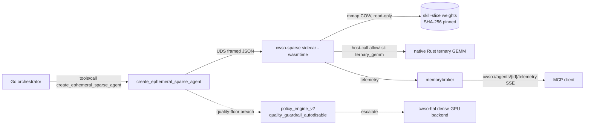

# Sparse Wasm Micro-Agent Tier — Design v1

> Artifact: `wasm-sparse-agent-design-v1.md`
> Based on: `cwso-nextgen-blueprint-v1.md` (§3.5, §Feature B), `ADR-008-wasm-sparse-agent-tier.md`,
> `plan-cwso-nextgen-phase6plus.md` (Phase 7, Feature B)
> Status: accepted — gates implementation tasks T120–T123, QA/gate T124–T125
> Owner: solution-architect · Reviewers: tech-lead, security-engineer

## 1. Purpose & scope

Define the **T0 sparse Wasm micro-agent tier** so the Feature B implementation tasks can proceed
without further design decisions. This is the gating design deliverable (active **T119**, roadmap
placeholder **T090**). It covers: the tier's place in the sandbox hierarchy, the runtime split, the
ternary inference contract, weight packaging, the `create_ephemeral_sparse_agent` lifecycle, the
telemetry surface, the security envelope (reused verbatim), the quality-floor guardrail, and the
implementation task breakdown with acceptance criteria.

Out of scope: the fully in-Wasm SIMD GEMM (promotion path, converges with Phase 8 Feature D), and any
training/fine-tuning of slices (Phase 9, Feature E).

## 2. Where it sits — the T0 tier

ADR-003 defined a tiered sandbox strategy (gVisor → Firecracker microVM). This adds **T0** below them:

| Tier | Backend | Cold start | Isolation | Use |
|------|---------|-----------|-----------|-----|
| **T0 (new)** | Wasm micro-agent (`cwso-sparse`, wasmtime) | **< 10 ms** | Wasm memory + host-call allowlist, no WASI FS/net | Deterministic small edits, sparse classifiers |
| T1 | gVisor (`runner_gvisor.go`) | ~hundreds ms | Syscall interception | General sub-agents |
| T2 | Firecracker microVM | ~seconds | Hardware VM | Untrusted / heavy workloads |

T0 is selected by the policy/dispatch layer for low-complexity, high-quality-floor tasks; anything
that breaches the quality floor escalates **upward** to a dense GPU model via the Phase 6 HAL.

## 3. Runtime split (ADR-008 §Decision)

- **Control-side scorers → existing wazero host (Go), `dispatch/wasm_scoring_plugin.go`.** Reused
  verbatim for tiny classifier micro-agents (e.g. the Feature C spike `SemanticScorer` seam). No new
  runtime.
- **Data-side inference → new Rust sidecar `cwso-sparse` (wasmtime).** Framed-JSON over UDS, same
  pattern as `cwso-hal`: 4-byte big-endian length prefix + JSON body, request-per-call for the PoC
  (pooling tracked as debt, mirrors `shadow.Client`).



## 4. Ternary inference contract

- **Format:** BitNet b1.58 — weights ∈ {-1, 0, +1}, packed at 2 bits/weight, plus a per-tensor (or
  per-group) `f32` scale. Activations are int8/f32 per the kernel variant.
- **Host-call:** a single allowlisted import `ternary_gemm(a_ptr, a_len, w_handle, out_ptr, out_len, m, n, k)`.
  - Operates **only** on buffers inside the module's linear memory (bounds-checked) plus a `w_handle`
    that indexes a host-resident, read-only mmap'd slice. No host pointers cross the boundary.
  - Deterministic: fixed reduction order, no parallel float nondeterminism in the PoC kernel.
- **Wasm module responsibility:** tokenization glue + layer loop orchestration + calling `ternary_gemm`
  for the hot matmuls. Keeps untrusted control flow sandboxed; pushes only the audited matmul to native.
- **Determinism test (T120):** identical `(slice, input)` → byte-identical logits across 1000 runs.

## 5. Weight packaging & COW mmap (T121)

- A **skill slice** = unstructured-pruned ternary slice of a base model for one `skill_domain`.
- **On disk:** content-addressed file `<sha256>.cwsl` (CWSO Weight Slice): header (magic, version,
  dims, group size, quantization tag) + packed ternary blocks + scale vector. Manifest maps
  `skill_domain → sha256`.
- **Loading:** host `mmap`s the file **read-only**; the OS shares physical pages across every agent
  that references the same slice (copy-on-write — but it is never written, so it stays shared).
  Per-agent marginal RAM ≈ activation buffers only.
- **Integrity:** SHA-256 of the mapped bytes is verified against the pinned manifest hash before first
  use, identical to `wasm_scoring_plugin.go` module pinning. Mismatch → hard error, agent not created.

## 6. `create_ephemeral_sparse_agent` MCP tool (T122)

Schema (`schemas/create_ephemeral_sparse_agent.json`, mirrors blueprint §3.5):

```json
{
  "title": "create_ephemeral_sparse_agent",
  "inputs": {
    "target_ast_node": "string  e.g. 'Class: DatabaseConnector' (provenance/context, optional)",
    "skill_domain":    "string  e.g. 'react-hooks' (selects pinned pruned slice; required)",
    "quantization":    "1.58-bit | int4 | int8 (default 1.58-bit)",
    "max_ram_mb":      "integer (default 512; hard cap, agent refused if exceeded)"
  },
  "outputs": {
    "wasm_agent_id":   "uuid",
    "cold_start_ms":   "number (SLO < 10ms, measured warm)",
    "resident_ram_mb": "number (marginal, COW-aware)",
    "stream_resource": "cwso://agents/{wasm_agent_id}/telemetry"
  }
}
```

- **Tier:** orchestrator-tier tool (creation is a control action); the worker tier consumes the agent.
- **Validation:** unknown `skill_domain` → `ErrToolExecution`; `max_ram_mb` ≤ 0 or > host cap →
  rejected; unsupported `quantization` → rejected. Feature-flag off → tool not registered.
- **Lifecycle:** resolve slice → verify SHA-256 (or reuse already-mapped) → instantiate wasmtime module
  with memory cap + call timeout + host-call allowlist → register agent + start telemetry publisher →
  return id + measured `cold_start_ms`. Agents are dropped on explicit `drop`/TTL; weight pages stay
  resident for reuse.

## 7. Telemetry resource (T122)

Reuse the T117 broker → SSE Resources layer. The sidecar publishes per-agent samples
(`resident_ram_mb`, `tokens_per_sec`, `state`) to a broker topic; the server exposes
`cwso://agents/{wasm_agent_id}/telemetry` via `resources/read` (snapshot) and `resources/subscribe`
(live SSE). No new transport — same filtered-SSE machinery as `cwso://spikes`.

## 8. Quality-floor guardrail & escalation (T123)

- Micro-agents are **restricted to deterministic small tasks** (rename, add types, lint-fix).
- The dispatch path attaches an optional `quality_floor` (0..1, blueprint §3.x). A breach (low
  confidence / failed self-check) routes through the **existing** `quality_guardrail_autodisable`
  reason path in `policy_engine_v2.go`, which escalates to a dense GPU backend via the Phase 6 HAL.
- The micro-agent tier is therefore never the sole path; dense fallback is always reachable and is
  the same code path Phase 6 already exercises.

## 9. Security envelope (reused verbatim — security-engineer sign-off in T125)

| Control | Source | Applied to T0 |
|---------|--------|---------------|
| SHA-256 module/weight pinning | `wasm_scoring_plugin.go` | Wasm module **and** weight slices |
| Linear-memory page cap | `WasmScoringConfig.MemoryLimitPages` | Per-agent `max_ram_mb` → page cap |
| Wall-clock call timeout | `WasmScoringConfig.CallTimeout` | Per-inference deadline |
| Host-call allowlist | `WasmScoringConfig.AllowedHostCalls` | Exactly `{ternary_gemm}` (+ telemetry write) |
| No WASI FS / network | host config | Enforced in wasmtime sidecar |
| UDS peer auth | `cwso-hal` pattern | `cwso-sparse` socket |

No new capability is granted beyond the single bounds-checked `ternary_gemm` import. The Wasm module
cannot open files, sockets, or clocks beyond the host-provided deadline.

## 10. Implementation task breakdown (proposed active IDs)

| Active ID | Roadmap | Title | Owner | Pri | Depends |
|-----------|---------|-------|-------|-----|---------|
| **T119** | T090 | This design + security envelope review (sandbox T0 tier) | solution-architect | P0 | T089 |
| T120 | T091 | Rust `cwso-sparse` sidecar: wasmtime host + native ternary GEMM host-call + UDS protocol | backend-developer | P0 | T119 |
| T121 | T092 | Pruned skill-slice (`.cwsl`) packaging + COW mmap loader + SHA-256 pinning | backend-developer | P1 | T120 |
| T122 | T093 | `create_ephemeral_sparse_agent` MCP tool + schema + `cwso://agents/{id}/telemetry` | backend-developer | P0 | T120, T121 |
| T123 | T094 | Quality-floor guardrail → dense GPU escalation (reuse `quality_guardrail_autodisable`) | backend-developer | P0 | T122 |
| T124 | T098 | Phase 7 integration QA (cold start < 10 ms, 0% idle CPU, escalation) | qa-engineer | P0 | T118, T123 |
| T125 | T099 | Phase 7 Tech-Lead + Security gate | tech-lead / security-engineer | P0 | T124 |

## 11. Risks & mitigations (blueprint §7)

1. **1.58-bit quality regression** → deterministic-task restriction + quality-floor escalation (§8).
2. **Host-call escape surface** → single allowlisted, bounds-checked `ternary_gemm`; no host pointers.
3. **Weight provenance** → SHA-256 content addressing + pinning (§5).
4. **Two-runtime maintenance** → wazero stays control-only; wasmtime data-only; both behind flags.

## 12. Acceptance criteria for T119 (this artifact)

- [x] T0 tier positioned relative to ADR-003 tiers with cold-start/isolation/use columns.
- [x] Runtime split decided and recorded in ADR-008 (wazero control / wasmtime data sidecar).
- [x] Ternary inference contract + deterministic `ternary_gemm` host-call defined.
- [x] Weight packaging (`.cwsl`) + COW mmap + SHA-256 pinning specified.
- [x] `create_ephemeral_sparse_agent` schema + lifecycle + telemetry resource specified.
- [x] Quality-floor guardrail mapped to existing `quality_guardrail_autodisable` path.
- [x] Security envelope mapped to the existing hardened Wasm host, no new capabilities.
- [x] Implementation task breakdown (T120–T125) with owners, priorities, dependencies.
