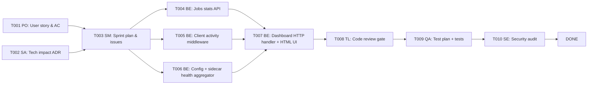

# Feature Plan: Operator Dashboard

> Protocol ref: Plan-Approve-Execute  
> Created: 2026-08-06  
> Status: **PENDING APPROVAL**  
> Feature slug: `operator-dashboard`

---

## Objective

CWSO currently provides no visibility into its own runtime state for platform engineers. The operator
cannot tell whether the system is healthy, which sidecars are connected, how many jobs are running,
whether LLM clients are authenticating correctly, or whether the rollout trajectory pipeline is
capturing data.

This feature adds a read-only **Operator Dashboard** surfaced as:

1. `GET /dashboard/status` — JSON health + operational snapshot (machine-readable; operator tooling,
   alerting, CI smoke-tests).
2. `GET /dashboard` — A lightweight embedded HTML page (human-readable; browser view for
   the platform engineer without needing a separate Grafana stack).

The dashboard is **read-only and additive**. It does not change any existing tool, auth flow, or MCP
behaviour.

---

## Problem decomposition

### What the operator needs to know

| Concern | Current gap | Dashboard answer |
|---------|-------------|-----------------|
| **System health** | `/healthz` returns `ok` even if all sidecars are down | Aggregated check: orchestrator liveness + sidecar reachability (git-shadow, merge-engine, HAL, rollout, sparse) |
| **Config completeness** | Silent degraded mode when env vars are missing | Config validation: required vars present, optional features flagged, feature-flag summary |
| **Job activity** | Internal only, no external visibility | Job queue depth, active jobs, completed/failed counts, worker utilisation |
| **Client health** | Auth failures log-only | Per-issuer/subject token activity, auth failure counts, rate-limit hits |
| **Rollout / learning** | No external signal | Trajectory capture rate, capture drop count (when queue saturated), active rollout tasks, last reward signal |
| **Capability registry** | No external view | HAL capability snapshot: available hardware tiers, last sync time |

---

## Affected components

| Component | Change | Scope |
|-----------|--------|-------|
| `orchestrator/internal/dashboard/` | **New package** — health aggregator, metrics snapshot, JSON renderer | ~300 LOC |
| `orchestrator/internal/transport/http.go` | Mount `/dashboard` and `/dashboard/status` routes (no-auth or operator-token) | ~20 LOC |
| `orchestrator/internal/jobs/manager.go` | Expose `Stats()` snapshot method | ~20 LOC |
| `orchestrator/internal/config/config.go` | Add `DashboardEnabled`, `DashboardTokenHash` config fields | ~10 LOC |
| `orchestrator/internal/server/server.go` | Wire dashboard handler into HTTP transport options | ~15 LOC |
| `deploy/docker-compose.yml` | Document `CWSO_DASHBOARD_TOKEN` env var | minor |
| `schemas/dashboard_status.json` | JSON schema for `/dashboard/status` response | new |

**No changes** to: MCP protocol, shadow workspaces, sandbox runners, merge engine, rollout API
contracts, JWT auth on `/mcp`.

---

## Task breakdown



| ID | Title | Owner | Priority | Estimated effort |
|----|-------|-------|----------|-----------------|
| T001 | PO: Write user story + acceptance criteria | product-owner | P0 | S |
| T002 | SA: Technical impact assessment + ADR | solution-architect | P0 | S |
| T003 | SM: Sprint plan, GitLab issues, effort estimates | scrum-master | P0 | S |
| T004 | BE: Expose `Stats()` on `jobs.Manager` | backend-developer | P0 | S |
| T005 | BE: Client activity middleware (auth counters, tool call counters) | backend-developer | P0 | M |
| T006 | BE: Config validation + sidecar health aggregator package | backend-developer | P0 | M |
| T007 | BE: Dashboard HTTP handler (`/dashboard`, `/dashboard/status`) + embedded HTML | backend-developer | P0 | M |
| T008 | TL: Code review gate | tech-lead | P0 | S |
| T009 | QA: Test plan + unit/integration tests for dashboard package | qa-engineer | P1 | M |
| T010 | SE: Security audit (auth on dashboard, no secret leakage in JSON) | security-engineer | P1 | S |

_Effort: S = <1 day, M = 1–2 days, L = 3+ days_

---

## API contract (draft)

### `GET /dashboard/status`

Auth: Bearer token (`CWSO_DASHBOARD_TOKEN`); separate from MCP JWT to allow lower-privilege
operator access without issuing full MCP tokens.

```json
{
  "version": "0.1.0",
  "timestamp": "2026-08-06T12:00:00Z",
  "overall": "healthy | degraded | unhealthy",
  "system": {
    "uptime_seconds": 3600,
    "go_version": "go1.23.0",
    "build_commit": "abc1234"
  },
  "sidecars": {
    "git_shadow": { "connected": true, "socket": "/run/cwso/git-shadow.sock" },
    "merge_engine": { "connected": true, "socket": "/run/cwso/merge-engine.sock" },
    "hal": { "connected": false, "socket": "/run/cwso/hal.sock", "note": "hardware-aware dispatch in shadow mode" },
    "rollout": { "connected": false, "socket": "", "note": "rollout disabled" },
    "sparse": { "connected": true, "socket": "/run/cwso/sparse.sock" }
  },
  "config": {
    "transport": "http",
    "sandbox_runner": "docker",
    "feature_flags": {
      "hhd_capability_registry": false,
      "ast_spike_monitor": true,
      "rollout_enabled": false
    },
    "warnings": []
  },
  "jobs": {
    "workers": 4,
    "queue_capacity": 64,
    "queue_depth": 2,
    "active": 1,
    "total_completed": 142,
    "total_failed": 3
  },
  "clients": {
    "total_requests": 1057,
    "auth_failures": 2,
    "rate_limit_hits": 0,
    "tool_calls": {
      "dispatch_concurrent_jobs": 34,
      "merge_concurrent_results": 12,
      "query_ast": 89
    }
  },
  "rollout": {
    "enabled": false
  },
  "capabilities": {
    "last_sync": null,
    "tiers": []
  }
}
```

### `GET /dashboard`

Returns an HTML page rendering the above JSON visually. No JavaScript framework — plain HTML + CSS
with an inline `<script>` that fetches `/dashboard/status` and renders it. Embedded via Go
`embed.FS`.

---

## Dependency impact

- **No breaking changes.** Existing `/healthz`, `/mcp`, `/rollout/*` routes are unchanged.
- `/dashboard` and `/dashboard/status` are **new routes** that require a separate bearer token
  (`CWSO_DASHBOARD_TOKEN`). This token must be distinct from the MCP JWT secret.
- If `CWSO_DASHBOARD_TOKEN` is unset, the dashboard routes return `501 Not Implemented` to prevent
  accidental open exposure.
- The `jobs.Manager` `Stats()` method is additive (new exported method); no callers break.
- Client activity counters are in-memory only (no persistence); they reset on restart.

---

## Risk assessment

| Risk | Likelihood | Impact | Mitigation |
|------|-----------|--------|-----------|
| Dashboard leaks internal config/secrets in JSON | Medium | High | Strict allowlist for exposed fields; hash/omit sensitive values; security gate T010 |
| Auth bypass on `/dashboard` | Low | High | Separate bearer token; same origin middleware as `/mcp`; security gate T010 |
| Sidecar health check adds latency / load | Low | Low | Checks are lazy (cached for 5s) on read; not on hot-path |
| Embedded HTML increases binary size | Low | Low | HTML is <10 KB; acceptable for an operator binary |
| Counter race conditions under high concurrency | Low | Medium | Use `sync/atomic` for all counters |

---

## Token budget

| Phase | Budget |
|-------|--------|
| Planning (T001–T003) | ≤ 30k tokens |
| Implementation (T004–T007) | ≤ 80k tokens |
| Review + QA + Security (T008–T010) | ≤ 40k tokens |

---

## Artifact flow

```
T001 → feature-operator-dashboard-requirements-v1.md (docs/artifacts/)
T002 → ADR-011-operator-dashboard.md (docs/decisions/)
T004–T007 → implementation in orchestrator/internal/dashboard/
           + schemas/dashboard_status.json
T009 → qa-operator-dashboard-v1.md (docs/artifacts/)
T010 → security-operator-dashboard-v1.md (docs/artifacts/)
```
