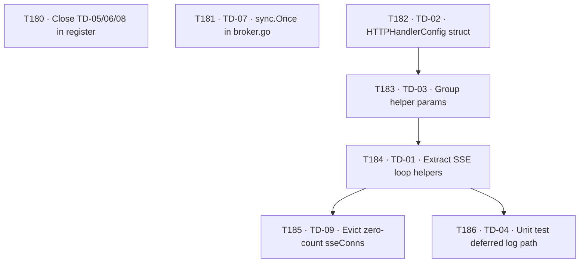

# Plan: Technical Debt Remediation — Phase 1

**Version:** v1  
**Created:** 2026-08-07  
**Owner:** orchestrator  

---

## Goal

Resolve all active technical debt items recorded in `TECHNICAL-DEBT.md`. Three items (TD-05,
TD-06, TD-08) were already remediated by task T162 (2026-06-19, see
`docs/tasks/completed-tasks.md`) but never closed in the register.
Six items (TD-01, TD-02, TD-03, TD-04, TD-07, TD-09) remain open and require implementation
work. All tasks are sized `S` (< 1 h) or `M` (1–4 h), making them suitable for single-purpose
delegated agents operating with limited context.

---

## Status Assessment

### Resolved — register closure only

| TD | Evidence of resolution |
|----|------------------------|
| TD-05 | `publish()` in `orchestrator/internal/jobs/manager.go` now logs errors at `Debug` level: `m.log.Debug().Err(err).Str("topic", topic).Msg("jobs publish failed")` |
| TD-06 | `Close()` now calls `cancelQueuedJobsOnClose()` which drains the queue channel and calls `cancelQueuedRecord()` for each, publishing a `StateCancelled` transition per stranded job |
| TD-08 | `publishTransition()` now calls `sanitizeErrorForBroadcast(job.Error)` before inserting the error string into the SSE payload; the sanitiser redacts entries containing credential hints and truncates at 256 chars |

All three fixes were delivered by **T162** ("Remediate high-value reliability/security technical
debt", completed 2026-06-19) with tests `TestCloseCancelsQueuedJobs` and
`TestPublishLifecycleErrorIsRedacted` in `orchestrator/internal/jobs/manager_test.go`.

### Active — implementation required

| TD | File | Category | Effort | Notes |
|----|------|----------|--------|-------|
| TD-01 | `orchestrator/internal/transport/http.go` | Style | S | `handleBrokerSSE` ≈ 70 lines; `handleSSE` > 50 lines — both exceed the ≤ 50-line limit |
| TD-02 | `orchestrator/internal/transport/http.go` | Style | S | `RunHTTP` and `newHTTPHandler` each take 7 positional parameters; limit is 4 |
| TD-03 | `orchestrator/internal/transport/http.go` | Style | S | `handlePOST` (6 params), `handleSSE` (6 params), `publishSampleEvents` (6 params) each exceed the 4-parameter limit |
| TD-04 | `orchestrator/internal/transport/http_test.go` | Testing | S | The deferred telemetry log closure inside `handleBrokerSSE` has no direct unit test |
| TD-07 | `orchestrator/internal/memorybroker/broker.go` | Correctness | S | `Broker.Close()` uses a `select`-over-closed-channel idiom that is not data-race-free; must use `sync.Once` |
| TD-09 | `orchestrator/internal/transport/http.go` | Reliability | S | `sseConnectionStore.release()` decrements the counter but never deletes the map entry when it reaches zero; over time the map accumulates O(unique IPs) entries |

---

## Task Graph



`T180` and `T181` have no dependencies and can run immediately in parallel with the
`http.go` chain. All `http.go` changes are sequenced (`T182 → T183 → T184 → T185`) to
prevent merge conflicts on the same file.

> Task IDs T180–T186 continue the global sequence — `docs/tasks/completed-tasks.md` is at
> T179; IDs T011–T017 were already consumed in earlier phases.

---

## Task Briefs

### T180 — Close resolved TDs in the debt register

**Owner:** backend-developer (or any agent with file-write access to docs)  
**Status:** pending  
**Priority:** P2  
**Depends on:** —

**Objective**  
Remove TD-05, TD-06, and TD-08 from the active table in `TECHNICAL-DEBT.md` because the
corresponding code fixes were delivered by T162 (2026-06-19). Add a closing note for each.

**Inputs**  
- `TECHNICAL-DEBT.md` (current file)

**Acceptance criteria**  
1. Rows for TD-05, TD-06, and TD-08 are removed from the active table.
2. A `## Closed` section (or similar) is appended listing the three items with a brief
   resolution note and the date `2026-08-07`.
3. No other rows are modified.
4. The legend and formatting of the active table are preserved.

**Step-by-step instructions for the agent**

1. Open `TECHNICAL-DEBT.md`.
2. Delete the three rows: TD-05, TD-06, TD-08.
3. Add a `## Closed Items` section at the bottom (before the Legend) with a table:

   | ID | Resolved by | Resolution summary | Closed on |
   |----|-------------|-------------------|-----------|
   | TD-05 | T162 — `orchestrator/internal/jobs/manager.go` | `publish()` logs errors at Debug level | 2026-08-07 |
   | TD-06 | T162 — `orchestrator/internal/jobs/manager.go` | `Close()` calls `cancelQueuedJobsOnClose()` which drains the queue and publishes `StateCancelled` transitions (test: `TestCloseCancelsQueuedJobs`) | 2026-08-07 |
   | TD-08 | T162 — `orchestrator/internal/jobs/manager.go` | `publishTransition()` calls `sanitizeErrorForBroadcast()` before broadcasting error strings (test: `TestPublishLifecycleErrorIsRedacted`) | 2026-08-07 |

4. Save. Verify the table renders correctly in Markdown.

---

### T181 — TD-07: Replace select idiom with sync.Once in Broker.Close()

**Owner:** backend-developer  
**Status:** pending  
**Priority:** P1  
**Depends on:** —  
**File:** `orchestrator/internal/memorybroker/broker.go`

**Objective**  
`Broker.Close()` currently guards against double-close using a `select` over the `closed`
channel. This is not data-race-free: two goroutines can both reach the `default` branch
simultaneously and both call `close(b.closed)`, causing a panic. Replace with `sync.Once`.

**Inputs**  
- `orchestrator/internal/memorybroker/broker.go`

**Acceptance criteria**  
1. `Broker` struct gains a `closeOnce sync.Once` field.
2. `Broker.Close()` uses `b.closeOnce.Do(func() { close(b.closed); … })` — the channel
   close, `closeSubscribers()`, and `wg.Wait()` all execute inside the `Do` closure.
3. The `select` guard is removed.
4. All existing tests pass (`go test ./orchestrator/internal/memorybroker/...`).
5. `go vet` reports no issues on the package.

**Step-by-step instructions for the agent**

1. Open `orchestrator/internal/memorybroker/broker.go`.
2. Locate the `Broker` struct definition. Add a field:
   ```go
   closeOnce sync.Once
   ```
3. Locate `func (b *Broker) Close()`. Replace the current body:
   ```go
   // BEFORE
   func (b *Broker) Close() {
       select {
       case <-b.closed:
           return
       default:
           close(b.closed)
       }
       b.closeSubscribers()
       b.wg.Wait()
   }
   ```
   with:
   ```go
   // AFTER
   func (b *Broker) Close() {
       b.closeOnce.Do(func() {
           close(b.closed)
           b.closeSubscribers()
           b.wg.Wait()
       })
   }
   ```
4. Run `go build ./orchestrator/internal/memorybroker/...` — must succeed.
5. Run `go test ./orchestrator/internal/memorybroker/...` — all tests must pass.
6. Run `go vet ./orchestrator/internal/memorybroker/...` — no issues.

---

### T182 — TD-02: Introduce HTTPHandlerConfig struct for RunHTTP / newHTTPHandler

**Owner:** backend-developer  
**Status:** pending  
**Priority:** P2  
**Depends on:** —  
**File:** `orchestrator/internal/transport/http.go`

**Objective**  
`RunHTTP` and `newHTTPHandler` both accept 7 positional parameters, violating the ≤ 4-parameter
standard. Introduce an `HTTPHandlerConfig` struct that groups the required (non-optional)
arguments, reducing both signatures to ≤ 4 parameters: `(ctx, cfg HTTPHandlerConfig, opts
...HTTPOption)`.

**Inputs**  
- `orchestrator/internal/transport/http.go`
- Any callers of `RunHTTP` (find with `grep -r "RunHTTP" --include="*.go" .`)

**Acceptance criteria**  
1. A new exported struct `HTTPHandlerConfig` is defined with fields:
   - `Log *logging.Logger`
   - `Bus *eventbus.Bus`
   - `Broker *memorybroker.Broker`
   - `SamplePublisher eventPublisher`
   - `Handler func(ctx context.Context, sess *Session, raw []byte) ([]byte, error)`
2. `RunHTTP` signature changes to:
   `func RunHTTP(ctx context.Context, cfg *config.Config, hcfg HTTPHandlerConfig, opts ...HTTPOption) error`
3. `newHTTPHandler` signature changes to:
   `func newHTTPHandler(ctx context.Context, cfg *config.Config, hcfg HTTPHandlerConfig, opts ...HTTPOption) http.Handler`
4. All internal uses of the old positional parameters are replaced with field accesses on `hcfg`.
5. All callers of `RunHTTP` in the codebase are updated to construct and pass an
   `HTTPHandlerConfig` value.
6. `go build ./orchestrator/...` succeeds.
7. `go test ./orchestrator/internal/transport/...` all pass.

**Step-by-step instructions for the agent**

1. Find all callers: `grep -rn "RunHTTP" --include="*.go" /home/emage/Code/emage/CWSO/orchestrator/`
2. Open `orchestrator/internal/transport/http.go`.
3. After the existing `httpOptions` struct, add:
   ```go
   // HTTPHandlerConfig groups the required (non-optional) dependencies for the HTTP transport.
   type HTTPHandlerConfig struct {
       Log            *logging.Logger
       Bus            *eventbus.Bus
       Broker         *memorybroker.Broker
       SamplePublisher eventPublisher
       Handler        func(ctx context.Context, sess *Session, raw []byte) ([]byte, error)
   }
   ```
4. Update `RunHTTP` to accept `hcfg HTTPHandlerConfig` as the third positional parameter and
   remove `log`, `bus`, `broker`, `samplePublisher`, `h` from the signature. Inside the body,
   replace references accordingly (`log` → `hcfg.Log`, `bus` → `hcfg.Bus`, etc.).
5. Update `newHTTPHandler` the same way — it becomes a private helper with the same 4-param
   shape.
6. Update every call site found in step 1 to build an `HTTPHandlerConfig{...}` and pass it.
7. Build and test as per acceptance criteria.

---

### T183 — TD-03: Group internal helper function parameters into option structs

**Owner:** backend-developer  
**Status:** pending  
**Priority:** P2  
**Depends on:** T182  
**File:** `orchestrator/internal/transport/http.go`

**Objective**  
`handlePOST` (6 params), `handleSSE` (6 params), and `publishSampleEvents` (6 params)
each exceed the ≤ 4-parameter limit. Group their dependencies into small, unexported option
structs so each signature becomes ≤ 4 parameters.

**Inputs**  
- `orchestrator/internal/transport/http.go` (after T182 is merged)

**Acceptance criteria**  
1. Three new unexported structs are introduced:
   - `postHandlerDeps` (fields: `log *logging.Logger`, `publisher eventPublisher`, `handler func(...)`, `metrics RequestMetrics`)
   - `sseHandlerDeps` (fields: `log *logging.Logger`, `bus *eventbus.Bus`, `broker *memorybroker.Broker`, `resolveSub SubscriptionResolver`)
   - `sampleEventParams` (fields: `method, requestID, state, errMsg string`)
2. `handlePOST(w, r http.ResponseWriter, deps postHandlerDeps)` — 3 params.
3. `handleSSE(w, r http.ResponseWriter, deps sseHandlerDeps)` — 3 params.
4. `publishSampleEvents(publisher eventPublisher, log *logging.Logger, p sampleEventParams)` — 3 params.
5. All call sites within `http.go` (in `newHTTPHandler`) are updated.
6. `go build ./orchestrator/internal/transport/...` succeeds.
7. `go test ./orchestrator/internal/transport/...` all pass.

**Step-by-step instructions for the agent**

1. Open `orchestrator/internal/transport/http.go`.
2. Add the three structs near the top of the file, after the interface definitions.
3. Rewrite each function signature and update the function body to use struct fields.
4. In `newHTTPHandler`, update the two call sites:
   - `handlePOST(w, r, postHandlerDeps{log: hcfg.Log, publisher: hcfg.SamplePublisher, handler: hcfg.Handler, metrics: o.metrics})`
   - `handleSSE(w, r, sseHandlerDeps{log: hcfg.Log, bus: hcfg.Bus, broker: hcfg.Broker, resolveSub: o.resolveSub})`
5. Inside `handlePOST`, update the call to `publishSampleEvents`:
   `publishSampleEvents(deps.publisher, deps.log, sampleEventParams{method: ..., requestID: ..., state: ..., errMsg: ...})`
6. Build and test.

---

### T184 — TD-01: Extract SSE loop body helpers to bring functions under 50 lines

**Owner:** backend-developer  
**Status:** pending  
**Priority:** P2  
**Depends on:** T183  
**File:** `orchestrator/internal/transport/http.go`

**Objective**  
After T183 the function signatures are clean; now extract the inner loop bodies and the deferred
telemetry closure to bring `handleBrokerSSE` and `handleSSE` each below 50 lines.

**Context — current line counts**  
- `handleBrokerSSE`: ≈ 70 lines (defer telemetry snapshot + select loop)  
- `handleSSE`: > 50 lines (subscribe setup + select loop)

**Inputs**  
- `orchestrator/internal/transport/http.go` (after T183 is merged)

**Acceptance criteria**  
1. `handleBrokerSSE` is ≤ 50 lines.
2. `handleSSE` is ≤ 50 lines.
3. At least the following helpers are extracted:
   - `writeBrokerSSEFrame(w http.ResponseWriter, flusher http.Flusher, log *logging.Logger, rec memorybroker.Record, filter RecordFilter, throttle *telemetryThrottle) bool`  
     — handles the per-record emit logic (filter, throttle, marshal, write, flush); returns `false` to signal the loop should return.
   - `brokerSSETelemetryDefer(log *logging.Logger, sub *memorybroker.Subscription, throttle *telemetryThrottle) func()`  
     — returns the closure that `handleBrokerSSE` defers. (`Broker.Subscribe()` returns `*Subscription`.)
4. Behaviour is unchanged — all existing SSE tests pass.
5. `go test ./orchestrator/internal/transport/...` all pass.

**Step-by-step instructions for the agent**

1. Open `orchestrator/internal/transport/http.go`.
2. Extract the record-handling `case` body inside `handleBrokerSSE`'s `for/select` into
   `writeBrokerSSEFrame`. The parent `case` becomes:
   ```go
   case rec, ok := <-sub.Messages():
       if !ok {
           return
       }
       if !writeBrokerSSEFrame(w, flusher, deps.log, rec, filter, throttle) {
           return
       }
   ```
3. Extract the `defer func() { … }()` body into `brokerSSETelemetryDefer`, which returns
   the closure. The defer becomes:
   ```go
   defer brokerSSETelemetryDefer(deps.log, sub, throttle)()
   ```
4. For `handleSSE`, extract the per-message `case` body (filter check, marshal, write, flush)
   into `writeSSEFrame(w http.ResponseWriter, flusher http.Flusher, log *logging.Logger, msg eventbus.Message, filter RecordFilter) bool`
   (`eventbus.Message` is the element type of `(*eventbus.Subscription).Messages()`).
5. Count lines for both functions to confirm they are ≤ 50.
6. Build and test.

---

### T185 — TD-09: Evict zero-count entries from sseConnectionStore.release()

**Owner:** backend-developer  
**Status:** pending  
**Priority:** P2  
**Depends on:** T184  
**File:** `orchestrator/internal/transport/http.go`

**Objective**  
`sseConnectionStore.release(ip)` decrements the counter but leaves the map entry at 0. Over
time the map accumulates one entry per unique source IP that has ever opened an SSE connection,
growing unboundedly. Delete the entry when the count drops to zero.

**Inputs**  
- `orchestrator/internal/transport/http.go` (after T184 is merged)

**Acceptance criteria**  
1. `release()` deletes the map key when `conns[ip]` would drop to 0:
   ```go
   func (s *sseConnectionStore) release(ip string) {
       s.mu.Lock()
       defer s.mu.Unlock()
       if s.conns[ip] <= 1 {
           delete(s.conns, ip)
           return
       }
       s.conns[ip]--
   }
   ```
2. `acquire()` logic is unchanged — `conns[ip]` missing key reads as 0 in Go, so no change required there.
3. A new test `TestSSEConnectionStoreEviction` is added to `http_test.go` verifying that after
   `acquire` + `release` on a fresh IP, the key is absent from the map.
4. All existing tests pass.

**Step-by-step instructions for the agent**

1. Open `orchestrator/internal/transport/http.go`.
2. Find `func (s *sseConnectionStore) release(ip string)`. Replace with the implementation shown
   in acceptance criterion 1.
3. Open `orchestrator/internal/transport/http_test.go`.
4. Add `TestSSEConnectionStoreEviction`:
   ```go
   func TestSSEConnectionStoreEviction(t *testing.T) {
       s := &sseConnectionStore{conns: make(map[string]int)}
       ok := s.acquire("1.2.3.4")
       if !ok {
           t.Fatal("expected acquire to succeed")
       }
       s.release("1.2.3.4")
       s.mu.Lock()
       _, present := s.conns["1.2.3.4"]
       s.mu.Unlock()
       if present {
           t.Error("expected map entry to be evicted after release to zero")
       }
   }
   ```
5. Run `go test ./orchestrator/internal/transport/...` — all pass.

---

### T186 — TD-04: Add unit test for handleBrokerSSE deferred telemetry log path

**Owner:** qa-engineer  
**Status:** pending  
**Priority:** P2  
**Depends on:** T184  
**File:** `orchestrator/internal/transport/http_test.go`

**Objective**  
The deferred closure in `handleBrokerSSE` (extracted as `brokerSSETelemetryDefer` in T184)
has no direct unit test. Add a test that verifies the telemetry log is emitted when the SSE
connection closes, including the `dropped_events` warning path when events were dropped.

**Inputs**  
- `orchestrator/internal/transport/http_test.go` (after T184 is merged)
- The extracted `brokerSSETelemetryDefer` helper from T184

**Acceptance criteria**  
1. A test `TestBrokerSSETelemetryLogOnClose` is added.
2. The test covers both branches:
   - **Happy path**: connection closes cleanly (no dropped events) → log emitted at `Info` level with `telemetry_counts` field.
   - **Drop path**: at least one event dropped → log emitted at `Warn` level with both `dropped_events` and `telemetry_counts` fields.
3. The test uses the real `handleBrokerSSE` endpoint via an `httptest.Server` (same pattern as
   existing SSE tests — see the `newSSETestServer` helper at line ~490 of `http_test.go`).
4. The test asserts that the SSE stream sends a `ready` event before the connection is closed.
5. `go test -race ./orchestrator/internal/transport/...` passes.

**Step-by-step instructions for the agent**

1. Read `orchestrator/internal/transport/http_test.go` from line 490 to 560 to understand the
   existing broker SSE test helper setup.
2. Add a new test function `TestBrokerSSETelemetryLogOnClose` after the existing SSE tests.
3. Use the existing `newSSETestServer` helper (it accepts a `*memorybroker.Broker`) to start a
   test server backed by a real broker.
4. In the happy-path sub-test:
   a. Open an SSE connection.
   b. Read the `ready` event.
   c. Close the connection (cancel the request context or close the response body).
   d. Assert the log output (capture via a test logger hook or buffer) contains
      `"SSE telemetry stream closed"` at Info level.
5. In the drop-path sub-test:
   a. Configure the broker subscriber queue depth to 1.
   b. Ingest enough records to fill and overflow the queue.
   c. Open an SSE connection, read the `ready` event, close.
   d. Assert the log output contains `"SSE telemetry stream closed"` at Warn level and
      the `dropped_events` field is > 0.
6. Run `go test -race ./orchestrator/internal/transport/... -run TestBrokerSSETelemetryLogOnClose`.

---

## Agent Assignments Summary

| Task | Owner | Priority | Depends on | Effort |
|------|-------|----------|-----------|--------|
| T180 | backend-developer | P2 | — | S |
| T181 | backend-developer | P1 | — | S |
| T182 | backend-developer | P2 | — | S |
| T183 | backend-developer | P2 | T182 | S |
| T184 | backend-developer | P2 | T183 | S |
| T185 | backend-developer | P2 | T184 | S |
| T186 | qa-engineer | P2 | T184 | S |

**Parallel streams:**
- Stream A: T180 (standalone, docs-only)
- Stream B: T181 (standalone, different file)
- Stream C: T182 → T183 → T184 → T185 (all in `http.go`)
- Stream D: T186 (test-only, depends on T184)

---

## Risks and Mitigations

| Risk | Mitigation |
|------|-----------|
| T182 caller updates break at compile time | Find all callers with grep before starting; build must pass before marking done |
| T184 extraction changes observable behaviour (SSE frame ordering) | Preserve the exact same `for/select` structure; only extract body into named helpers |
| T181 `sync.Once` causes `wg.Wait()` to block if called twice | `Do` only runs once; second calls return immediately without blocking |
| T186 test is flaky on dropped events due to timing | Use `memorybroker.WithSubscriberQueueDepth(1)` and ingest synchronously before opening the SSE connection |

---

## Token Budget

All tasks are `S` (< 1 h) effort and fit within the Implementation phase budget of ≤ 120k tokens.
Estimated total: ~30k tokens across 7 tasks.
