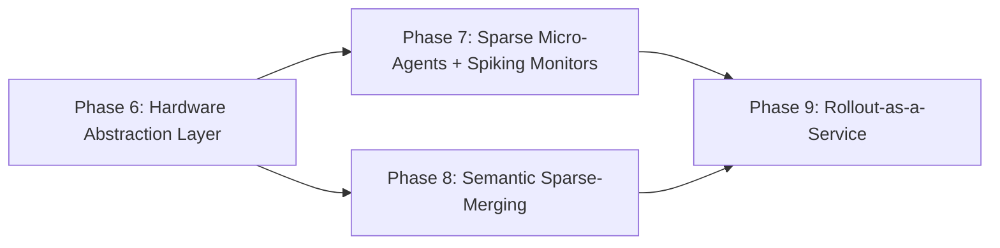

# Plan — CWSO Next-Gen (Phase 6+) "Holy Grail of Agentic Development"

> Owner: orchestrator · Status: **GA prep** — RC published; docs + Polar parity track (T142–T151)
> Based on: `docs/artifacts/cwso-nextgen-blueprint-v1.md`, `input/*.pdf`, current `develop` @ `62f8075`
> Protocol: `plan-approve-execute`. Task IDs continue the sequence after `T079`.

## Goal

Evolve CWSO from a deterministic concurrent MCP orchestrator (shipped, `v0.2.0-rc1`) into a
**hardware-aware, self-improving agent hypervisor**: real heterogeneous hardware routing, sub-10 ms
sparse Wasm micro-agents, zero-idle-CPU spiking AST monitors, photonic-ready sparse merging, and a
Polar-style RL rollout substrate that turns every solved task into training data.

## Guardrails (apply to every task)

- Branch from `develop`; do not destabilize the `v0.2.0` GA gate (`T079`).
- All new capabilities ship **default-off** behind `CWSO_*` flags with deterministic CPU fallback.
- Reuse existing security envelopes (Wasm SHA-256 pinning, host-call allowlist, UDS peer auth).
- Each phase passes Tech-Lead + Security + QA gates before the next begins.

## Dependency graph

## Phase 6 — Hardware Abstraction & Real Backends (Feature A → production)

| ID | Title | Owner | Pri | Depends |
|----|-------|-------|-----|---------|
| T080 | Phase 6 requirements + hardware benchmark targets | product-owner | P0 | — |
| T081 | HAL design: `InferenceBackend` trait + plugin loading + contract `dispatch.provider/v2` | solution-architect | P0 | T080 |
| T082 | Rust `cwso-hal` crate + CPU-baseline adapter | backend-developer | P0 | T081 |
| T083 | GPU adapter (vLLM/TensorRT-LLM, OpenAI-compatible) | backend-developer | P0 | T082 |
| T084 | LPU adapter (Groq-style deterministic low-latency) | backend-developer | P1 | T082 |
| T085 | Profiling layer: tensor_tag derivation + workload mapping | backend-developer | P0 | T082 |
| T086 | `dispatch_hardware_aware_job` MCP tool + schema | backend-developer | P0 | T083, T085 |
| T087 | Wire policy_engine_v2 to live adapters (remove spike stubs) | backend-developer | P0 | T086 |
| T088 | Phase 6 integration + reliability QA (fallback ≤ 2.0s, overhead ≤ 10ms) | qa-engineer | P0 | T087 |
| T089 | Phase 6 Tech-Lead + Security gate | tech-lead / security-engineer | P0 | T088 |

> **Numbering note (2026-06-03):** the IDs below (T090–T113) were allocated when this roadmap
> was authored. The Phase 6 gate follow-ups later consumed **T090–T094** (+ **T114** for the
> Go toolchain bump), so these Phase 7–9 IDs are now **feature placeholders**, not active task
> IDs. Active IDs are assigned sequentially from `docs/tasks/active-tasks.md` (continuing after
> T114) as each feature is picked up. Mapping so far: **T095 (eBPF AST write-spike monitor) →
> active T115**, **T096 (spike filter + semantic-conflict pre-warning) → active T116**, **T097
> (`subscribe_ast_spikes` MCP resource) → active T117** (its write-event feeder half split into
> **active T118**). Feature B: **T090 (Wasm sandbox tier design + security review) → active T119**,
> and pre-mapped **T091 → T120**, **T092 → T121**, **T093 → T122**, **T094 → T123**, **T098 →
> T124**, **T099 → T125**. See the reconciliation section in `active-tasks.md`.

## Phase 7 — Sparse Micro-Agents & Spiking Monitors (Features B + C)

| ID | Title | Owner | Pri | Depends |
|----|-------|-------|-----|---------|
| T090 | T0 Wasm sandbox tier design + security envelope review | solution-architect | P0 | T089 |
| T091 | Wasm inference host (wasmtime) + 1.58-bit ternary GEMM kernel | backend-developer | P0 | T090 |
| T092 | Pruned skill-slice packaging + COW weight mmap | backend-developer | P1 | T091 |
| T093 | `create_ephemeral_sparse_agent` tool (< 10 ms cold start) + RAM/token SSE stream | backend-developer | P0 | T091 |
| T094 | Quality-floor guardrail → dense GPU escalation | backend-developer | P0 | T093 |
| T095 | eBPF AST write-spike monitor (generalize anomaly_monitor) + userspace fallback | backend-developer | P0 | T089 |
| T096 | Spike filter (sparse mini-model) + semantic-conflict pre-warning | backend-developer | P1 | T095 |
| T097 | `subscribe_ast_spikes` MCP resource (SSE, threshold-gated) | backend-developer | P0 | T096 |
| T098 | Phase 7 integration QA (cold start, 0% idle CPU, escalation) | qa-engineer | P0 | T094, T097 |
| T099 | Phase 7 Tech-Lead + Security gate | tech-lead / security-engineer | P0 | T098 |

## Phase 8 — Semantic Sparse-Merging (Feature D)

| ID | Title | Owner | Pri | Depends |
|----|-------|-------|-----|---------|
| T100 | Sparse AST tensor encoding spec (photonic-ready kernel contract) | solution-architect | P0 | T089 |
| T101 | AVX-512 / std::simd vectorized sparse diff kernel in cwso-merge-engine | backend-developer | P0 | T100 |
| T102 | Sparse pre-filter integration (skip shared base subtrees) | backend-developer | P0 | T101 |
| T103 | Sparse↔dense conflict-matrix conformance suite | qa-engineer | P0 | T102 |
| T104 | Phase 8 Tech-Lead gate + large-repo merge benchmark | tech-lead | P0 | T103 |

## Phase 9 — Rollout-as-a-Service (Features E + F + G, Polar)

| ID | Title | Owner | Pri | Depends |
|----|-------|-------|-----|---------|
| T105 | Rollout architecture: proxy boundary + gateway staging + REST/gRPC API | solution-architect | P0 | T099, T104 |
| T106 | Rust `hyper` reverse proxy (OpenAI/Anthropic/Google) + zero-copy capture | backend-developer | P0 | T105 |
| T107 | Trajectory builder: per-request + prefix-merging + loss mask | backend-developer | P0 | T106 |
| T108 | Trajectory store: Protobuf/Arrow + LZ4 + lock-free async I/O (Parquet/ClickHouse) | backend-developer | P1 | T107 |
| T109 | KV-cache prefix router keyed by shared base tree OID | backend-developer | P1 | T106 |
| T110 | Programmatic reward emission from merge state machine (+1/-1, GRPO) | backend-developer | P0 | T104, T107 |
| T111 | Polar service API (`/rollout/*`, `/callbacks/*`, `/nodes/*`) + external trainer e2e | backend-developer | P0 | T108, T110 |
| T112 | Phase 9 integration QA + security gate (proxy overhead, trainer e2e) | qa-engineer / security-engineer | P0 | T111 |
| T113 | Next-Gen release readiness (v0.3.0) + docs | release-manager / technical-writer | P0 | T112 |

## Token budget (per AGENTS.md governance)

| Phase | Planning | Implementation | QA/Sec/Release |
|-------|----------|----------------|----------------|
| 6 | ≤80k | ≤120k | ≤60k |
| 7 | ≤80k | ≤120k | ≤60k |
| 8 | ≤80k | ≤120k | ≤60k |
| 9 | ≤80k | ≤120k | ≤60k |

## Risks (see blueprint §7 for full table + mitigations)

Top three: (1) hardware API fragmentation → Rust HAL plugin + CPU fallback; (2) 1.58-bit quality
regression → deterministic-task restriction + quality-floor escalation; (3) proxy overhead in front
of LPUs → Rust hyper + zero-copy + binary trajectory storage.

## Execution status (2026-06-06)

| Phase | Feature(s) | Status | Checkpoint |
|-------|------------|--------|------------|
| 6 | A — HAL | **complete** | `checkpoint-007-phase6-complete.md` |
| 7 | B + C — Sparse + Spikes | **complete** | `checkpoint-009-phase7-complete.md` |
| 8 | D — Sparse merge | **complete** | `checkpoint-010-phase8-complete.md` |
| 9 | E + F + G — Rollout | **complete** | `checkpoint-011-phase9-complete.md` |

Release packaging: **T139** → `v0.3.0-rc1` tagged @ `2032b33`; **T141** GitLab release published. Post-RC: T135, T140 on `develop`. GA blocked on stakeholder RC validation (`checkpoint-012-nextgen-ga-prep.md`).

**Post-RC track:** complete — **v0.3.0 GA** tagged @ `de071c0` (T152). Polar **T145–T151** post-GA backlog.

## Approval

Approved and executed. Phases 6–9 landed on `develop`; RC release readiness tracked as **T139**.
