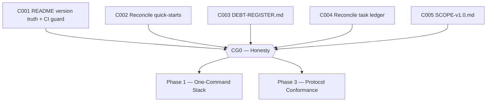

# Plan: CWSO v1.0 — Phase 0: Honest Baseline (v0.7.0)

- **Status:** approved — human approval granted 2026-08-13
- **Author:** orchestrator
- **Date:** 2026-08-12
- **Parent plan:** [plan-cwso-v1.0-roadmap.md](plan-cwso-v1.0-roadmap.md) (Phase 0)
- **Gate:** **CG0 — Honesty** (closes when all exit criteria pass)
- **Target release:** v0.7.0
- **Estimated effort:** ~1 week
- **Token budget:** 80k

## Goal

The repository stops contradicting itself. The README, CHANGELOG, release artifacts,
quick-starts, debt records, and task ledger all agree with each other and with the code,
and a CI guard makes future drift a build failure instead of a surprise. This is the
cheapest phase and it gates everything: no feature work proceeds on top of documents
that lie.

## Scope

- **In scope**: C001–C005 — README/CHANGELOG version truth, quick-start reconciliation,
  a single live debt register, task-ledger reconciliation, and the v1.0 scope statement.
- **Out of scope**: any application-code change; any compose/Docker change (Phase 1);
  closing the 25 `in_review` briefs on merit (C004 only makes the ledger *honest*;
  disposition decisions are orchestrator + human work).
- **Assumptions**:
  - The newest release artifact (`docs/artifacts/release-v0.6.1.md`) is the actual
    current release. README says v0.4.1, CHANGELOG top entry is v0.5.2 — both lag.
  - `develop` is the working branch; all work lands via MR per `git-workflow.md`.

## Task graph



All five tasks are mutually independent and may run in parallel in separate worktrees.

## Agent assignments

| Task | Title | Agent | Estimated scope | Brief |
|------|-------|-------|-----------------|-------|
| C001 | README version truth + CI drift guard | devops-engineer | small | [task-C001.md](../tasks/task-C001.md) |
| C002 | Reconcile quick-start commands | technical-writer | small | [task-C002.md](../tasks/task-C002.md) |
| C003 | Publish docs/DEBT-REGISTER.md | technical-writer | medium | [task-C003.md](../tasks/task-C003.md) |
| C004 | Reconcile task ledger with briefs | technical-writer | medium | [task-C004.md](../tasks/task-C004.md) |
| C005 | Publish docs/SCOPE-v1.0.md | technical-writer | small | [task-C005.md](../tasks/task-C005.md) |

## Artifact flow

```
C001 → README.md, CHANGELOG.md, scripts/check-version-drift.sh, .gitlab-ci.yml  (consumed by: CI, all later phases)
C002 → README.md, docs/user/installation-v3.md                                  (consumed by: C050, users)
C003 → docs/DEBT-REGISTER.md                                                    (consumed by: C060, all v1.0-blocker tasks)
C004 → docs/tasks/active-tasks.md (+ discrepancy report)                        (consumed by: orchestrator)
C005 → docs/SCOPE-v1.0.md                                                       (consumed by: C025, C050, C063)
```

## Risks & mitigations

| Risk | Likelihood | Impact | Mitigation |
|------|-----------|--------|-----------|
| CHANGELOG itself lags the release artifacts (v0.5.2 vs v0.6.1), so a README-vs-CHANGELOG CI check can never pass | High (confirmed in audit) | Medium | C001 explicitly includes backfilling the v0.6.0/v0.6.1 CHANGELOG entries from the release artifacts before wiring the check |
| C004 uncovers briefs whose true state is unknowable | Medium | Medium | Rail in brief: never guess a status; list as `blocked` and escalate with a discrepancy table |
| Drift check is too brittle (false failures) and gets disabled | Medium | Medium | Check compares *version strings only*, with a documented exact extraction rule; test with a deliberate break in CI |

## Token budget

| Task | Budget |
|------|--------|
| C001 | 15k |
| C002 | 10k |
| C003 | 25k |
| C004 | 20k |
| C005 | 10k |
| **Total** | **80k** |

## Entry criteria

- [ ] Human has approved the parent roadmap (status advance from `proposed`)

## Exit criteria (gate CG0 — ALL must pass)

- [ ] Reverting the README version deliberately makes CI fail (proven by a test MR or pipeline run)
- [ ] README and installation guide quick-starts are byte-identical command sequences
- [ ] Every in-code `POC-DEBT` marker appears in `docs/DEBT-REGISTER.md` with a disposition (`v1.0-blocker` / `v1.1` / `wontfix` / `fixed`)
- [ ] `active-tasks.md` row count matches the number of non-`done` briefs
- [ ] `docs/SCOPE-v1.0.md` exists and states the roadmap §1.5 definition verbatim

## Approval

- [x] User approved on 2026-08-13
- [x] Plan locked; revisions create `plan-cwso-v1.0-phase0-honest-baseline-v2.md`
