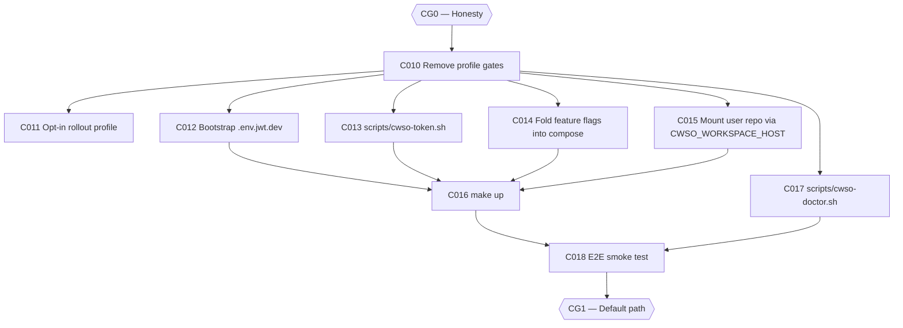

# Plan: CWSO v1.0 — Phase 1: One-Command Stack (v0.8.0)

- **Status:** superseded by [plan-cwso-v1.0-phase1-one-command-stack-v2.md](plan-cwso-v1.0-phase1-one-command-stack-v2.md) (2026-08-13: added C019 per approval decision 3)
- **Author:** orchestrator
- **Date:** 2026-08-12
- **Parent plan:** [plan-cwso-v1.0-roadmap.md](plan-cwso-v1.0-roadmap.md) (Phase 1)
- **Gate:** **CG1 — Default path** (closes when all exit criteria pass)
- **Target release:** v0.8.0
- **Estimated effort:** ~2 weeks
- **Token budget:** 200k

## Goal

`git clone && make up` takes a developer from a clean checkout to a healthy, complete
CWSO stack — orchestrator **plus** git-shadow **plus** merge-engine — with secrets
bootstrapped, a token minted, and a ready-to-paste MCP client config block on screen.
The 7-step manual startup with its documented failure mode (installation-v3.md §2–§4)
collapses into one command. This phase removes reachability problems only; it changes
no orchestration semantics.

## Scope

- **In scope**: C010–C018 — compose profile removal, opt-in rollout profile, secret
  bootstrap, token script, feature-flag fold-in, user-repo mounting, `make up`,
  `cwso-doctor.sh`, and the end-to-end smoke test that becomes the v1.0
  definition-of-done executable.
- **Out of scope**: the filesystem projection (Phase 2); protocol work (Phase 3);
  deleting the old install guides (Phase 5 — until then, docs must stay consistent
  with the compose file as changed here).
- **Assumptions**:
  - `deploy/docker-compose.yml` lines 46, 52, 71 hold the stale profile gates (audited).
  - `deploy/Dockerfile.rollout` exists and CI already publishes the image (v0.5.2 CHANGELOG).
  - Sandbox degraded-mode detection already exists in `sandbox/router.go`; C017 only surfaces it.

## Task graph



C011–C015 and C017 may run in parallel after C010. C016 and C018 are sequential.

## Agent assignments

| Task | Title | Agent | Estimated scope | Brief |
|------|-------|-------|-----------------|-------|
| C010 | Remove phase2/phase4 profile gates | devops-engineer | medium | [task-C010.md](../tasks/task-C010.md) |
| C011 | Add cwso-rollout behind opt-in profile | devops-engineer | small | [task-C011.md](../tasks/task-C011.md) |
| C012 | Bootstrap .env.jwt.dev on first run | devops-engineer | medium | [task-C012.md](../tasks/task-C012.md) |
| C013 | scripts/cwso-token.sh replaces heredoc | devops-engineer | small | [task-C013.md](../tasks/task-C013.md) |
| C014 | Fold enable-all-features into compose | devops-engineer | medium | [task-C014.md](../tasks/task-C014.md) |
| C015 | Mount user repo (CWSO_WORKSPACE_HOST) | devops-engineer | medium | [task-C015.md](../tasks/task-C015.md) |
| C016 | `make up` one-command target | devops-engineer | medium | [task-C016.md](../tasks/task-C016.md) |
| C017 | scripts/cwso-doctor.sh diagnostics | devops-engineer | medium | [task-C017.md](../tasks/task-C017.md) |
| C018 | E2E smoke test (v1.0 DoD executable) | qa-engineer | large | [task-C018.md](../tasks/task-C018.md) |

## Artifact flow

```
C010 → deploy/docker-compose.yml                    (consumed by: C011–C018, users)
C011 → deploy/docker-compose.yml (rollout profile)  (consumed by: rollout users, v1.1)
C012 → orchestrator entrypoint / bootstrap script   (consumed by: C016)
C013 → scripts/cwso-token.sh                        (consumed by: C016, C017, users)
C014 → deploy/docker-compose.yml env defaults       (consumed by: C016)
C015 → deploy/docker-compose.yml volume mount       (consumed by: C016, C018, users)
C016 → Makefile (up/down/logs)                      (consumed by: C018, users)
C017 → scripts/cwso-doctor.sh + Makefile (doctor)   (consumed by: C018, C050, users)
C018 → scripts/cwso-smoke-test.sh + Makefile (smoke) + CI job (consumed by: CG1, Phase 6 release gate)
```

## Risks & mitigations

| Risk | Likelihood | Impact | Mitigation |
|------|-----------|--------|-----------|
| Removing profile gates breaks users mid-phase who still pass `--profile phase2` | Medium | Low | Compose accepts unknown-profile flags gracefully; C002 already made docs consistent; note in CHANGELOG |
| Parallel edits to `deploy/docker-compose.yml` (C010–C015) conflict | High | Medium | Serialize: C010 merges first; C011–C015 each rebase on the merged result. One file, one task at a time — orchestrator enforces order |
| Parallel edits to `Makefile` (C016/C017/C018) conflict | Medium | Low | Rails assign disjoint targets: C016 owns `up`/`down`/`logs`; C017 adds `doctor`; C018 adds `smoke`; C017/C018 depend on C016 |
| Secret bootstrap writes a weak or committed secret | Low | High | Rails: min 32-byte CSPRNG value, `chmod 600`, verify `.env.jwt.dev` is gitignored before first generation, never echo the secret to logs |
| Read-write workspace mount lets a bug corrupt the user's repo | Medium | High | C015 rail: default stays `sample-workspace`; read-write mount is documented in the guide; Phase 2 sandbox tiering is the real containment answer (open question 3 in the roadmap) |

## Token budget

| Task | Budget |
|------|--------|
| C010 | 20k |
| C011 | 10k |
| C012 | 25k |
| C013 | 15k |
| C014 | 20k |
| C015 | 25k |
| C016 | 25k |
| C017 | 25k |
| C018 | 35k |
| **Total** | **200k** |

## Entry criteria

- [ ] CG0 closed (all Phase 0 exit criteria pass)

## Exit criteria (gate CG1 — ALL must pass)

- [ ] `git clone && make up` reaches a healthy full stack with **zero** manual file creation
- [ ] `docker compose up` with no profile flags starts orchestrator + git-shadow + merge-engine
- [ ] `make up` prints a config block that works when pasted into a client unmodified
- [ ] C018 passes from a clean checkout on a machine that has never run CWSO
- [ ] `cwso-doctor.sh` correctly reports degraded sandbox mode on a host without KVM

## Approval

- [ ] User approved on YYYY-MM-DD
- [ ] Plan locked; revisions create `plan-cwso-v1.0-phase1-one-command-stack-v2.md`
