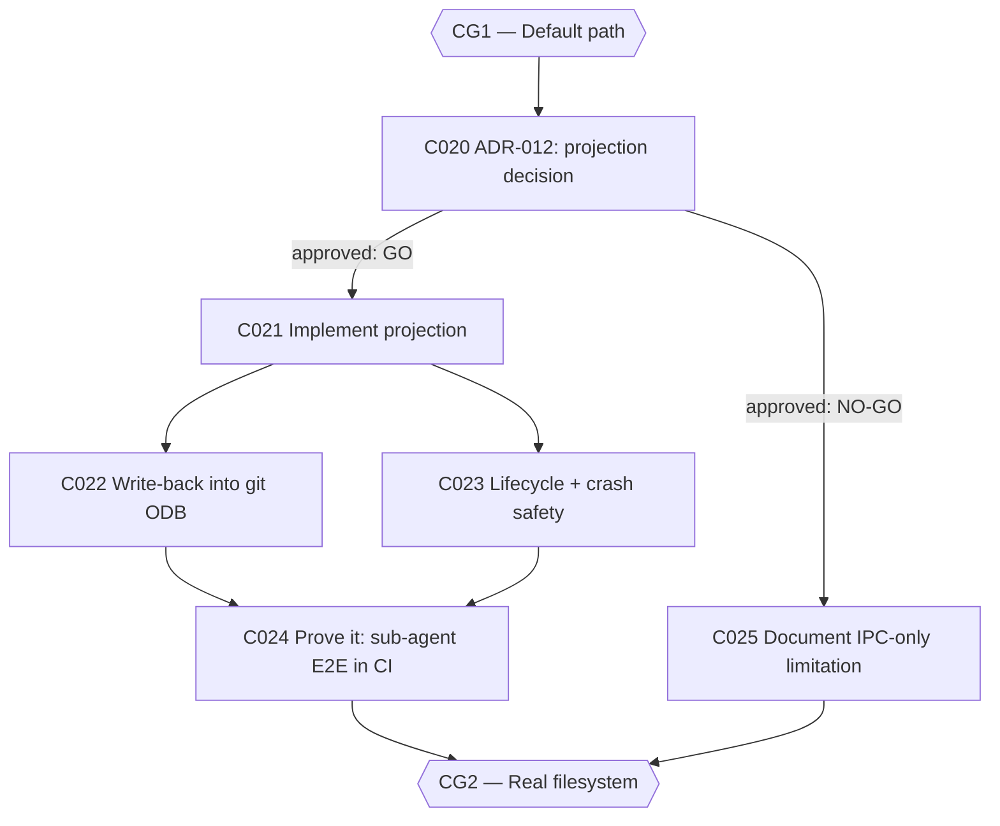

# Plan: CWSO v1.0 — Phase 2: Real Filesystem (v0.9.0)

- **Status:** approved — human approval granted 2026-08-13
- **Author:** orchestrator
- **Date:** 2026-08-12
- **Parent plan:** [plan-cwso-v1.0-roadmap.md](plan-cwso-v1.0-roadmap.md) (Phase 2)
- **Gate:** **CG2 — Real filesystem** (the load-bearing gate; has an explicit documented escape hatch)
- **Target release:** v0.9.0
- **Estimated effort:** ~3–4 weeks
- **Token budget:** 350k

## Goal

Close blocker **B2**: shadow workspaces become reachable as real filesystem paths, so a
coding sub-agent can `cd` into one, run `ls`, `cat`, `pytest`, edit with an ordinary
editor, and have `commit_shadow` capture the result. This is the single biggest gap
between "architecturally interesting" and "useful" — without it, shadow workspaces are
unusable by exactly the agents they exist to serve.

## Scope

- **In scope**: C020–C025 — the projection ADR, implementation, write-back into the
  in-memory git object store, lifecycle/crash safety, the CI-proven end-to-end
  demonstration, and (conditionally) the honest-fallback documentation task.
- **Out of scope**: Merkle incremental AST indexing (P2-2, deferred to v1.1); any
  change to the MCP tool surface (Phase 3); performance tuning beyond correctness.
- **Assumptions**:
  - `services/cwso-git-shadow/src/main.rs:11` carries the `POC-DEBT (P2-1)` marker (audited).
  - The host matrix is: Linux with KVM, Linux without KVM (degraded sandbox), rootless
    Docker, and SELinux-enforcing hosts. The ADR must evaluate all four.
  - **C020 must be approved by a human before C021 starts.** This is the roadmap's
    explicit risk mitigation.

## Task graph



## Agent assignments

| Task | Title | Agent | Estimated scope | Brief |
|------|-------|-------|-----------------|-------|
| C020 | ADR-012: filesystem projection decision | solution-architect | medium | [task-C020.md](../tasks/task-C020.md) |
| C021 | Implement the projection | backend-developer | large | [task-C021.md](../tasks/task-C021.md) |
| C022 | Write-back into in-memory git ODB | backend-developer | large | [task-C022.md](../tasks/task-C022.md) |
| C023 | Lifecycle + crash safety | backend-developer | medium | [task-C023.md](../tasks/task-C023.md) |
| C024 | Prove it: sub-agent E2E in CI | qa-engineer | large | [task-C024.md](../tasks/task-C024.md) |
| C025 | CONDITIONAL: document IPC-only limitation | technical-writer | small | [task-C025.md](../tasks/task-C025.md) |

## Artifact flow

```
C020 → docs/decisions/ADR-012-shadow-workspace-filesystem-projection.md  (consumed by: C021, C025, human approver)
C021 → services/cwso-git-shadow projection code                          (consumed by: C022, C023, C024)
C022 → write-back path (inotify/FUSE hooks → libgit2 ODB)                (consumed by: C024)
C023 → lifecycle teardown + crash tests                                  (consumed by: C024)
C024 → CI job + test fixtures                                            (consumed by: CG2, Phase 6 release gate)
C025 → README + SCOPE-v1.0.md + LIMITATIONS.md updates (ONLY if NO-GO)   (consumed by: C050, C063)
```

## Risks & mitigations

| Risk | Likelihood | Impact | Mitigation |
|------|-----------|--------|-----------|
| Projection proves infeasible on the host matrix (rootless Docker + SELinux + no-KVM) | Medium | **Critical** | C020 is an ADR with three options and a decision record; C025 is the honest documented fallback. **Do not start C021 before C020 is approved.** |
| Write-back (C022) silently loses edits made via the filesystem | Medium | High | C024's acceptance criteria include editing via an ordinary editor and proving `commit_shadow` captures it — in CI, not by hand |
| Leaked mounts after a crash wedge the host | Medium | High | C023 tests the SIGKILL path explicitly; `docker compose down` after forced kill must leave zero orphaned mounts |
| Scope creep into Merkle indexing or performance work | Medium | Medium | Explicitly out of scope; briefs carry a hard "MUST NOT" rail |

## Token budget

| Task | Budget |
|------|--------|
| C020 | 40k |
| C021 | 90k |
| C022 | 80k |
| C023 | 50k |
| C024 | 70k |
| C025 | 20k |
| **Total** | **350k** |

## Entry criteria

- [ ] CG1 closed
- [ ] Human has answered roadmap open question 1 (projection in/out of v1.0) — this plan assumes **in**, with C025 as the escape hatch

## Exit criteria (gate CG2 — ALL must pass)

- [ ] A shell inside the sandbox can `cd` into a shadow workspace and run ordinary tooling
- [ ] Edits made through the filesystem appear in `commit_shadow` output
- [ ] `docker compose down` after a forced kill leaves no orphaned mounts
- [ ] C024 runs in CI, not only by hand
- [ ] **OR** (escape hatch): C025 has published the IPC-only limitation in README + SCOPE + LIMITATIONS, and v1.0 scope is restated honestly

## Approval

- [x] User approved on 2026-08-13 (incl. decision 1: projection is IN v1.0 — ADR-012 selects the mechanism; C025 remains escape-hatch-only)
- [x] Plan locked; revisions create `plan-cwso-v1.0-phase2-real-filesystem-v2.md`
