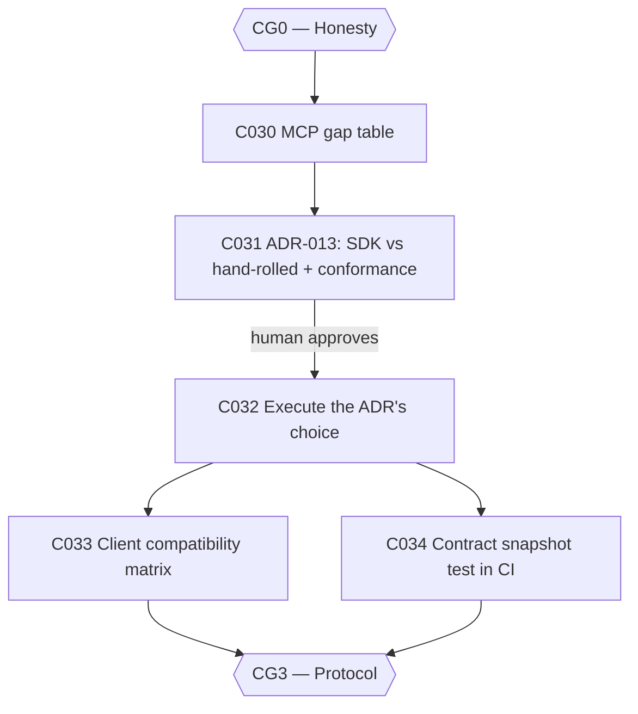

# Plan: CWSO v1.0 — Phase 3: Protocol Conformance (v0.9.0, parallel with Phase 2)

- **Status:** approved — human approval granted 2026-08-13
- **Author:** orchestrator
- **Date:** 2026-08-12
- **Parent plan:** [plan-cwso-v1.0-roadmap.md](plan-cwso-v1.0-roadmap.md) (Phase 3)
- **Gate:** **CG3 — Protocol**
- **Target release:** v0.9.0 (ships alongside Phase 2)
- **Estimated effort:** ~3 weeks (runs in parallel with Phase 2 — disjoint code)
- **Token budget:** 250k

## Goal

Close blocker **B1**: the hand-rolled MCP subset in `orchestrator/internal/mcp/protocol.go`
is either replaced by the official SDK **or** proven, method by method, against the spec
by a conformance suite — with the decision made from a published gap table, not instinct.
A v1.0 whose headline claim is "runs as MCP locally" cannot rest on an undocumented,
partial protocol surface.

## Scope

- **In scope**: C030–C034 — the gap table, the SDK-vs-conformance ADR, executing the
  chosen path, a real-client compatibility matrix (≥3 clients × 2 transports), and a
  contract snapshot test that makes protocol drift break CI.
- **Out of scope**: adding new MCP tools; changing tool semantics; the emage.code-side
  conformance test (T422 in the companion plan — it consumes this phase's output and
  **must not be written until CG3 closes**).
- **Assumptions**:
  - `orchestrator/internal/mcp/protocol.go:10` carries the hand-rolled-subset POC-DEBT marker (audited).
  - The spec of record is MCP `2025-03-26` (per README "Architecture in one paragraph").
  - Keeping the hand-rolled kernel plus a conformance suite is an **explicitly acceptable**
    outcome — the kernel is a deliberate determinism choice, and a rewrite at v0.9 carries real risk.

## Task graph



## Agent assignments

| Task | Title | Agent | Estimated scope | Brief |
|------|-------|-------|-----------------|-------|
| C030 | MCP gap table (impl vs spec) | backend-developer | medium | [task-C030.md](../tasks/task-C030.md) |
| C031 | ADR-013: SDK vs conformance-suite decision | solution-architect | medium | [task-C031.md](../tasks/task-C031.md) |
| C032 | Execute the ADR's choice | backend-developer | large | [task-C032.md](../tasks/task-C032.md) |
| C033 | Client compatibility matrix (3×2) | qa-engineer | large | [task-C033.md](../tasks/task-C033.md) |
| C034 | Contract snapshot test in CI | qa-engineer | medium | [task-C034.md](../tasks/task-C034.md) |

## Artifact flow

```
C030 → docs/artifacts/mcp-gap-analysis-v1.md            (consumed by: C031, human approver)
C031 → docs/decisions/ADR-013-mcp-protocol-path.md      (consumed by: C032, human approver)
C032 → protocol code + conformance suite                (consumed by: C033, C034)
C033 → docs/artifacts/mcp-client-compatibility-v1.md    (consumed by: C050, C063, emage.code T422)
C034 → contract snapshot test + CI job                  (consumed by: CI, emage.code T422 alignment)
```

## Risks & mitigations

| Risk | Likelihood | Impact | Mitigation |
|------|-----------|--------|-----------|
| Phase becomes a protocol rewrite that swallows the release | Medium | High | C030 mandates the gap table *before* any decision; ADR-013 names "keep + prove" as a first-class option; C032 is bounded by the ADR, not by ambition |
| Gap table is wrong because the spec is ambiguous | Medium | Medium | C030 rail: cite the spec section for every row; where the spec is ambiguous, record the ambiguity as its own finding instead of guessing |
| Client matrix only tests happy paths | Medium | Medium | C033 requires error-path cases (unknown method, malformed params) and publishing **failures**, not just passes |
| Snapshot test calcifies a wrong surface | Low | Medium | C034 snapshot is generated from the *post-C032* surface and reviewed against the C030 gap table before merge |

## Token budget

| Task | Budget |
|------|--------|
| C030 | 40k |
| C031 | 30k |
| C032 | 90k |
| C033 | 60k |
| C034 | 30k |
| **Total** | **250k** |

## Entry criteria

- [ ] CG0 closed (this phase depends only on CG0 and runs in parallel with Phases 1–2)

## Exit criteria (gate CG3 — ALL must pass)

- [ ] Gap table published before implementation began (C030 merged before C032 started)
- [ ] Every implemented method has a conformance test asserting spec-shaped requests and errors
- [ ] Compatibility matrix published with at least three clients × two transports (stdio + Streamable HTTP)
- [ ] Unimplemented methods return a correct "not supported" error, never a malformed response
- [ ] Contract snapshot test fails CI when the protocol surface drifts

## Approval

- [x] User approved on 2026-08-13 (incl. decision 2: keep the hand-rolled kernel and prove it — ADR-013 documents the decision; C032 executes keep-and-prove)
- [x] Plan locked; revisions create `plan-cwso-v1.0-phase3-protocol-conformance-v2.md`
