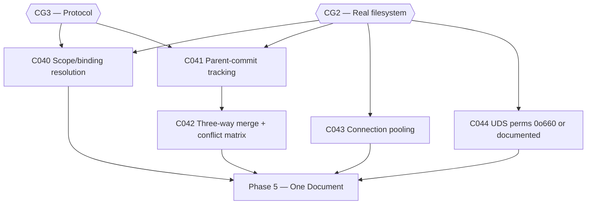

# Plan: CWSO v1.0 — Phase 4: Correctness (v0.9.x)

- **Status:** approved — human approval granted 2026-08-13
- **Author:** orchestrator
- **Date:** 2026-08-12
- **Parent plan:** [plan-cwso-v1.0-roadmap.md](plan-cwso-v1.0-roadmap.md) (Phase 4)
- **Gate:** none of its own — feeds Phase 5; every task closes a named v1.0-blocker
- **Target release:** v0.9.x
- **Estimated effort:** ~2–3 weeks
- **Token budget:** 250k

## Goal

The two tools users call most — `query_ast` (especially `find_references`) and
`merge_concurrent_results` — give *right* answers, and the concurrency the product is
named for stops being throttled by a single-connection client. Silently wrong answers
are worse than errors; this phase replaces them with correct answers or honest
conflict matrices.

## Scope

- **In scope**: C040–C044 — scope/binding resolution for `find_references` (B6/P2-7),
  parent-commit tracking (B7/P2-4), true three-way merge with a conflict matrix,
  connection pooling in the shadow client (B13/P2-6), and UDS permission tightening
  (B12/P2-5).
- **Out of scope**: new AST grammars (the four wired grammars — Go, Python, Rust,
  TypeScript — are the fixture set); Merkle indexing (v1.1); merge *strategies* beyond
  the Blueprint §5.4 conflict-matrix contract.
- **Assumptions**:
  - `services/cwso-git-shadow/src/repo.rs:180` carries the orphan-commit marker (audited).
  - `orchestrator/internal/shadow/client.go:5` is one-request-per-connection (audited).
  - UDS perms are 0o666 per scorecard P2-5 (audited).

## Task graph



C040, C041, C043, C044 are mutually independent. C042 depends on C041.
*Orchestrator discretion:* C041 and C043 touch neither the projection nor the protocol
surface and may be pulled forward once CG1 closes, if capacity allows.

## Agent assignments

| Task | Title | Agent | Estimated scope | Brief |
|------|-------|-------|-----------------|-------|
| C040 | Scope/binding resolution for find_references | backend-developer | large | [task-C040.md](../tasks/task-C040.md) |
| C041 | Parent-commit tracking per workspace | backend-developer | medium | [task-C041.md](../tasks/task-C041.md) |
| C042 | Three-way merge + conflict matrix | backend-developer | large | [task-C042.md](../tasks/task-C042.md) |
| C043 | Connection pooling in shadow client | backend-developer | medium | [task-C043.md](../tasks/task-C043.md) |
| C044 | UDS perms 0o660 + shared GID (or documented) | backend-developer | small | [task-C044.md](../tasks/task-C044.md) |

## Artifact flow

```
C040 → services/cwso-git-shadow ast.rs resolver + fixtures  (consumed by: users of query_ast)
C041 → services/cwso-git-shadow repo.rs parent tracking     (consumed by: C042)
C042 → services/cwso-merge-engine three-way merge           (consumed by: users of merge_concurrent_results)
C043 → orchestrator/internal/shadow/client.go pool          (consumed by: dispatch_concurrent_jobs)
C044 → UDS bind perms + docs/security section               (consumed by: C061, C063)
```

## Risks & mitigations

| Risk | Likelihood | Impact | Mitigation |
|------|-----------|--------|-----------|
| Scope resolution is a research project, not a task | Medium | High | Rail: implement binding resolution for the four wired grammars only, using tree-sitter's scope model; anything beyond (cross-file, type inference) is explicitly v1.1 and must return an honest "unresolved" rather than a guess |
| Three-way merge surfaces conflicts the PoC UI can't display | Medium | Medium | C042's contract is the Blueprint §5.4 conflict matrix as *data*; presentation is out of scope |
| Connection pool introduces races under dispatch | Medium | High | C043 acceptance includes a concurrent-dispatch soak (N parallel jobs, no exhaustion, no cross-talk) |
| UDS perm change breaks existing containers | Low | Low | C044 allows the documented-limitation escape; either outcome closes B12 honestly |

## Token budget

| Task | Budget |
|------|--------|
| C040 | 80k |
| C041 | 50k |
| C042 | 70k |
| C043 | 30k |
| C044 | 20k |
| **Total** | **250k** |

## Entry criteria

- [ ] CG2 closed
- [ ] CG3 closed

## Exit criteria (ALL must pass)

- [ ] `find_references` returns no false positives on the shadowed-name fixture set (all four grammars)
- [ ] `git log` in a shadow workspace shows a chain, not an orphan
- [ ] A genuine three-way merge succeeds; an unresolvable one returns a conflict matrix — never a corrupted file
- [ ] Concurrent dispatch of N jobs does not exhaust connections
- [ ] UDS perms are 0o660 with shared GID, **or** the limitation is documented in the security section

## Approval

- [x] User approved on 2026-08-13
- [x] Plan locked; revisions create `plan-cwso-v1.0-phase4-correctness-v2.md`
