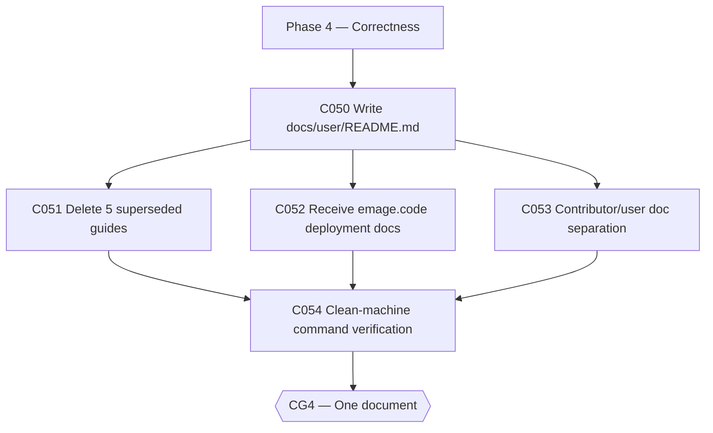

# Plan: CWSO v1.0 — Phase 5: One Document (v1.0.0-rc)

- **Status:** approved — human approval granted 2026-08-13
- **Author:** orchestrator
- **Date:** 2026-08-12
- **Parent plan:** [plan-cwso-v1.0-roadmap.md](plan-cwso-v1.0-roadmap.md) (Phase 5)
- **Gate:** **CG4 — One document**
- **Target release:** v1.0.0-rc
- **Estimated effort:** ~1–2 weeks
- **Token budget:** 150k

## Goal

Directly from the TODO: *"documentation of deployment configuration and usage must be
at one place and easy to follow (end user)"* and *"remove old stuff"*. `docs/user/`
ends this phase containing **exactly one guide**, written against the post-Phase-1
flow, with every command in it executed on a clean machine. A command that has not
been run is a claim, not a document.

## Scope

- **In scope**: C050–C054 — the single user guide, deletion of the five superseded
  guides, receiving the six deployment guides relocated from emage.code (T403),
  contributor/user doc separation, and clean-machine verification.
- **Out of scope**: contributor docs content changes beyond separation; rewriting
  architecture docs; the emage.code-side removal (that is T403 — C052 only *receives*).
- **Assumptions**:
  - `docs/user/` currently holds `installation-v1/v2/v3.md` + `ide-integration-v1/v2.md` (confirmed).
  - Deletion is preferred over archival — the emage.code audit showed archived docs
    still surface in searches. Git history preserves them.
  - C052 pairs with emage.code T403; neither lands until both are ready.

## Task graph



## Agent assignments

| Task | Title | Agent | Estimated scope | Brief |
|------|-------|-------|-----------------|-------|
| C050 | Write the single user guide | technical-writer | large | [task-C050.md](../tasks/task-C050.md) |
| C051 | Delete the 5 superseded guides | technical-writer | small | [task-C051.md](../tasks/task-C051.md) |
| C052 | Receive emage.code deployment docs (T403 ⇄ C052) | technical-writer | medium | [task-C052.md](../tasks/task-C052.md) |
| C053 | Contributor vs user doc separation | technical-writer | medium | [task-C053.md](../tasks/task-C053.md) |
| C054 | Verify every command on a clean machine | qa-engineer | medium | [task-C054.md](../tasks/task-C054.md) |

## Artifact flow

```
C050 → docs/user/README.md (the single guide)   (consumed by: C051–C054, users)
C051 → deletions + link updates                 (consumed by: C054)
C052 → docs/user/deployment/* (from emage.code) (consumed by: C050, C054)
C053 → CONTRIBUTING.md + docs/dev/* separation  (consumed by: contributors)
C054 → verification log appended to guide PR    (consumed by: CG4, Phase 6)
```

## Risks & mitigations

| Risk | Likelihood | Impact | Mitigation |
|------|-----------|--------|-----------|
| Deleting old guides breaks external bookmarks | High | Low | Accepted by the roadmap. Git history preserves them; the single guide carries a "moved from" note |
| Deployment docs dropped between the two repos | Medium | Medium | C052 pairs with T403; the brief forbids landing until emage.code's side is ready, and vice versa |
| Guide written against how the author *thinks* the stack works | Medium | High | C054 executes every command on a clean machine; any command that fails blocks CG4 |
| Guide accretes version-suffix files again | Low | Low | Exit criterion: no file in `docs/user/` carries a version suffix |

## Token budget

| Task | Budget |
|------|--------|
| C050 | 50k |
| C051 | 10k |
| C052 | 30k |
| C053 | 25k |
| C054 | 35k |
| **Total** | **150k** |

## Entry criteria

- [ ] Phase 4 exit criteria pass
- [ ] Phase 1 flow is stable (the guide documents the post-Phase-1 world)

## Exit criteria (gate CG4 — ALL must pass)

- [ ] `docs/user/` contains exactly one guide
- [ ] Every command in it was executed on a clean host during C054 (log attached)
- [ ] No file in `docs/user/` carries a version suffix
- [ ] Both repos agree on which owns deployment docs (C052 ⇄ T403 landed on both sides)

## Approval

- [x] User approved on 2026-08-13
- [x] Plan locked; revisions create `plan-cwso-v1.0-phase5-one-document-v2.md`
