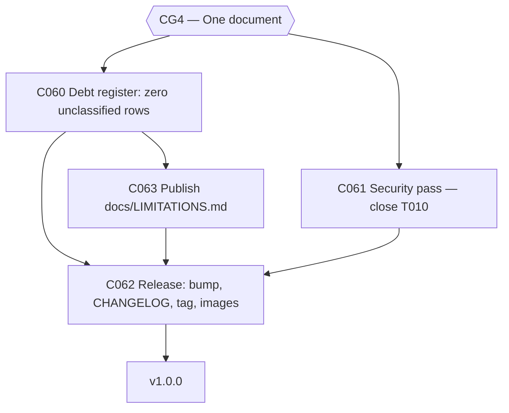

# Plan: CWSO v1.0 — Phase 6: v1.0.0 Release

- **Status:** approved — human approval granted 2026-08-13
- **Author:** orchestrator
- **Date:** 2026-08-12
- **Parent plan:** [plan-cwso-v1.0-roadmap.md](plan-cwso-v1.0-roadmap.md) (Phase 6)
- **Gate:** none — this phase *is* the release gate
- **Target release:** v1.0.0
- **Estimated effort:** ~1 week
- **Token budget:** 80k

## Goal

Ship v1.0.0 with zero unclassified debt rows, the long-open security audit (T010)
closed, and a published `LIMITATIONS.md` that makes the next version-drift cycle
impossible to start quietly. The release is defined by evidence: the C018 smoke test
green on a clean host, and every clause of the roadmap §1.5 definition demonstrably true.

## Scope

- **In scope**: C060–C063 — full debt-register reclassification, the security pass
  closing T010, release mechanics (version bump, CHANGELOG, tag, images), and
  `docs/LIMITATIONS.md`.
- **Out of scope**: fixing v1.1-classified debt; any new feature; promoting the
  Firecracker tier (ships as documented fallback).
- **Assumptions**:
  - T010 (security audit: auth, secret leakage) has been open since 2026-08-06 and is
    the only pre-existing row in the active ledger.
  - C018 (smoke test) is green and running in CI by this point.

## Task graph



## Agent assignments

| Task | Title | Agent | Estimated scope | Brief |
|------|-------|-------|-----------------|-------|
| C060 | Debt register full reclassification | technical-writer | medium | [task-C060.md](../tasks/task-C060.md) |
| C061 | Security pass — close T010 | security-engineer | medium | [task-C061.md](../tasks/task-C061.md) |
| C062 | Release v1.0.0 | devops-engineer | medium | [task-C062.md](../tasks/task-C062.md) |
| C063 | Publish docs/LIMITATIONS.md | technical-writer | small | [task-C063.md](../tasks/task-C063.md) |

## Artifact flow

```
C060 → docs/DEBT-REGISTER.md (all rows classified)  (consumed by: C062, C063)
C061 → security findings + T010 closure             (consumed by: C062; CRITICAL/HIGH findings block)
C063 → docs/LIMITATIONS.md                          (consumed by: C062, users, v1.1 planning)
C062 → v1.0.0 tag, images, CHANGELOG, release       (consumed by: the world)
```

## Risks & mitigations

| Risk | Likelihood | Impact | Mitigation |
|------|-----------|--------|-----------|
| Security pass finds CRITICAL/HIGH issues at the eleventh hour | Medium | High | Per security-guidelines.md, CRITICAL/HIGH block merge — the release slips rather than ships. C061 may start early (it needs no Phase 5 output) |
| Debt rows get classified `documented-limitation` to avoid work | Medium | Medium | C060 rail: `documented-limitation` requires a corresponding entry in LIMITATIONS.md, cross-checked in review |
| Release mechanics drift from the established release-artifact pattern | Low | Low | C062 follows the existing `docs/artifacts/release-vN.md` pattern (v0.3.0–v0.6.1 precedent) |

## Token budget

| Task | Budget |
|------|--------|
| C060 | 25k |
| C061 | 25k |
| C062 | 20k |
| C063 | 10k |
| **Total** | **80k** |

## Entry criteria

- [ ] CG4 closed
- [ ] C018 smoke test green on a clean host

## Exit criteria (ALL must pass — this is the v1.0.0 definition of done)

- [ ] C018 smoke test green on a clean host (re-run at release commit)
- [ ] Debt register has zero unclassified rows
- [ ] Every roadmap §1.5 clause demonstrably true
- [ ] `docs/LIMITATIONS.md` published alongside the release
- [ ] T010 closed (security audit complete; no unresolved CRITICAL/HIGH findings)
- [ ] Annotated tag `v1.0.0`, CHANGELOG entry, and all four service images published

## Approval

- [x] User approved on 2026-08-13
- [x] Plan locked; revisions create `plan-cwso-v1.0-phase6-release-v2.md`
