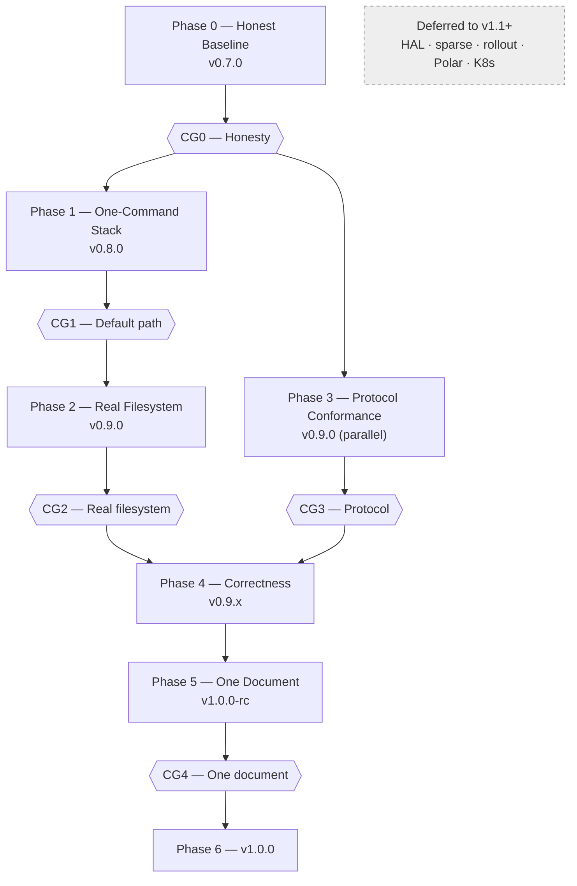

# Plan: emage.code.cwso → v1.0

- **Status:** approved — human approval granted 2026-08-13
- **Repo audited:** `github.com/xemage/emage.code.cwso` @ `main` (`1608dcb`, merge of `release-v0.6.1-to-main`)
- **Companion plan:** `plan-roadmap-v7-ground-up.md` (emage.code). Coupling points in §2.5 of that document.
- **Task ID range:** C001–C036 — a `C` prefix is proposed because the existing `T###` series
  runs to T189 across two repos with overlapping numbers; a distinct prefix removes the ambiguity.

---

## Part 1 — Audit: planned vs. implemented vs. missing

Per `---TODO_AFTER_UPDATE---.txt`: *"Review the initial input and ideas (/input & /docs/archive),
what was planned, added and what is missing."* This section is that review.

### 1.1 What was planned

`input/` holds the founding documents: the *Agentic AI Orchestration Blueprint* (markdown +
PDF), *CWSO Next-Gen Features*, *CWSO RL & Rollout Features*, *NVIDIA Polar*, and a *System
Architect Prompt*. The Blueprint is the spec of record. It defines a 4-phase roadmap
(§7), a 4-tool MCP surface (§5), and three architectural commitments: in-memory Git shadow
workspaces via libgit2 (§2.3), tiered microVM/container isolation (§2.4), and semantic
conflict-free AST merging (§3.3).

### 1.2 What was built — more than the Blueprint asked for

The Blueprint's §5 specifies exactly four tools. **All four exist**, plus ten more:

| Blueprint §5 tool | Status |
|---|---|
| `query_ast` | implemented (`shadow_tools.go:394`) |
| `create_shadow_workspace` | implemented (`shadow_tools.go:46`) |
| `dispatch_concurrent_jobs` | implemented (`dispatch_tools.go:157`) |
| `merge_concurrent_results` | implemented (`merge_tools.go:37`) |

Beyond spec: `drop_shadow_workspace`, `read_shadow_file`, `write_shadow_file`,
`commit_shadow`, `read_file_sync`, `write_file_sync`, `list_dir`,
`subscribe_ast_spikes`, `dispatch_hardware_aware_job`, `create_ephemeral_sparse_agent`.

Also built and not in the original Blueprint at all: the HAL (`services/cwso-hal`),
sparse micro-agents (`services/cwso-sparse`), and the rollout/Polar trajectory service
(`services/cwso-rollout`) with a pluggable evaluator registry.

Engineering discipline is genuinely strong: 92 task briefs, 28 plans (8 active + 20
archived), per-phase PoC debt scorecards, a technical-debt remediation plan, root-cause
analysis artifacts, and CI publishing four service images.

**The problem is not that too little was built. It is that the project kept building
forward past v0.4 while the foundations under the four headline tools stayed at
proof-of-concept quality — and this is documented, by the project itself, in
`docs/archive/debt/`.**

### 1.3 What is missing — the v1.0 blockers

Every row below is a live code reference, not an inference.

| # | Gap | Evidence | Why it blocks v1.0 |
|---|---|---|---|
| **B1** | **Hand-rolled MCP protocol subset**, not the official SDK | `orchestrator/internal/mcp/protocol.go:10` — `POC-DEBT: Hand-rolled MCP subset; production must adopt` | A v1.0 whose headline claim is "runs as MCP locally" cannot rest on a partial hand-rolled protocol. Every client quirk becomes your bug. |
| **B2** | **Shadow files are IPC-only; no OverlayFS mount** | `services/cwso-git-shadow/src/main.rs:11` — `POC-DEBT (P2-1): OverlayFS bind-mount layer is deferred`; scorecard: *"Sub-agents that expect a real fs path will not work"* | This is the largest gap. A coding sub-agent runs `ls`, `cat`, `pytest` — it needs a filesystem path. Without the mount, shadow workspaces are unusable by exactly the agents they exist to serve. |
| **B3** | **Sidecars are off by default** | `deploy/docker-compose.yml:52,71` — `profiles: ["phase2"]` / `["phase4"]`, commented *"kept disabled until implemented"* | A bare `docker compose up` starts the orchestrator **alone** — no git-shadow, no merge-engine. The two headline features are absent from the default path. |
| **B4** | **`cwso-rollout` is not in the compose file at all** | `deploy/Dockerfile.rollout` exists, CI builds and publishes it, `docker-compose.yml` never references it | A service that ships in CI but cannot be started by the documented path. |
| **B5** | **7-step manual startup with a documented failure mode** | `docs/user/installation-v3.md` §2–§4: source a feature script → compose with two explicit profiles → mint a JWT via inline Python heredoc → export env → launch VS Code *from the same shell*. §4 is literally titled *"Critical env step"*. | This is the gap between "it works" and "it is useful". |
| **B6** | **`find_references` is text matching, not scope resolution** | Scorecard P2-7: *"matches identifier text only — no scope/binding analysis. False positives across shadowed names"* | `query_ast` is the most-called tool. Silently wrong answers are worse than errors. |
| **B7** | **Orphan commits — no history chain** | `services/cwso-git-shadow/src/repo.rs:180` — `POC-DEBT P2-4: orphan commits per workspace` | Without parent tracking there is no three-way merge, so `merge_concurrent_results` cannot do the thing its name promises in the general case. |
| **B8** | **Documentation fragmented across 5 overlapping guides** | `docs/user/`: `installation-v1/v2/v3.md` + `ide-integration-v1/v2.md`, 1039 lines total | Directly named in the TODO. A new user must guess which of three install guides is current. |
| **B9** | **Version drift in README** | `README.md:23` states *"Current state v0.4.1 GA"*; `CHANGELOG.md` top entry is v0.5.2; HEAD is a v0.6.1 merge | Same class of defect as emage.code's v6.0.1 drift. Two releases behind. |
| **B10** | **Inconsistent quick-start** | `README.md:56` uses `--profile phase2`; `installation-v3.md:29` uses `--profile phase2 --profile phase4` | Following the README gets you a system without the merge engine. |
| **B11** | **SWE-bench evaluator is a stub** | `evaluator_swebench.go:64` — `POC-DEBT: Launch SWE-bench/SWE-Gym harness…`; T148 notes *"neutral reward; harness launch deferred"* | Not a v1.0 blocker. Listed so it isn't mistaken for working. |
| **B12** | **UDS permissions 0o666** | Scorecard P2-5 — *"not acceptable for prod"* | Local-only v1.0 tolerates this; it must be a documented limitation, not a silent one. |
| **B13** | **No connection pooling** | `orchestrator/internal/shadow/client.go:5` — one request per connection | *"Will throttle under Phase-3 concurrent dispatch"* — i.e. under the concurrency the product is named for. |

Language coverage (scorecard P2-3) has since been **closed** — `Cargo.toml` now wires
`tree-sitter-go`, `-python`, `-rust`, `-typescript`, matching the README's claim. Rate
limiting (phase-1 debt D6) also appears implemented in `transport/http.go`. Credit where
due: the debt register is being worked.

### 1.4 The pattern

The Blueprint's phases 1–4 were completed, and then work moved to Phases 6–9 (HAL, sparse,
rollout, Polar) — features that are architecturally impressive and that no v1.0 user needs.
Meanwhile P2-1 (OverlayFS), P2-4 (orphan commits), P2-7 (reference resolution), and D1
(hand-rolled MCP) — all flagged *critical* by the project's own scorecard — remain open.

**v1.0 is not ahead of the current state. It is partly behind it.** The work is to finish
the foundations under what is already built, and to stop building outward until they hold.

### 1.5 What "v1.0" should mean

From the TODO: *"a working and useful version 1.0 which can run in Docker as MCP locally."*
Translated into a testable definition:

> A developer with Docker and one supported MCP client can, from a clean checkout, reach a
> working CWSO in **one command plus one config paste**, point it at **their own
> repository**, and have a sub-agent create a shadow workspace, edit real files at a real
> path, and merge the result back — with correct AST answers and an honest error whenever
> CWSO cannot do what was asked.

Everything in Part 2 serves that sentence. Anything that does not is v1.1.

---

## Part 2 — Roadmap

### 2.0 Guiding principle

**Subtract before adding.** Four of six phases below remove or consolidate rather than
build. The repo's problem is not missing capability; it is capability that cannot be
reached, trusted, or explained.

### 2.1 Gates

| Gate | Statement |
|---|---|
| **CG0 — Honesty** | No v1.0 work proceeds until the README, CHANGELOG, and quick-start agree with each other and with the code. |
| **CG1 — Default path** | No feature work until `docker compose up` alone yields a fully functional stack. |
| **CG2 — Real filesystem** | v1.0 cannot be declared while shadow workspaces are unreachable as filesystem paths (B2). This is the load-bearing gate. |
| **CG3 — Protocol** | v1.0 cannot be declared on the hand-rolled MCP subset (B1) unless a written conformance suite proves parity with the spec for every implemented method. |
| **CG4 — One document** | v1.0 ships with exactly one installation-and-usage guide. |

### 2.2 Phase graph

---

### Phase 0 — Honest Baseline (v0.7.0, ~1 week)

**Goal:** the repo stops contradicting itself. Cheapest phase, gates everything.

| ID | Task | Scope |
|---|---|---|
| C001 | Fix `README.md:23` status table to the actual current release; add a CI check that fails when README's stated version lags the newest CHANGELOG entry | small |
| C002 | Reconcile the quick-start: `README.md:56` and `installation-v3.md:29` must issue identical commands (B10) | small |
| C003 | Publish `docs/DEBT-REGISTER.md` — one live register consolidating both phase scorecards plus the 6 in-code `POC-DEBT` markers, each row tagged `v1.0-blocker` / `v1.1` / `wontfix` | medium |
| C004 | Reconcile the task ledger: `docs/tasks/active-tasks.md` lists **one** row (T010) while 25 briefs sit at `in_review` and 4 at `pending`. Either close them or list them. | medium |
| C005 | Add `docs/SCOPE-v1.0.md` stating the §1.5 definition verbatim, plus the explicit non-goals list (§2.4) | small |

**Acceptance**
- [ ] Reverting the README version deliberately makes CI fail
- [ ] README and installation guide quick-starts are byte-identical command sequences
- [ ] Every in-code `POC-DEBT` marker appears in the register with a disposition
- [ ] `active-tasks.md` row count matches the number of non-`done` briefs

> **CG0 closes.**

---

### Phase 1 — One-Command Stack (v0.8.0, ~2 weeks)

**Goal:** `docker compose up` gives a complete, working system.

| ID | Task | Scope |
|---|---|---|
| C010 | Remove the `phase2` / `phase4` profile gates (B3). `git-shadow` and `merge-engine` join the default profile. Delete the stale comment *"kept disabled until implemented"* — they **are** implemented. | medium |
| C011 | Add `cwso-rollout` to the compose file behind an **opt-in** `rollout` profile (B4). Opt-in is correct here — it is genuinely optional — but it must be reachable. | small |
| C012 | Bootstrap secrets automatically: entrypoint generates `.env.jwt.dev` on first run if absent. No manual `.env.jwt.dev` step. | medium |
| C013 | `scripts/cwso-token.sh` replaces the inline Python heredoc in `installation-v3.md` §3. One command, prints a token, `--role` flag. | small |
| C014 | Fold `scripts/cwso-enable-all-features.sh` into compose defaults. If a feature must be enabled for the product to work, it is not a feature flag. | medium |
| C015 | **Mount the user's repository**, not `sample-workspace`. `CWSO_WORKSPACE_HOST` env var, defaulting to `sample-workspace` for the smoke test. Re-evaluate the `:ro` mount — a shadow-workspace orchestrator that cannot write is a demo. | medium |
| C016 | `make up` → build, start, wait for health, mint a token, print the ready-to-paste MCP client config block | medium |
| C017 | `scripts/cwso-doctor.sh`: checks Docker, ports, KVM/vhost-net presence (sandbox degraded-mode detection already exists in `sandbox/router.go` — surface it), sidecar sockets, health endpoints, token validity. Prints `[OK]`/`[WARN]`/`[FAIL]` per line. | medium |
| C018 | End-to-end smoke test as a single script: clean checkout → `make up` → create shadow workspace → write → AST query → commit → merge → teardown. This becomes the v1.0 definition-of-done executable. | large |

**Acceptance**
- [ ] `git clone && make up` reaches a healthy full stack with **zero** manual file creation
- [ ] `docker compose up` with no profile flags starts orchestrator + git-shadow + merge-engine
- [ ] `make up` prints a config block that works when pasted into a client unmodified
- [ ] C018 passes from a clean checkout on a machine that has never run CWSO
- [ ] `cwso-doctor.sh` correctly reports degraded sandbox mode on a host without KVM

> **CG1 closes.**

---

### Phase 2 — Real Filesystem (v0.9.0, ~3–4 weeks)

**Goal:** close B2 — the single biggest gap between "architecturally interesting" and "useful".

| ID | Task | Scope |
|---|---|---|
| C020 | ADR for the shadow-workspace filesystem projection. Status `proposed`; human approval required. Options: OverlayFS bind-mount (the original P2-1 plan), FUSE, or materialise-to-tmpfs-on-open. Record why the chosen one wins on *this* host matrix. | medium |
| C021 | Implement the projection: every shadow workspace is reachable at a real path inside the sandbox | large |
| C022 | Write-back: mutations at the projected path flow into the in-memory git object store, not just the page cache | large |
| C023 | Lifecycle: projection created with the workspace, torn down with it, no leaked mounts after crash. Test the crash path explicitly. | medium |
| C024 | Prove it: a sub-agent runs `ls`, `cat`, and a real test command against a shadow workspace, edits a file with an ordinary editor, and `commit_shadow` captures the change | large |
| C025 | If C020 concludes the projection cannot be delivered on the target host matrix, **say so in the README** and scope v1.0 to IPC-only workspaces with the limitation stated plainly. An honest limitation beats a silent one. | small |

**Acceptance**
- [ ] A shell inside the sandbox can `cd` into a shadow workspace and run ordinary tooling
- [ ] Edits made through the filesystem appear in `commit_shadow` output
- [ ] `docker compose down` after a forced kill leaves no orphaned mounts
- [ ] C024 runs in CI, not only by hand

> **CG2 closes.** This gate has an explicit escape hatch (C025) because it is the one item that could genuinely prove infeasible — but the escape is *documentation*, never silence.

---

### Phase 3 — Protocol Conformance (v0.9.0, parallel with Phase 2)

**Goal:** close B1. Runs in parallel because it touches disjoint code.

| ID | Task | Scope |
|---|---|---|
| C030 | Enumerate exactly which MCP methods, notification types, and error codes `internal/mcp/protocol.go` implements versus the current spec. Produce a gap table before deciding anything. | medium |
| C031 | Decide via ADR: adopt the official Go SDK, or keep the hand-rolled implementation and back it with a conformance suite. **Both are defensible** — the hand-rolled kernel is a deliberate determinism choice, and a rewrite at v0.9 carries real risk. What is not defensible is shipping v1.0 with an undocumented protocol subset. | medium |
| C032 | Execute the ADR's choice | large |
| C033 | Client compatibility matrix: verify against at least three real MCP clients over both stdio and Streamable HTTP. Publish results, including failures. | large |
| C034 | Contract snapshot test so protocol drift breaks CI (emage.code already has `test_cwso_mcp_contract_snapshot.py` — align the two ends) | medium |

**Acceptance**
- [ ] Gap table published before implementation begins
- [ ] Every implemented method has a conformance test asserting spec-shaped requests and errors
- [ ] Compatibility matrix published with at least three clients × two transports
- [ ] Unimplemented methods return a correct "not supported" error, never a malformed response

> **CG3 closes.**

---

### Phase 4 — Correctness (v0.9.x, ~2–3 weeks)

**Goal:** the two tools users call most give right answers.

| ID | Task | Scope |
|---|---|---|
| C040 | Scope/binding resolution for `find_references` (B6, P2-7). Test fixtures must include shadowed names across all four wired grammars. | large |
| C041 | Parent-commit tracking per workspace (B7, P2-4); each workspace forms a real history chain | medium |
| C042 | Enable three-way merge in `merge_concurrent_results` now that C041 supplies parents. Where a merge is still unresolvable, return the conflict matrix the Blueprint §5.4 promises — never a corrupted file. | large |
| C043 | Connection pooling in `shadow/client.go` (B13, P2-6) — required before concurrent dispatch is honest | medium |
| C044 | Tighten UDS perms to 0o660 with a shared GID (B12, P2-5), or document the limitation in the security section | small |

**Acceptance**
- [ ] `find_references` returns no false positives on the shadowed-name fixture set
- [ ] `git log` in a shadow workspace shows a chain, not an orphan
- [ ] A genuine three-way merge succeeds; an unresolvable one returns a conflict matrix
- [ ] Concurrent dispatch of N jobs does not exhaust connections

---

### Phase 5 — One Document (v1.0.0-rc, ~1–2 weeks)

Directly from the TODO: *"documentation of deployment configuration and usage must be at
one place and easy to follow (end user)"* and *"remove old stuff"*.

| ID | Task | Scope |
|---|---|---|
| C050 | Write `docs/user/README.md` — the single guide: prerequisites → install → configure client → verify → daily use → troubleshoot. Written against the *post-Phase-1* flow, not the current one. | large |
| C051 | **Delete** `installation-v1.md`, `installation-v2.md`, `installation-v3.md`, `ide-integration-v1.md`, `ide-integration-v2.md`. Delete, not archive — the emage.code audit shows archived docs still surfacing in searches. Git history preserves them. | small |
| C052 | Receive the 6 deployment guides relocated from emage.code (T403 in the companion plan) and fold them into the single tree. Coordinate so neither repo drops them. | medium |
| C053 | Contributor docs (`CONTRIBUTING.md`, build, branching, debt register) stay strictly separate from user docs. One cross-link each way, no more. | medium |
| C054 | Verify every command in the guide by executing it on a clean machine. A command that has not been run is a claim, not a document. | medium |

**Acceptance**
- [ ] `docs/user/` contains exactly one guide
- [ ] Every command in it was executed on a clean host during C054
- [ ] No file in `docs/user/` carries a version suffix
- [ ] Both repos agree on which owns deployment docs

> **CG4 closes.**

---

### Phase 6 — v1.0.0 (~1 week)

| ID | Task | Scope |
|---|---|---|
| C060 | Full debt-register review; every row reclassified `fixed` / `documented-limitation` / `v1.1`. **No row may remain unclassified.** | medium |
| C061 | Security pass — close T010, open since 2026-08-06 and the only row in the active ledger | medium |
| C062 | Release: version bump, CHANGELOG, tag, images | medium |
| C063 | Publish `docs/LIMITATIONS.md` — what CWSO v1.0 does *not* do. This is a feature. It prevents the next version-drift cycle. | small |

**Acceptance**
- [ ] C018 smoke test green on a clean host
- [ ] Debt register has zero unclassified rows
- [ ] Every §1.5 clause demonstrably true
- [ ] `LIMITATIONS.md` published alongside the release

---

### 2.4 Explicitly not in v1.0

Each of these is real, working code. None is needed for the §1.5 definition. Freezing them
is the plan's main source of leverage.

| Deferred | Status | Re-entry |
|---|---|---|
| HAL / hardware-aware dispatch | built (`services/cwso-hal`) | v1.1 — keep working, don't extend |
| Sparse micro-agents | built (`services/cwso-sparse`) | v1.1 |
| Rollout / Polar trajectory capture | built (`services/cwso-rollout`) | v1.1 — opt-in profile only (C011) |
| SWE-bench evaluator (B11) | stub | After v1.0; the registry hook already exists |
| Terminal-Bench evaluator | not started | After v1.0. Benchmarking a pre-1.0 orchestrator measures its incompleteness. |
| Firecracker microVM tier | implemented with degraded fallback | v1.0 ships with the fallback path documented, not the tier promoted |
| Kubernetes operator, CRDs, autoscaling | not started | Not before v1.1, and only on observed demand |
| Merkle incremental AST indexer (P2-2) | not started | v1.1 — re-parsing is fine at v1.0 scale |
| Vault/SOPS secret management (T029) | not started | v1.0 is local-only; file-based secrets are acceptable **if** stated in `LIMITATIONS.md` |

### 2.5 Risks

| Risk | Likelihood | Impact | Mitigation |
|---|---|---|---|
| Phase 2 (filesystem projection) proves infeasible on the host matrix | Medium | **Critical** | C020 is an ADR with three options and a decision record. C025 provides an honest documented fallback. Do not start C021 before C020 is approved. |
| Phase 3 becomes a protocol rewrite that swallows the release | Medium | High | C030 mandates a gap table *before* the decision; keeping the hand-rolled kernel plus a conformance suite is an explicitly acceptable outcome. |
| Deferred Phase 6–9 work resumes mid-plan | **High** | High | §2.4 is an explicit freeze list. The historical pattern is building outward past open critical debt; naming it is the countermeasure. |
| Deleting the old install guides breaks someone's bookmark | High | Low | Acceptable. Git history preserves them. Three contradictory guides cost more than a broken link. |
| Deployment docs dropped between the two repos | Medium | Medium | C052 pairs with T403; neither lands until both are ready. |
| 25 `in_review` tasks hide unfinished work | Medium | Medium | C004 forces resolution before Phase 1. |

### 2.6 Token budget

| Phase | Budget |
|---|---|
| Phase 0 — Honest Baseline | 80k |
| Phase 1 — One-Command Stack | 200k |
| Phase 2 — Real Filesystem | 350k |
| Phase 3 — Protocol Conformance | 250k |
| Phase 4 — Correctness | 250k |
| Phase 5 — One Document | 150k |
| Phase 6 — Release | 80k |

### 2.7 Sequencing against emage.code

Both plans are concurrent per your decision. Practical ordering of the three coupling points:

| When | emage.code | CWSO |
|---|---|---|
| Week 1–3 | Phase 0 (Ground Truth) + T417 Harbor smoke | Phase 0 (Honest Baseline) |
| Week 3 | **T403 ⇄ C052** — deployment docs handover. Sequence C052's receiving structure *before* T403 removes them. | |
| Week 4+ | Phase 1 (measurement) | Phase 1 (one-command stack) |
| Later | T420/T422 MCP conformance test | **CG3 must close first** — emage.code cannot write a conformance test against a surface CWSO is still deciding |
| Ongoing | T415 failure taxonomy defined here | C-side failures reference the same scheme |

The one hard ordering constraint: **emage.code's T422 must not be written until CWSO's
CG3 closes.** Otherwise the test encodes a protocol surface that is about to change.

---

## Approval

**Approved.** Human approval granted 2026-08-13. Task IDs use the `C` prefix as proposed
(C001–C063, plus C019 added at approval — see decision 3). Phase plans and task briefs
live under `docs/plans/plan-cwso-v1.0-phase*-v1.md` and `docs/tasks/task-C*.md`.

The three open questions were decided by the human on 2026-08-13:

1. **Filesystem projection (B2) is IN v1.0.** C020's ADR-012 selects the *mechanism*
   (OverlayFS vs FUSE vs tmpfs) on the host matrix; the whether is settled. C025 remains
   as the documented escape hatch only on proven infeasibility.
2. **Keep the hand-rolled MCP kernel and prove it.** ADR-013 (C031) documents this
   decision and scopes the conformance suite from the C030 gap table; C032 executes
   keep-and-prove. SDK adoption is recorded as considered-and-rejected (determinism
   rationale, rewrite risk at v0.9).
3. **v1.0 mounts the user's repository read-write** (C015), conditional on the sandbox
   tiering being trustworthy for the default non-KVM path. That condition is new task
   **C019** (Phase 1, P0): audit and harden the degraded sandbox path, with evidence,
   before the read-write default ships. Phase 1 budget rises 200k → 240k accordingly
   (total 1,360k → 1,400k).
