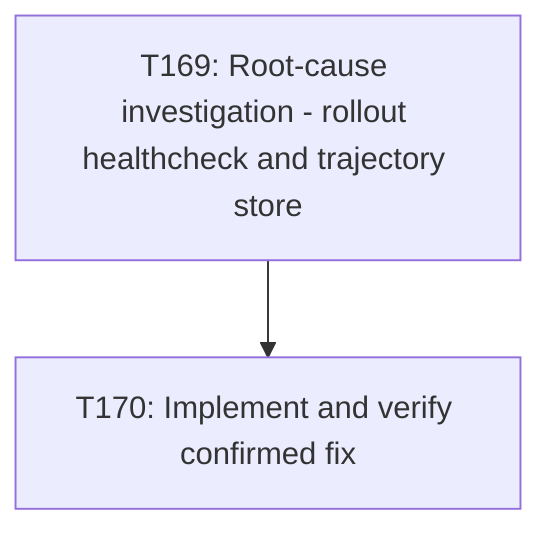

# Plan: fix-cwso-rollout-healthcheck-and-trajectory-store

> Status: draft — awaiting approval
> Filed by: emage.code devops-engineer (T310), reporting a defect found while independently
> building and running CWSO's own documented Docker Compose profile from a consuming project.
> This plan is a proposal only. Scheduling it into CWSO's active queue, assigning owners, and
> approving it are CWSO's own maintainers' decision — not made by this plan's author.

## Goal

**Root cause is currently unconfirmed.** Two candidate causes have been identified from log and
config evidence alone (see `docs/artifacts/emagecode-integration-defect-cwso-rollout-unhealthy-v1.md`),
but neither has been verified against `cwso-rollout`'s Rust source in this repository. This plan
therefore does not propose a fix directly — its first task is root-cause investigation. Only
once the actual cause is confirmed against source should implementation proceed.

The outcome this plan is working toward, once root cause is confirmed: the `rollout` container
built from `deploy/Dockerfile.rollout` reaches and sustains Docker's `healthy` status under the
documented healthcheck (`curl -f http://127.0.0.1:8787/v1/models`, interval 10s, timeout 3s,
retries 5), and the trajectory Parquet store writer starts successfully and writes to the path
configured via `CWSO_ROLLOUT_TRAJECTORY_STORE_PATH` instead of failing on startup. "Done" means
a fresh `docker compose up -d` of the rollout service reports `(healthy)` and the trajectory
store writer logs no startup error, sustained over at least one full observation window
(5 consecutive successful health probes, no `FailingStreak` growth).

## Scope

- **In scope**:
  - Reading `cwso-rollout`'s source for the `/v1/models` HTTP handler (method support, expected
    verbs) and for the trajectory store writer's path resolution logic.
  - Determining, from source, whether the healthcheck's `curl -f .../v1/models` GET request is
    simply hitting the wrong method/path, or whether `/v1/models` needs a dedicated liveness
    route.
  - Determining, from source, why the trajectory store writer uses `./rollout_store` instead of
    the configured `CWSO_ROLLOUT_TRAJECTORY_STORE_PATH` value.
  - Implementing and verifying a fix for whichever of the two issues is confirmed as a genuine
    defect (both may be real and unrelated; the investigation task may find one, the other, or
    both).
  - Re-running the exact `docker compose -f deploy/docker-compose-t226.yml up -d` verification
    sequence from the originating report to confirm the fix.
- **Out of scope**:
  - Changes to any other CWSO service (`orchestrator`, `git-shadow`, `merge-engine`,
    `sia-executor`) — none showed this defect.
  - Changes to the emage.code project's own `deploy/docker-compose-t226.yml` or any file outside
    this repository.
  - Broader rollout service refactors unrelated to these two specific failure modes.
  - Scheduling this plan's tasks into CWSO's live `docs/tasks/active-tasks.md` queue — that is a
    CWSO maintainer decision, made after this plan is reviewed and approved.
- **Assumptions**:
  - The evidence in `docs/artifacts/emagecode-integration-defect-cwso-rollout-unhealthy-v1.md` is
    accurate and reproducible (it was independently re-verified twice with identical results).
  - The `rollout` binary's source is present in this repository and buildable via the existing
    `deploy/Dockerfile.rollout`.
  - No production dependency currently relies on the current (broken) behavior in a way that
    would make a fix backward-incompatible; this assumption should be checked during
    investigation, not taken for granted.

## Task graph



## Agent assignments

| Task | Agent | Estimated scope |
|------|-------|-----------------|
| T169 | backend-developer | small |
| T170 | backend-developer | medium |

## Artifact flow

```
T169 → root-cause-analysis-v1.md    (consumed by: T170)
T170 → fix-verification-v1.md       (consumed by: CWSO maintainers, for merge review)
```

## Risks & mitigations

| Risk | Likelihood | Impact | Mitigation |
|------|-----------|--------|-----------|
| Investigation finds the two symptoms share a deeper common root cause not captured by either candidate above | Medium | Medium | T169 explicitly re-examines both hypotheses against source rather than assuming either is correct; scope for T170 is only fixed after T169 confirms actual cause(s) |
| Fixing `/v1/models` to accept GET changes its API contract for other callers | Low | Medium | T169 must check for existing callers/tests of `/v1/models` before T170 proposes a method/route change; prefer adding a dedicated liveness endpoint over changing `/v1/models` semantics if callers exist |
| Trajectory store path fix silently breaks other deployments that rely on the current (broken) relative-path behavior | Low | Low | T170 must grep the repo and any deployment configs for `./rollout_store` and `CWSO_ROLLOUT_TRAJECTORY_STORE_PATH` usage before changing path resolution |
| Investigation or fix scope creeps beyond the two documented symptoms | Medium | Low | Scope section above explicitly excludes unrelated rollout refactors; T170 acceptance criteria are limited to the two confirmed issues |

## Token budget

| Phase | Budget | Spent | Remaining |
|-------|--------|-------|-----------|
| Planning | 80k | — | — |
| Architecture | 80k | — | — |
| Implementation | 120k | — | — |
| QA / Security / Release | 60k | — | — |

## Approval

- [x] User approved on 2026-07-31
- [x] Plan locked; revisions create `plan-fix-cwso-rollout-healthcheck-and-trajectory-store-v2.md`
