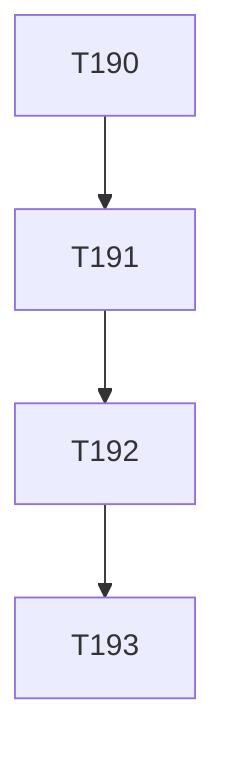

# Plan: Commit emage.code Agent Harness Update (Cline Projection Sync)

**Author:** orchestrator
**Date:** 2026-08-09
**Status:** approved

## Objective
Commit the uncommitted working-tree changes, which are purely an update of the emage.code agent harness — adding the Cline platform projection (`.cline/`, `.clinerules/`) and syncing existing platform projections (`.claude/`, `.cursor/`, `.gemini/`, `.github/`, `.opencode/`, `.pi/`), MCP configs, and `AGENTS.md`. No CWSO application code is involved.

## Scope

### In Scope
- 15 modified tracked files (all harness/platform projection files):
  - `.claude/rules/git-workflow.md`, `.claude/skills/task-management/SKILL.md`
  - `.cursor/rules/git-workflow.mdc`, `.cursor/skills/task-management/SKILL.md`
  - `.gemini/instructions/git-workflow.md`, `.gemini/settings.json`, `.gemini/skills/task-management/SKILL.md`
  - `.github/instructions/git-workflow.instructions.md`, `.github/skills/task-management/SKILL.md`
  - `.opencode/instructions/git-workflow.md`, `.opencode/skills/task-management/SKILL.md`
  - `.pi/instructions/git-workflow.md`, `.pi/skills/task-management/SKILL.md`
  - `.vscode/mcp.json`, `AGENTS.md`
- 2 untracked directories (new Cline projection, generated by `scripts/sync.mjs`):
  - `.cline/` (skills, `mcp.json`, `.generated-manifest.json`)
  - `.clinerules/` (coding-standards, git-workflow, poc-guidelines, security-guidelines)

### Out of Scope
- Any CWSO application code (`orchestrator/`, `services/`, `schemas/`, app content in `docs/`) — none is modified.
- The 15 local commits already ahead of `origin/develop` (separate concern; not part of this commit).
- Editing generated projection files by hand — they are regenerated by `scripts/sync.mjs` from the emage.code source repo.

## Approach
Follow the established harness-sync precedent (`ad46913 chore(harness): sync emage.code multi-agent platform projections` and `2dff269 chore(harness): add cwso awareness skill and role guidance`). Because `develop` is protected, the change goes through a dedicated branch + MR:

1. Create branch `chore/harness-sync-2026-08-09` from current `develop`.
2. Stage all harness files (15 modified + `.cline/` + `.clinerules/`).
3. Commit with conventional message `chore(harness): sync emage.code platform projections (add Cline)`.
4. Push branch, open MR → `develop`.
5. Squash-and-merge, delete source branch.

## Task Breakdown
| ID | Title | Assignee | Priority | BlockedBy | Estimated Effort |
|----|-------|----------|----------|-----------|-----------------|
| T190 | Create branch `chore/harness-sync-2026-08-09` from develop | orchestrator | high | — | S |
| T191 | Stage harness files (15 modified + `.cline/` + `.clinerules/`) | orchestrator | high | T190 | S |
| T192 | Commit `chore(harness): sync emage.code platform projections (add Cline)` | orchestrator | high | T191 | S |
| T193 | Push branch, open MR → develop, squash-merge, delete source branch | orchestrator | high | T192 | S |

## Dependency Graph

## Risks & Mitigations
| Risk | Likelihood | Impact | Mitigation |
|------|-----------|--------|------------|
| `.cline/`/`.clinerules/` are generated files that could drift from source | medium | low | Commit as-is; they are the current sync output. Regeneration is a separate emage.code-source-repo concern. |
| Direct push to protected `develop` rejected | low | medium | Use branch + MR flow; never push directly to `develop`. |
| Unintended app files staged | low | high | Stage only the explicit harness paths listed in Scope; verify with `git status` before commit. |

## Success Criteria
- [ ] Branch `chore/harness-sync-2026-08-09` created from `develop`
- [ ] Commit contains only the 15 modified harness files + `.cline/` + `.clinerules/` (no app code)
- [ ] Conventional commit message `chore(harness): ...` used
- [ ] MR opened → `develop`, squash-merged, source branch deleted

## Open Questions
- None — scope is unambiguous (pure harness update with clear precedent).