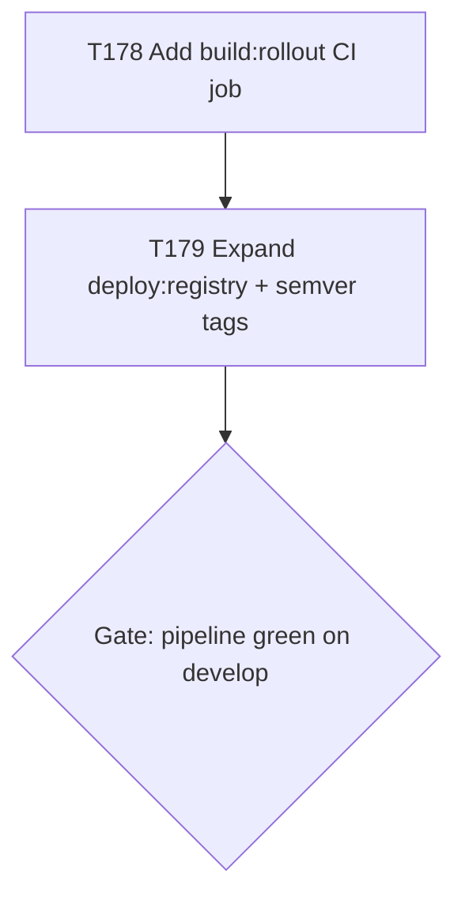

# Plan: registry-publishing-completion

**Based on:** `docs/artifacts/emagecode-integration-registry-gap-v1.md`

## Goal

Publish all 4 CWSO service images (`orchestrator`, `git-shadow`, `merge-engine`, `rollout`) to
`registry.gitlab.com/em-age/emage.code.cwso/...` with real semver tags on tag pipelines and
`:latest` on main/develop, so that downstream consumers (specifically emage.code's
`deploy/docker-compose-t226.yml`) can pull instead of build-from-source. Done means:
all 4 images exist in the registry with at least `:latest` on the next pipeline that runs
against `main`, and `:$CI_COMMIT_TAG` exists for the next tagged release.

## Scope

- **In scope**: three CI changes to `.gitlab-ci.yml` (new build job, expanded deploy job,
  semver tag push on `$CI_COMMIT_TAG`)
- **Out of scope**: changes to Dockerfiles themselves (no change needed — `Dockerfile.rollout`
  already exists), changes to emage.code's compose file (that is a downstream task)
- **Assumptions**: `deploy/Dockerfile.rollout` builds successfully (it exists and mirrors the
  merge-engine pattern — confirm with a local `docker build` if unsure before merging)

## Task graph



## Agent assignments

| Task | Agent | Estimated scope |
|------|-------|-----------------|
| T178 | devops-engineer | small |
| T179 | devops-engineer | small |

## Suggested CI YAML

The following is a concrete suggested implementation. CWSO's own team should adapt it as needed —
this is not a mandate.

### New `build:rollout` job (add after `build:merge-engine`)

```yaml
build:rollout:
  extends: .docker-base
  script:
    - docker build -t $CI_REGISTRY_IMAGE/rollout:$CI_COMMIT_SHORT_SHA -f deploy/Dockerfile.rollout .
  rules:
    - if: $CI_PIPELINE_SOURCE == "merge_request_event"
    - if: $CI_COMMIT_BRANCH == "develop"
    - if: $CI_COMMIT_BRANCH == "main"
    - if: $CI_COMMIT_TAG
```

### Updated `deploy:registry` job

```yaml
deploy:registry:
  extends: .docker-socket
  stage: deploy
  image: docker:27
  needs:
    - job: build:orchestrator
    - job: build:git-shadow
    - job: build:merge-engine
    - job: build:rollout
    - job: e2e:phase2
      optional: true   # T153: e2e excluded on tag pipelines
  before_script:
    - docker info >/dev/null
    - echo "$CI_REGISTRY_PASSWORD" | docker login -u "$CI_REGISTRY_USER" --password-stdin "$CI_REGISTRY"
  script:
    - |
      ensure_local_image() {
        local name="$1"
        local dockerfile="$2"
        local img="${CI_REGISTRY_IMAGE}/${name}:${CI_COMMIT_SHORT_SHA}"
        if docker image inspect "${img}" >/dev/null 2>&1; then
          echo "Image ${img} present locally"
        else
          echo "Image ${img} missing locally; building on this runner..."
          docker build -t "${img}" -f "${dockerfile}" .
        fi
      }
      ensure_local_image orchestrator  deploy/Dockerfile.orchestrator
      ensure_local_image git-shadow    deploy/Dockerfile.git-shadow
      ensure_local_image merge-engine  deploy/Dockerfile.merge-engine
      ensure_local_image rollout       deploy/Dockerfile.rollout
    - |
      for svc in orchestrator git-shadow merge-engine rollout; do
        docker tag $CI_REGISTRY_IMAGE/${svc}:$CI_COMMIT_SHORT_SHA $CI_REGISTRY_IMAGE/${svc}:latest
        docker push $CI_REGISTRY_IMAGE/${svc}:latest
        if [ -n "$CI_COMMIT_TAG" ]; then
          docker tag $CI_REGISTRY_IMAGE/${svc}:$CI_COMMIT_SHORT_SHA $CI_REGISTRY_IMAGE/${svc}:$CI_COMMIT_TAG
          docker push $CI_REGISTRY_IMAGE/${svc}:$CI_COMMIT_TAG
        fi
      done
  rules:
    - if: $CI_COMMIT_BRANCH == "main"
    - if: $CI_COMMIT_TAG
```

## Artifact flow

```
T178 → .gitlab-ci.yml with build:rollout job
T179 → .gitlab-ci.yml with expanded deploy:registry (all 4 images + semver tags)
     → registry.gitlab.com/em-age/emage.code.cwso/{orchestrator,git-shadow,merge-engine,rollout}:latest
     → ...:{vX.Y.Z}  (on next tag pipeline)
```

## Risks

| Risk | Mitigation |
|------|-----------|
| `Dockerfile.rollout` has never been built in CI before — may have a latent issue | Run `docker build -f deploy/Dockerfile.rollout .` locally before opening the MR |
| `deploy:registry` job uses `docker-socket` (DinD) — `build:rollout` uses `docker-base` — ensure both use compatible runner tags | Mirror `build:merge-engine`'s `extends:` exactly |
| Tag pipeline skips e2e; `ensure_local_image` fallback handles missing images on different runner | Same pattern already in use for orchestrator/git-shadow (T153 precedent) |
