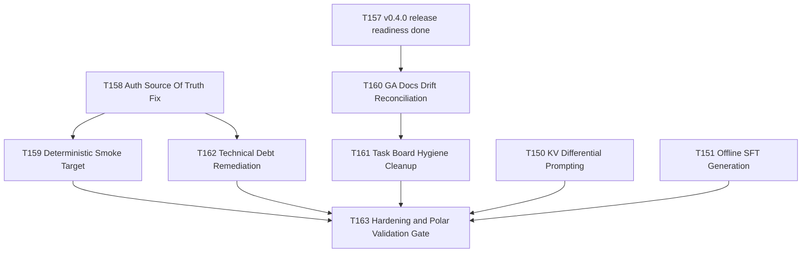

# Plan - v0.4.1 Usability Hardening and Polar Completion

> Owner: orchestrator  
> Status: planned (pending user approval for execution)  
> Date: 2026-06-18  
> Based on: `docs/tasks/active-tasks.md`, `docs/tasks/task-T150.md`, `docs/tasks/task-T151.md`, `docs/checkpoints/checkpoint-014-v0.4.0-ga.md`, `TECHNICAL-DEBT.md`

## Goal

Bring CWSO from "usable with operator knowledge" to "frictionless and production-ready for day-to-day teams" by eliminating local integration auth drift, adding a deterministic smoke workflow, reconciling release documentation drift, cleaning task-board hygiene, remediating highest-value reliability/security debt, and completing deferred Polar backlog items T150/T151.

## Scope

1. Fix local integration auth mismatch in Phase 2 integration flow.
2. Add one-command deterministic local smoke target.
3. Reconcile GA documentation drift for v0.4.0 completion state.
4. Clean active/completed task board hygiene.
5. Address highest-value debt in jobs/SSE reliability and error exposure.
6. Implement T150 and T151 for deeper Polar parity.

## Task Graph

## Agent Assignments

| Task | Owner | Estimated scope |
|------|-------|-----------------|
| T158 | backend-developer | S |
| T159 | devops-engineer | S |
| T160 | technical-writer | S |
| T161 | scrum-master | S |
| T162 | backend-developer | M |
| T150 | backend-developer | M |
| T151 | backend-developer | M |
| T163 | qa-engineer + security-engineer + tech-lead | M |

## Artifact Flow

- T158 outputs auth-aligned integration behavior in `scripts/phase2-integration.py` and compose config alignment.
- T159 consumes T158 and outputs deterministic local smoke entrypoint in `Makefile` + docs note.
- T160 outputs corrected GA state in checkpoint/release references.
- T161 consumes T160 and outputs clean `active-tasks.md`/`completed-tasks.md` split.
- T162 outputs reliability/security debt fixes with tests and debt register updates.
- T150/T151 output rollout-path capabilities and user-guide updates.
- T163 consumes all above and outputs verification artifact + gate verdict.

## Risks and Mitigations

| Risk | Impact | Mitigation |
|------|--------|------------|
| Auth fix regresses CI flow | Medium | Preserve CI override behavior in `deploy/docker-compose.ci.yml`; add local+CI path tests |
| Board cleanup introduces traceability loss | Medium | Move, do not delete; keep append-only history in `completed-tasks.md` |
| Debt remediation changes runtime semantics | Medium | Add focused unit tests and explicit transition assertions |
| T150/T151 increase rollout complexity | Medium | Keep feature-flagged and default-off with explicit docs |

## Token Budget

| Phase | Budget |
|------|--------|
| Planning | <= 20k |
| Implementation | <= 80k |
| QA/Security Gate | <= 30k |
| Release Readiness | <= 20k |

## Success Criteria

- Local Phase 2 integration passes without manual JWT secret choreography.
- `make` one-liner smoke path is deterministic and documented.
- GA checkpoint/release docs no longer conflict with actual tag status.
- Active board contains only non-done tasks; done inventory preserved.
- TD-05, TD-06, TD-08 remediated or explicitly reclassified with rationale.
- T150/T151 merged behind flags with tests and installation-v2 coverage.

## Approval

Plan prepared. Awaiting user approval to execute tasks T158-T163 plus T150/T151.